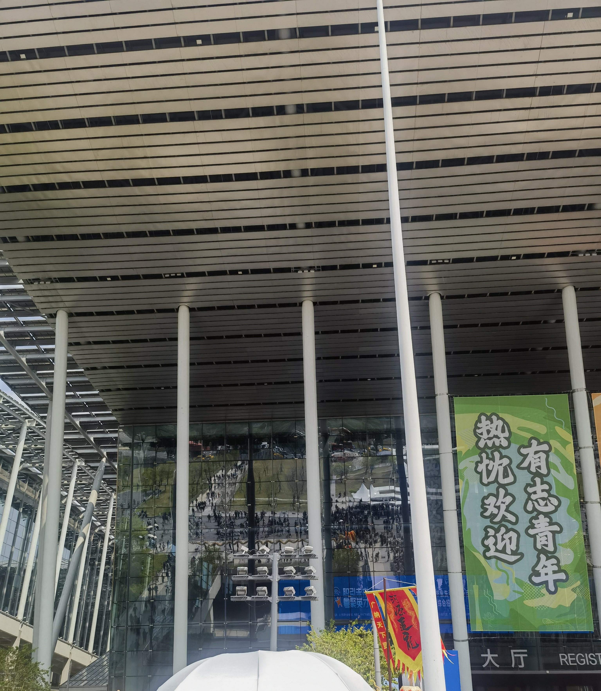

找工作中...后续去了招聘会学习

<!-- more -->

# 闭门造车

昨天吃法时听到妈妈聊自己的工作

刚开始换了很多份，最后回到老家稳定了几年

之后来到gz，十几年没有上过班了

我从考研到现在找工作似乎就是在闭门造车

责怪他人是不会改善自己的生活现状的

要往两方面努力

一是化解自己的贪欲，名欲。不要弄的自己变成为满足自己的欲望什么都做得出来的人，你并不需要那么多的欲望才能活下去，你并不需要那么多的钱，那么多的名，那么多的人为你崇拜你（坦白讲，崇拜是离理解最遥远的距离）才能活得快乐。

二是做自己的父母，在安全的情况下冒风险，让自己拥有勇气。

---

3/30

后续去了招聘会，人山人海~

*文字写于：广东*