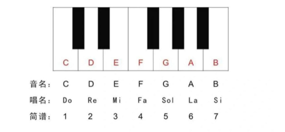
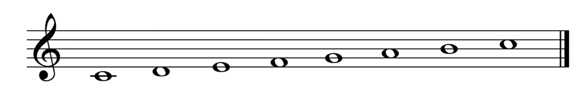
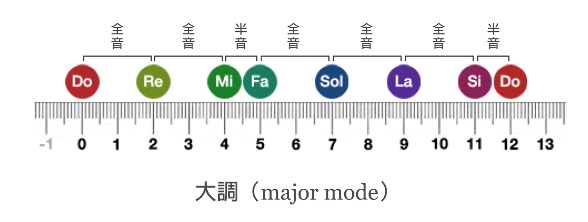
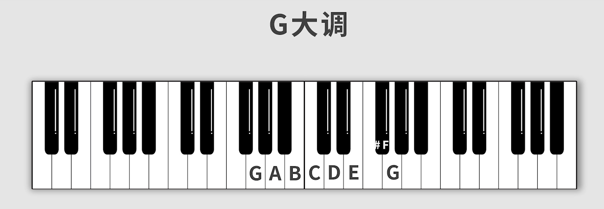
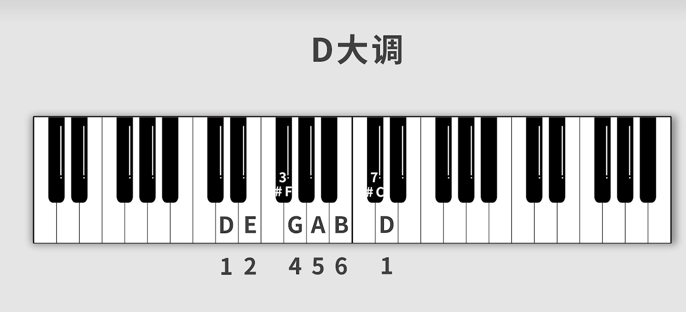
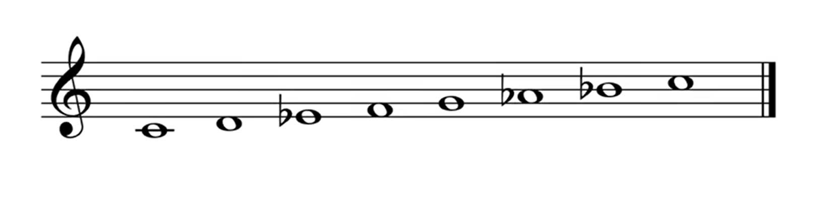

# 02.基础乐理知识

想实现**音准识别**，先了解一下基础的**乐理知识**吧

<!-- more -->   

## 七个基本音级

七个基本音级是我们平常接触到的do re mi fa sol la si

对应关系：

为什么是从**C**开始呢

从C开始的一般是大调，就是do re mi fa sol la si -do

音跟音之间的频率有间隔。（调式：在一个音阶中，音跟音之间的排列方式）

全全半全全全半

如果频率比一致，每组的音阶都会是do re mi fa sol la si -do

假设从G出发，G后一个全音是A，A后一个全音是B，B后一个半音是C，C后一个全音是D，D后一个全音是E，E后一个全音是#F(升F)，升F后一个半音是G

听起来也是do re mi fa sol la si -do

D大调同理

A小调，将367音的音阶向下调

> 在巴洛克之前的时期，七个中古调式（Ionian Dorian Phrygian Lydian Mixolydian Aeolian Locrian ）中，用得最多的是Aeolian，也就是以ABCDEFG模式排列的音阶，把A作为主音。（也就是现在的A自然小调音阶）巴洛克时期向古典主义时期过度的时候，大调音阶和小调音阶逐渐占据主流，其他中古调式慢慢减少了使用。与此同时复调音乐慢慢向主调音乐过度，才慢慢流行在大调上写作，也就是以CDEFGAB模式排列的音阶，也叫Ionian调式。现代音乐的主源是德奥古典音乐,他们盛行大调,do为主音,排第一位。现代音乐中的音名按大调排列,所以以C自然大调

*文字写于：广东*
