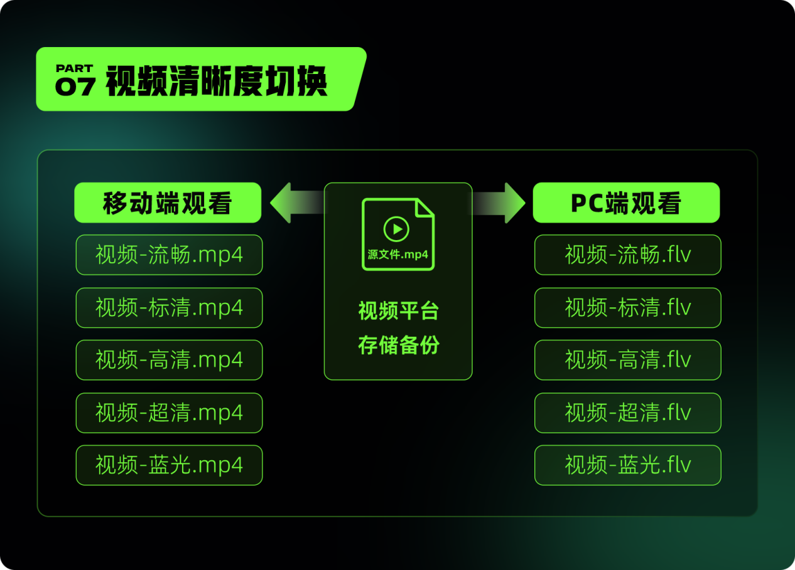

# 01.网络平台视频的编码压缩

> 本文引用自：[影视飓风视频引争议：平台画质标识的真相大揭秘 - 知乎](https://zhuanlan.zhihu.com/p/2961874735)
>

**假如一条视频的参数如下：**

分辨率：1920*1080，码率：1000kbps，帧率：30，时长：5s，封装：mp4

这条视频是由一个150帧（帧率x时长=30x5=150帧），分辨率为1920*1080的连续图片通过编码技术，封装成一个0.625MB的mp4视频文件。

这个视频文件如果想流畅在线播放，必须拥有一个不小于1M的独享带宽支持，即网速不低于0.625MB/s。

这些编码技术能将巨大的视频文件压缩，以实现各平台间的流畅播放、下载与转发。

如果你做过视频剪辑，在输出文件的时候，剪辑软件会提供不同的编码技术以及码率供你选择，码率越高，清晰度越高，导出的文件也会越大（当然，不会大于未编码的文件），最终上传到平台所占用的服务器空间、流畅播放所需的带宽以及流量成本就会越高。

一般情况下，分辨率不变，如果降低了视频码率，改变了原有的编码标准，视频清晰度就会不如从前。

单幅画面宽高不变的情况下，画面内的信息密度不同，画质也会不同，而所谓的信息密度，就是视频码率。视频码率越高，视频清晰度就越高。同样是1080p（画幅）的视频，不同的码率会出现不同的画质。

但同样是1080P的视频，在移动端、PC端、电视大屏中的画质感受也有区别。移动端设备的屏幕小，能看到的细节少，超高清视频在移动端反而是过剩的产能。因此，有些视频平台会针对移动端用户提供低码率的视频，从而减少观看视频所消耗的流量。

**视频导出时参数已经固定，为什么清晰度还会变化？**

当创作者将视频上传至平台，观众可以看到好几种清晰度。在弱网环境中，平台会切给用户切换更低清晰度，保障视频的流畅播放。

其实，并不是一个视频文件有多种清晰度选择，而是一个视频文件被平台编码成多个清晰度的文件，早期某些视频平台会为不同的观看终端转码视频，也是为了让用户弱网环境下看视频不卡顿。

举个例子，平台上了一个新的电影，他要在PC端和移动端播放，这个电影提供了流畅、标清、高清、超清、蓝光五个清晰度给用户选择，那么这个电影就需要编码出来5个清晰度的和5个清晰度的mp4文件，加上源文件，相当于一个电影会存储11个文件。

    

​	现在由于H5播放器的大量应用，flv文件用得也越来越少了，某些平台只提供mp4格式视频，就这样，一个电影依然需要至少存储6个文件才支撑5个清晰度的播放。

​	大家在使用这些小运营商的网络时，可能会发现一个情况：很多时候在观看一些热门电影电视剧的时候，网络飞快一点都不带卡的，反而有些时候访问一些网页的时候，打开就没那么顺畅。这是因为，小运营商通常会缓存一些热门资源的文件，供用户快速下载访问。

   `这个话题可以讲讲企业公益，视频平台是免费提供服务器存储大家的视频资源的，不过还没想好怎么写，先回到前端开发上吧`

*文字写于：广东*
