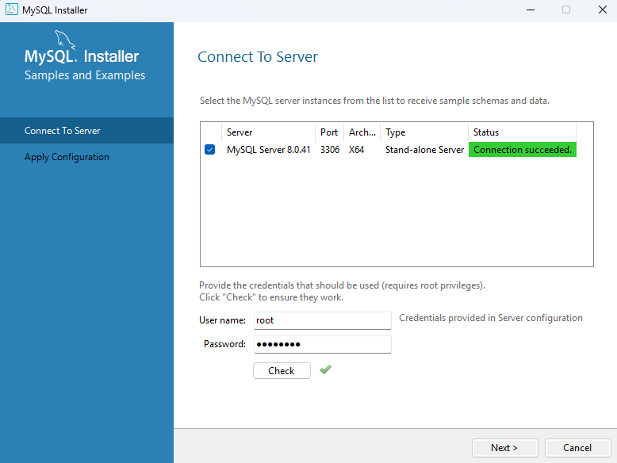

# Vue3用户中心项目

##  配置数据库

使用Mysql

MySQL官网：[https://www.mysql.com/downloads/ ](https://www.mysql.com/downloads/)

记住user密码



## 前端初始化

在项目入口（main.ts)引入pinia，在此之前已经引入了ant-design-vue

Pinia 是 Vue 的存储库，它允许您跨组件/页面共享状态。

[介绍 | Pinia 中文文档](https://pinia.web3doc.top/introduction.html)

Store可以作为全局变量，任意组件都可以使用它

在GlobalHeader（全局导航条）中引用 （这里若引用未变成紫色就可能是写错了，我写函数名没写对(0 . 0） )

```VUE
<a-col flex="80px">
  <div class="user-login-status">
    {{ JSON.stringify(loginUserStore.loginUser) }}
    <a-button type="primary" href="/user/login">登录</a-button>
  </div>
</a-col>
```

###  前端页面开发

#### 01.Homepage页

每个页面唯一，可以套一个`<div id="homePage">`容器

#### 02.Login页

在[表单 Form - Ant Design Vue](https://www.antdv.com/components/form-cn/#Form-)找到表单组件，第一个就是登录页面

```vue
      style="max-width: 480px; margin: 0 auto" <!-- 480宽度，左右边距为0-->
```

#### 03.踩坑，在md文件里直接写了

```vue
<div id="homePage">
```

结果md文件显示不出来，也是导致git推送失败报错的原因

以下是报错记录

> Error: Failed to compile with errors.    at E:\VueCode\Blog\msingbai.github.io\node_modules\@vuepress\core\lib\node\build\index.js:190:16    at finalCallback (E:\VueCode\Blog\msingbai.github.io\node_modules\webpack\lib\MultiCompiler.js:254:12)具体是 Webpack 在编译时遇到了错误。
>
> 可能是因为 Markdown 文件中包含了 VuePress 或 Webpack 无法处理的内容。检查以下内容：
>
> - **语法错误**：确保 Markdown 文件的格式正确，没有语法错误。
> - **Vue 组件或代码块**：如果文件中包含 Vue 组件或代码块（如 `<template>` 或 `<script>`），检查是否有语法错误或未正确闭合的标签。

应该就是没有闭合的div导致了无法编译。

改成代码块形式后恢复


#### 目前卡在了数据库上，是从前端开始做的，后端代码直接copy，结果数据库的链接有问题，也不知道密码，今天就先到这里吧~

*文字写于：广东*