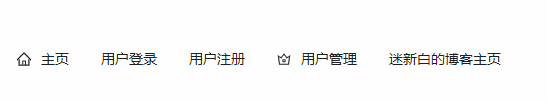
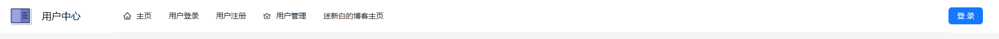

# 用户中心项目前端-Vue3

##  配置数据库

使用Mysql

MySQL官网：[https://www.mysql.com/downloads/ ](https://www.mysql.com/downloads/)

记住user密码


## 前端初始化

在Vue中

template是html部分，script部分用于向后端发送请求，style是页面的样式

## 前端布局

把所有项目放在layouts文件夹里

创建一个通用布局BasicLayout.Vue，使用组合式API

> 在 Vue.js 中，主要存在两种 API 设计模式：**选项式 API（Options API）** 和 **组合式 API（Composition API）**。它们在代码组织、逻辑复用、响应式数据处理等方面有显著不同。
>
> **逻辑组织**
>
> - **选项式 API**：逻辑分散在多个选项中，适合简单组件。
> - **组合式 API**：逻辑集中在一个函数中，适合复杂组件。


### 根页面引用

根页面是**App.Vue**文件

引入我们的通用布局BasicLayout.Vue


### 上中下三栏

规划为header、content、footer三部分


### 底部栏（下）

Footer一般可以写版权信息

### 内容栏（中）

#### Router 路由

在router/index.ts

content部分要实现动态切换，可以直接使用router的语法

```Vue
      <a-layout-content class="content">
        <router-view />
      </a-layout-content>
```

改变路由的路径，并开发他们的组件

```tsx
{
  path: "/",
  name: "home",
  component: HomePage,
},
```


### 导航栏

全局的公共导航栏 GlobalHeader.Vue

在蚂蚁金服提供的组件中可直接使用[导航菜单 Menu - Ant Design Vue](https://www.antdv.com/components/menu-cn) 

选用这个顶部导航栏



左上角logo，右上角登录

分别是使用一个<div标签>、一个<button标签>，通过改变style实现



**排版** 

Flex布局能够自动伸缩

```html
  <a-row :warp="false"><!--   关闭自动换行      -->
    <a-col flex="100px">100px</a-col><!--   100px       -->
    <a-col flex="auto">auto</a-col><!--   自适应       -->
  </a-row>
```

#### 点击菜单事件（click）

```html
@click="doMenuClick"
```

[导航菜单 Menu - Ant Design Vue](https://www.antdv.com/components/menu-cn)

Menu 事件 [#](https://www.antdv.com/components/menu-cn#menu-事件)

| 事件名称   | 说明                               | 回调参数                                 |
| :--------- | :--------------------------------- | :--------------------------------------- |
| click      | 点击 MenuItem 调用此函数           | function({ item, key, keyPath })         |
| deselect   | 取消选中时调用，仅在 multiple 生效 | function({ item, key, selectedKeys })    |
| openChange | SubMenu 展开/关闭的回调            | function(openKeys: (string \| number)[]) |
| select     | 被选中时调用                       | function({ item, key, selectedKeys })    |

然后在script标签里定义这个事件

```javascript
const router = useRouter();
//点击菜单后的路由跳转事件

const doMenuClick = ({ key }: { key: string }) => {
  router.push({ path: key });
};
```

## 向后端发送请求

> 引入Axios请求库

一般情况下，前端只负责界面展示和动效交互，尽量避免写复杂的逻辑；当需要获取数据时，通常是向后端提供的接口发送请求，由后端执行操作（比如保存数据）并响应数据给前端。

前端如何向后端发送请求呢？最传统的方式是使用AJAX技术。但其代码有些复杂，我们可以使用第三方的封装库，来简化发送请求的代码，比如主流的请求工具库Axios。


### 全局自定义请求

​	需要自定义全局请求地址等，参考Axios官方文档，编写请求配置文件`request.ts`。包括全局接口请求地址、超时时间、自定义请求响应拦截器等。

​	响应拦截器的应用场景：我们需要对接口的通用响应进行统一处理，比如从response中取出data；或者根据code去集中处理错误。这样不用在每个接口请求中都去写相同的逻辑。

​	比如可以在全局响应拦截器中，读取出结果中的data，并校验code是否合法，如果是未登录状态，则自动登录。

​	示例代码如下，其中 `withCredentials：true` 一定要写，否则无法在发请求时携带Cookie，就无法完成登录。


## 待整理

在项目入口（main.ts)引入pinia，在此之前已经引入了ant-design-vue

Pinia 是 Vue 的存储库，它允许您跨组件/页面共享状态。

[介绍 | Pinia 中文文档](https://pinia.web3doc.top/introduction.html)

Store可以作为全局变量，任意组件都可以使用它

在GlobalHeader（全局导航条）中引用 （这里若引用未变成紫色就可能是写错了，我写函数名没写对(0 . 0） )

```VUE
<a-col flex="80px">
  <div class="user-login-status">
    {{ JSON.stringify(loginUserStore.loginUser) }}
    <a-button type="primary" href="/user/login">登录</a-button>
  </div>
</a-col>
```


###  前端页面开发

#### 01.Homepage页

每个页面唯一，可以套一个`<div id="homePage">`容器

#### 02.Login页

在[表单 Form - Ant Design Vue](https://www.antdv.com/components/form-cn/#Form-)找到表单组件，第一个就是登录页面

```vue
      style="max-width: 480px; margin: 0 auto" <!-- 480宽度，左右边距为0-->
```


# 踩坑

## 1.在md文件里直接写了

```vue
<div id="homePage">
```

结果md文件显示不出来，也是导致git推送失败报错的原因

以下是报错记录

> Error: Failed to compile with errors.    at E:\VueCode\Blog\msingbai.github.io\node_modules\@vuepress\core\lib\node\build\index.js:190:16    at finalCallback (E:\VueCode\Blog\msingbai.github.io\node_modules\webpack\lib\MultiCompiler.js:254:12)具体是 Webpack 在编译时遇到了错误。
>
> 可能是因为 Markdown 文件中包含了 VuePress 或 Webpack 无法处理的内容。检查以下内容：
>
> - **语法错误**：确保 Markdown 文件的格式正确，没有语法错误。
> - **Vue 组件或代码块**：如果文件中包含 Vue 组件或代码块（如 `<template>` 或 `<script>`），检查是否有语法错误或未正确闭合的标签。

应该就是没有闭合的div导致了无法编译。

改成代码块形式后恢复

**目前卡在了数据库上，是从前端开始做的，后端代码直接copy，结果数据库的链接有问题，也不知道密码，今天就先到这里吧~**


*文字写于：广东*