# 02.用户中心后端-1

## 企业的项目流程

需求分析 => 设计（概要设计、详细设计） => 技术选型  => 初始化/引入需要的技术 => 写Demo => 写代码（实现业务逻辑） => 测试（单元测试）=> 代码提交/代码评审 => 部署 => 发布 

## 需求分析

1.登录/注册

2.用户管理（管理员）

3.用户校验（**是否是购买服务的用户**）

## 技术选型

前端：三件套(HTML CSS JS) +React + 组件库 Ant Design（阿里巴巴的蚂蚁金服) + Umi 开发框架  + Ant Design Pro(现成管理系统) 

后端： java + spring + springmvc + mybatis + mybatis-plus + springboot + mysql

部署：服务器/容器（平台）

## 计划

1.初始化项目 20min

​	1.前端初始化 ✔️

​		1.初始化项目 ✔️

​		2.引入组件 ✔️

​		3.项目瘦身

​	2.后端初始化20min

​		1.准备环境（MySQL等） 验证MySQL是否安装成功-链接 ✔️

​		2.引入框架（整合框架）

**2.登录/注册** 20min

​	1.前端

​	2.后端

3.用户管理（仅管理员可见） 20min

​	1.前端

​	2.后端


## 笔记

###  配置数据库

使用Mysql

MySQL官网：[https://www.mysql.com/downloads/ ](https://www.mysql.com/downloads/)

记住user密码

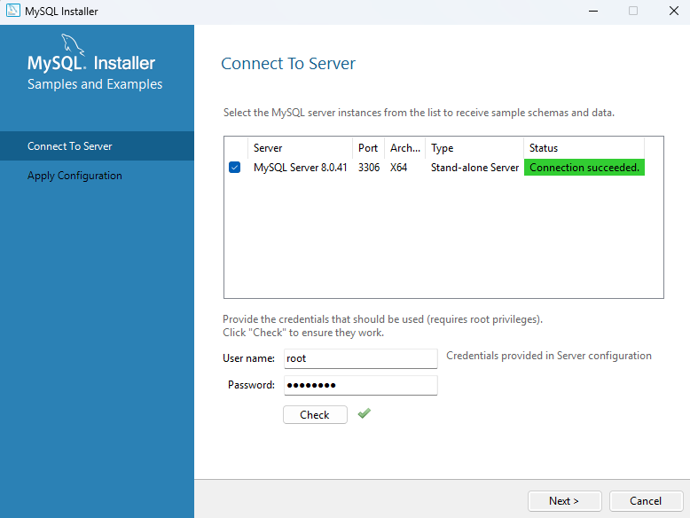

------

### 项目初始化

三种初始化Java项目的方式

​	1.github拉取

​	2.springboot官方模板 [Spring Initializr](https://start.spring.io/)

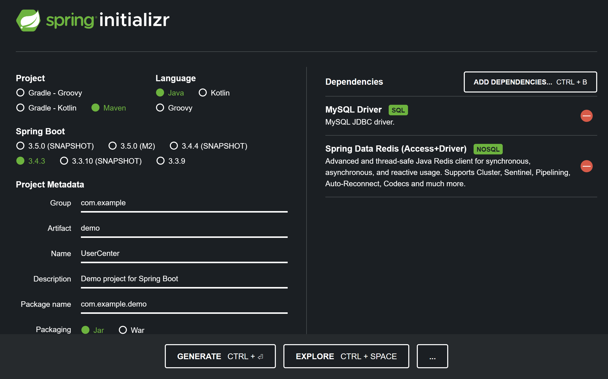

3.直接在IDEA开发工具中生成  ✔️

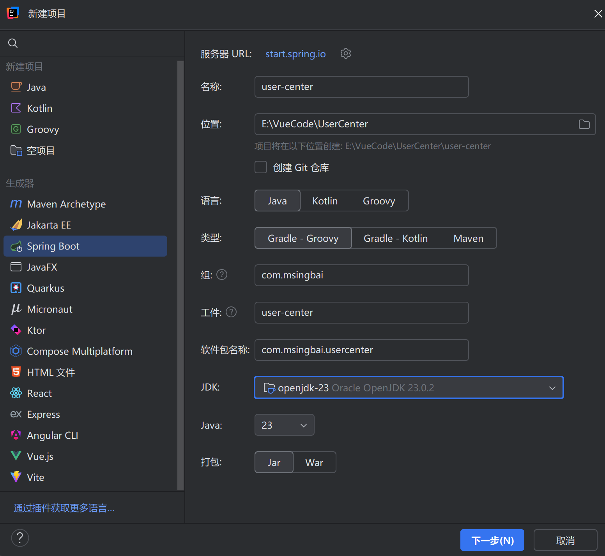

### 工具名词解释：

- Lombok 可以通过注解,帮助开发人员消除JAVA中尤其是POJO类中的冗长代码。

- myBatis 数据访问层的框架，用于操作数据库

- spring（依赖注入框架，帮助你管理Java对象，集成一些其他的内容）

- springmvc（web框架，提供接口访问、festful接口等能力）

- mybatis (Java操作数据库的框架，持久层框架，对jdbc的封装)
- mybatis-plus（对mybatis的增强，不用写sql也能实现增删改查）
- springboot（**快速启动/快速集成项目** 不用自己管理spring配置，不用自己整合各种框架）
- MySQL 关系型数据库管理系统


### maven配置

4.maven换源,settings.xml复制下面的内容覆盖 没有的话创建一个 

```xml
<?xml version="1.0" encoding="UTF-8"?>
<settings xmlns="http://maven.apache.org/SETTINGS/1.0.0"
          xmlns:xsi="http://www.w3.org/2001/XMLSchema-instance"
          xsi:schemaLocation="http://maven.apache.org/SETTINGS/1.0.0 http://maven.apache.org/xsd/settings-1.0.0.xsd">
    <!-- localRepository
     | The path to the local repository maven will use to store artifacts.
     |
     | Default: ${user.home}/.m2/repository
    <localRepository>/path/to/local/repo</localRepository>
    -->
    <mirrors>
        <!-- mirror
         | Specifies a repository mirror site to use instead of a given repository. The repository that
         | this mirror serves has an ID that matches the mirrorOf element of this mirror. IDs are used
         | for inheritance and direct lookup purposes, and must be unique across the set of mirrors.
         |
        <mirror>
          <id>mirrorId</id>
          <mirrorOf>repositoryId</mirrorOf>
          <name>Human Readable Name for this Mirror.</name>
          <url>http://my.repository.com/repo/path</url>
        </mirror>
         -->
 
        <mirror>
            <id>alimaven</id>
            <name>aliyun maven</name>
            <url>http://maven.aliyun.com/nexus/content/groups/public/</url>
            <mirrorOf>central</mirrorOf>
        </mirror>
 
        <mirror>
            <id>uk</id>
            <mirrorOf>central</mirrorOf>
            <name>Human Readable Name for this Mirror.</name>
            <url>http://uk.maven.org/maven2/</url>
        </mirror>
 
        <mirror>
            <id>CN</id>
            <name>OSChina Central</name>
            <url>http://maven.oschina.net/content/groups/public/</url>
            <mirrorOf>central</mirrorOf>
        </mirror>
 
        <mirror>
            <id>nexus</id>
            <name>internal nexus repository</name>
            <!-- <url>http://192.168.1.100:8081/nexus/content/groups/public/</url>-->
            <url>http://repo.maven.apache.org/maven2</url>
            <mirrorOf>central</mirrorOf>
        </mirror>
 
    </mirrors>
</settings>

```

### 数据库创建

5.在数据库创建表

使用mybatis-plus[快速开始 | MyBatis-Plus](https://baomidou.com/getting-started/)

连接数据库后，右键新建[架构]，[架构]右键[查询控制台]，可以直接输入创建数据表的sql语句

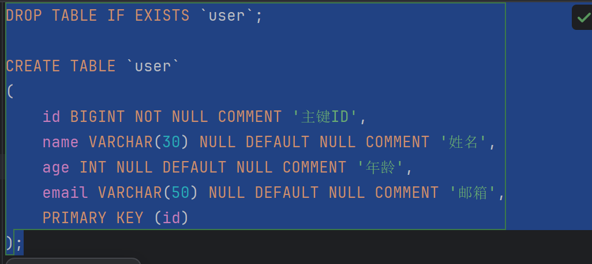

右键执行

还可以输入创建数据demo的语句


6.编写配置文件application

改为yml格式，yml格式是缩进敏感的，例如

```yml
url: jdbc:mysql://localhost:3306/数据库名
#url:[空格][代码]
```

### 编写实体类

7.编写实体类

model包存储实体类

mapper包存储mapper接口

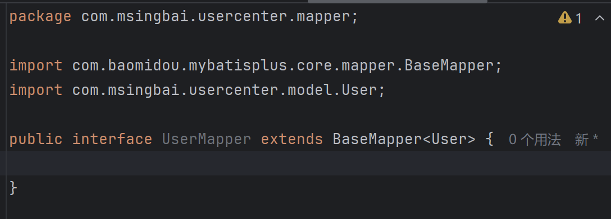


BaseMapper里有写好的增删查改等功能，直接继承


### 测试类

8.添加测试类，进行功能测试

在test文件夹编写SampleTest

发现没有Junit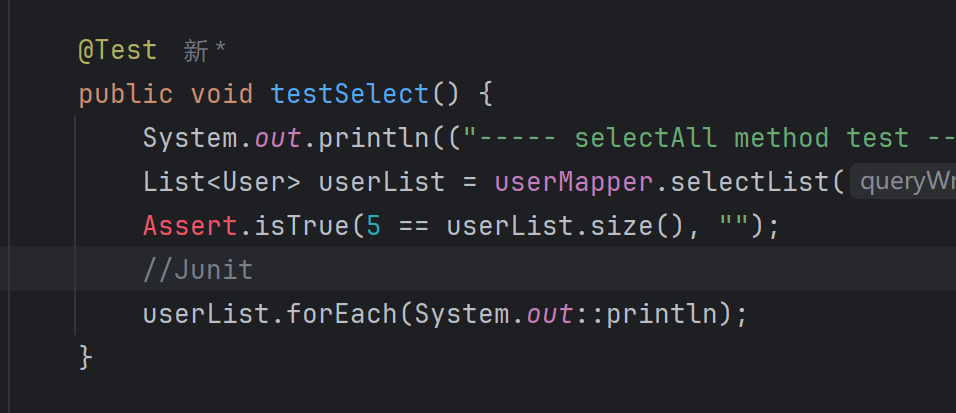

进入到Maven中心仓库[Maven Repository: Search/Browse/Explore](https://mvnrepository.com/)

复制Junit的pom

后来发现不是Junit没有 是直接在mybatis-plus引入的

```python
import com.baomidou.mybatisplus.core.toolkit.Assert;
```

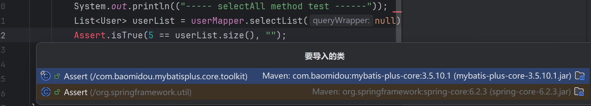

试运行test之后 报错

把报错信息发给kimi

发现是数据库连接出了问题，在配置文件中

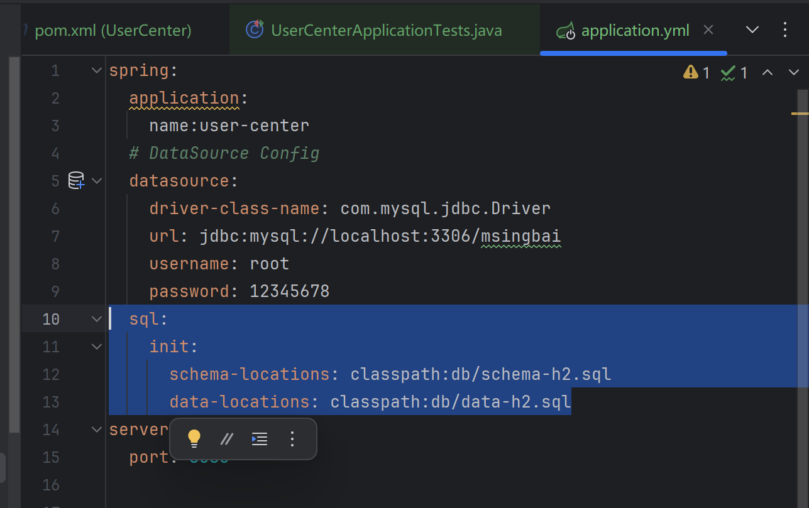

不用这段，用我们自己的数据库

删除后成功测试通过

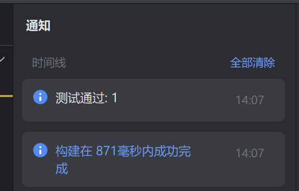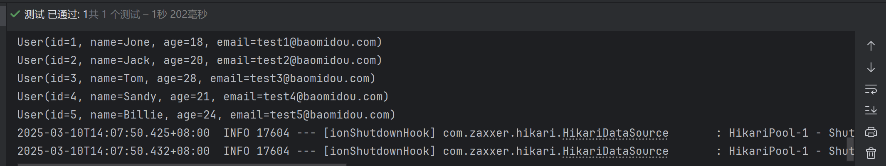

## 踩坑

1.遇到了一个问题，前端发送的账号和密码都是正确的，后端返回的数据库都是正确的

但是显示不存在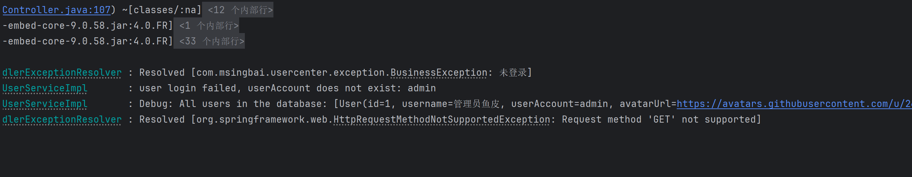

修了一个多小时，找不到原因 先不修了，因为我不是很懂后端的逻辑，不是自己一步步写的，去运动一会吧

*PS:上传本文时踩了一个新坑*

md文件虽然在本地用了相对路径，但是这个相对路径还是会因为前缀的路径号不够准确无法显示

暂时的解决办法：一键替换

不能每一篇都这么改，以后是要想个办法来完善它的

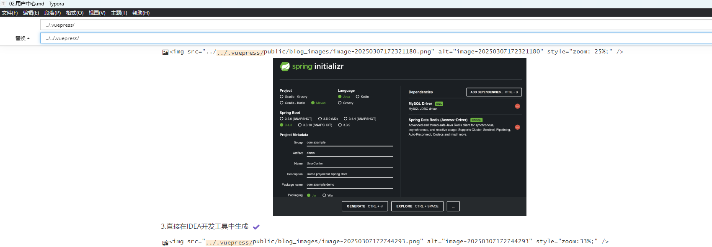

2.用了作者的完整前后端代码，仍然是user==null

决定暂时放弃此项目，去学习基础的前后端知识

*文字写于：广东*

