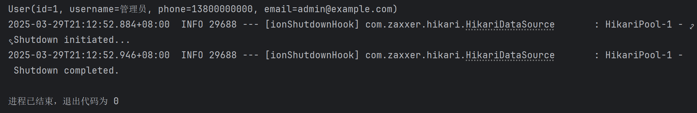

数据库表的初始化和mybatis的初始化配置

<!-- more -->

# 03.用户中心后端-2

​	创建好 **Mapper 接口** 和 **实体类** 后，接下来**配置数据源**

## **1. 配置数据源（DataSource）**

Spring Boot 需要知道如何连接数据库。在 `application.properties` 或 `application.yml` 中配置数据库信息：

### **示例（MySQL）**

```properties
# application.properties
spring.datasource.url=jdbc:mysql://localhost:3306/你的数据库名?useSSL=false&serverTimezone=UTC
spring.datasource.username=root
spring.datasource.password=123456
spring.datasource.driver-class-name=com.mysql.cj.jdbc.Driver
```

## **2. 配置MyBatis（如果是MyBatis）**

### **（1）添加MyBatis依赖**

在 `pom.xml` 中加入：

```xml
<dependency>
    <groupId>org.mybatis.spring.boot</groupId>
    <artifactId>mybatis-spring-boot-starter</artifactId>
    <version>3.0.3</version>  <!-- 使用最新版本 -->
</dependency>
```

运行 HTML

### **（2）告诉MyBatis你的Mapper接口在哪里**

在 `application.properties` 中指定扫描路径：

```properties
mybatis.mapper-locations=classpath:mapper/*.xml  # 如果你的Mapper XML文件在resources/mapper下
mybatis.type-aliases-package=com.example.entity  # 实体类所在的包
```

### **（3）在启动类上添加 `@MapperScan`**

```java
@SpringBootApplication
@MapperScan("com.example.mapper")  // 替换为你的Mapper接口所在包
public class DemoApplication {
    public static void main(String[] args) {
        SpringApplication.run(DemoApplication.class, args);
    }
}
```

**Mybatis劣势：**

- 简单CRUD操作需要编写SQL语句（单表仍需要编写Mapper接口方法和xml的sql）
- XML中有大量sql需维护
- mybatis自身功能有限

### *MyBatisPlus

MyBatisPlus，以下简称MP，基于MyBatis做拓展，本身无性能损耗

#### MyBatisPlus入门

**安装lombok**

> lombok作用：提高开发效率，通过注解形式使javabean生成get、set、有参数、无参数、toString等方法，无需手动实现。

**倘若不使用lombok可以使用的注解有：
注解介绍：**

**@Getter / @Setter**

> 可以作用在类上和属性上，放在类上，会对所有的非静态(non-static)属性生成Getter/Setter方法，放在属性上，会对该属性生成Getter/Setter方法。并可以指定Getter/Setter方法的访问级别。
>

**@EqualsAndHashCode**

> 默认情况下，会使用所有非瞬态(non-transient)和非静态(non-static)字段来生成equals和hascode方法，也可以指定具体使用哪些属性。
>

**@ToString**

> 生成toString方法，默认情况下，会输出类名、所有属性，属性会按照顺序输出，以逗号分割。
>

**@NoArgsConstructor, @RequiredArgsConstructor and @AllArgsConstructor**

> 无参构造器、部分参数构造器、全参构造器，当我们需要重载多个构造器的时候，Lombok就无能为力了。
>

**@Data**

> @ToString, @EqualsAndHashCode, 所有属性的@Getter, 所有non-final属性的@Setter和@RequiredArgsConstructor的组合，通常情况下，我们使用这个注解就足够了。

lombok在IDE的插件市场里可以安装，可在[Stable](https://projectlombok.org/features/)查询，然后在maven的pom.xml引入依赖

## 3.数据库表初始化

### 数据库需求分析

我们需要昵称、账号id、性别、用户头像、密码、个人信息

以及方便后台管理的用户状态、创建时间、权限等

```sql
create table user
(
    username     varchar(256)                       null comment '用户昵称',
    id           bigint auto_increment comment 'id'
        primary key,
    userAccount  varchar(256)                       null comment '账号',
    avatarUrl    varchar(1024)                      null comment '用户头像',
    gender       tinyint                            null comment '性别',
    userPassword varchar(512)                       not null comment '密码',
    phone        varchar(128)                       null comment '电话',
    email        varchar(512)                       null comment '邮箱',
    userStatus   int      default 0                 not null comment '状态 0 - 正常',
    createTime   datetime default CURRENT_TIMESTAMP null comment '创建时间',
    updateTime   datetime default CURRENT_TIMESTAMP null on update CURRENT_TIMESTAMP,
    isDelete     tinyint  default 0                 not null comment '是否删除',
    userRole     int      default 0                 not null comment '用户角色 0 - 普通用户 1 - 管理员',
    planetCode   varchar(512)                       null comment '星球编号'
)
    comment '用户';
```

4.测试我们写好的User和UserMapper是否能够实现查看数据库的功能

> mapper\SampleTest.java

```java
@SpringBootTest
public class SampleTest {

    @Resource
    private UserMapper userMapper;

    @Test
    public void testSelect() {
        System.out.println(("----- selectAll method test ------"));
        List<User> userList = userMapper.selectList(null);
//        Assert.isTrue(5 == userList.size(), "");
//        //断言，我觉得数据库列表大小是5，如果不是就报错
        userList.forEach(System.out::println);
    }

}
```

输出



查询成功

*文字写于：广东*