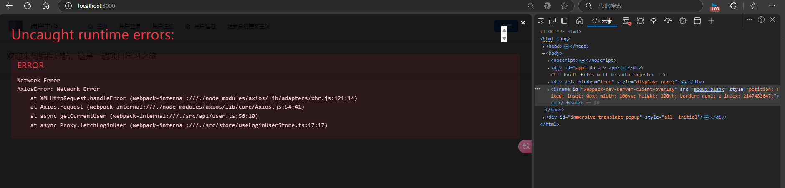
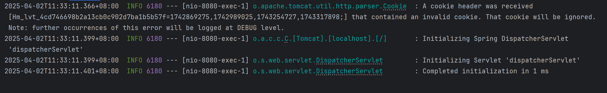
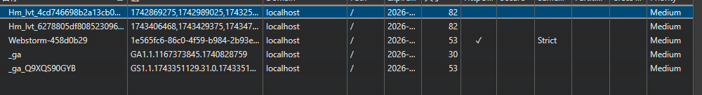
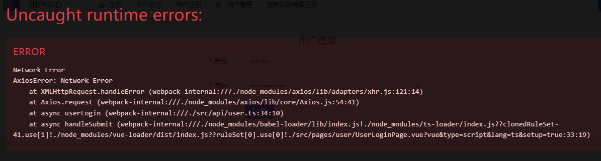

# 04.用户中心前端-Vue（二）

用户中心的**前端部分**debug

<!-- more -->   

上一次开发了Login功能，后端的数据库我们也调试好了

有了F12的开发者工具，我们可以开始debug

## Debug

### 进入首页会弹出报错



`<iframe>`是一个嵌入html的标签，可以加载一个独立的窗口

`id`可以看到这个元素的唯一标识符

 Axios 在尝试发送网络请求时遇到了问题

> at async getCurrentUser (webpack-internal:///./src/api/user.ts:56:10)
>
> at async Proxy.fetchLoginUser (webpack-internal:///./src/store/useLoginUserStore.ts:17:17)

这里指出了调用Axios的路径

看看`user.ts`文件

我们是这么写的

```tsx
export const getCurrentUser = async () => {
  return await myAxios.request({
    url: "/api/user/current",
    method: "GET",
  });
};
```

看看`useLoginUserStore.ts`

```ts
  //远程获取登录用户信息
  async function fetchLoginUser() {
    const res = await getCurrentUser();
    if (res.data.code === 0 && res.data.data) {
      loginUser.value = res.data.data;
    }
    // 测试代码
    // else {
    //   setTimeout(() => {
    //     loginUser.value = { username: "小黑子", id: 1 };
    //   }, 3000);
    // }
  }
```

这是一个远程获取登录用户信息的功能

#### 服务端显示



收到一个cookie，被忽视了

为什么要忽视呢。。？看看这个cookie写了什么

F12进到应用程序的cookie



查阅[解析百度联盟广告页的Hm_cookie机制-CSDN博客](https://blog.csdn.net/weixin_44732155/article/details/126731454)

>  包含百度联盟的广告页面都会有Hm_lpvt_xxxx以及Hm_lvt_xxx这类cookie;其具体含义和用途对于联盟使用者或许根本就不需要知道。
>
> Hm_lpvt_xxxxxxx 为当前时间戳(秒)
>
> Hm_lvt_xxx 为一串时间戳。最近的一次访问时间戳追加在后面，最多保留4个时间戳。可以通过关闭浏览器然后再访问相同页面查看其cookie值来验证。

和我们的项目好像没有关系 我们不管它

测试下登录

## 登录功能报错



也是网络请求失败

有可能是因为后端还没写这个api，所以请求无法实现

正好也要写后端 我下午把时间放到后端

*文字写于：广东*