# 05.用户中心后端-3

开始写后端部分的登录功能

<!-- more -->   

## 规整项目目录

新建`controller`、`service`、`utils`包

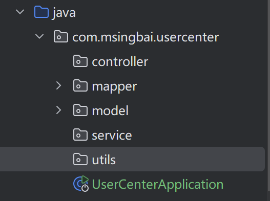

回顾一下后端的架构参考@[后端架构 ](../../06.后端/01.后端基础/02.后端的四层架构.md)

Spring Boot是五层

| 文件                  | 说明                                                         | 补充说明                                                     |
| :-------------------- | :----------------------------------------------------------- | :----------------------------------------------------------- |
| controller            | 请求层/控制层<br>(不做任何业务处理，只接收请求)              | 应用程序的入口点，负责接收用户的请求并返回响应。<br>调用Service层的方法来处理业务逻辑，并将结果返回给前端用户 |
| service               | 业务逻辑层<br>(专门用来编写业务逻辑，例如登录注册)           | 应用程序的核心，负责处理业务逻辑。<br>接收来自Controller层的请求，调用Mapper层执行数据库操作，并将处理结果返回给Controller层。<br>还可以包含一些复杂的业务逻辑处理，如事务管理、数据校验等。 |
| mapper / dao          | 数据访问层<br>(专门用于从数据库中对数据进行增删改查)         | 负责与数据库进行交互，执行数据的增删改查（CRUD）操作。<br>Mapper层通常包含了一系列的接口，这些接口定义了数据库操作的方法，而具体的SQL实现则位于Mapper XML文件中 |
| model / entity / pojo | 实体层<br>(定义了一些和数据库相关的数据模型、封装类)<br>(可能需要分层 entity、dto、vo......) | 定义数据模型，即数据库表的映射实体类。<br>实体类中包含了与数据库表相对应的属性和方法（如get和set方法，toString方法，有参无参构造函数） |
| utils                 | 存放一些工具类<br>(如：加密、格式转换、日期转换......<br>与业务关系不太大的类) | 存放一些工具类，如加密、格式转换、日期转换等，与业务逻辑关系不大的类 |
| static                | 写前后端不分离的项目时，放一些静态文件<br>(例如学习 Java web 时的一些前端页面)【删】 | 用于存放静态资源文件，如图片、CSS、JavaScript等。<br>在前后端分离的项目中，这些静态文件通常由前端框架或工具管理，因此可以考虑删除该目录 |

## 功能：用户注册

Mybatis-X插件，自动根据数据库生成

- **domain（实体对象）**

- **mapper（定义与数据库交互的接口。）**
    - **mapper.xml**（定义了mapper对象和数据库的关联，可以在里面自己写SQL。）**

- **service（包含常用的增删改查）**
    - **serviceImpl（具体实现service的业务逻辑）**

### 1.插件安装

`File` -> `Settings` -> `Plugins` ->搜索  `MyBatisX` -> `Install`

### 2.右键数据库user表

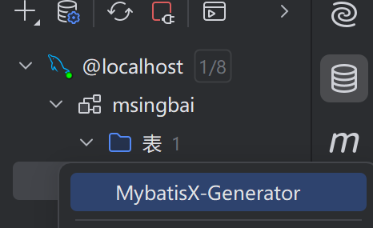

点击路径自动定位当前文件夹->`next`

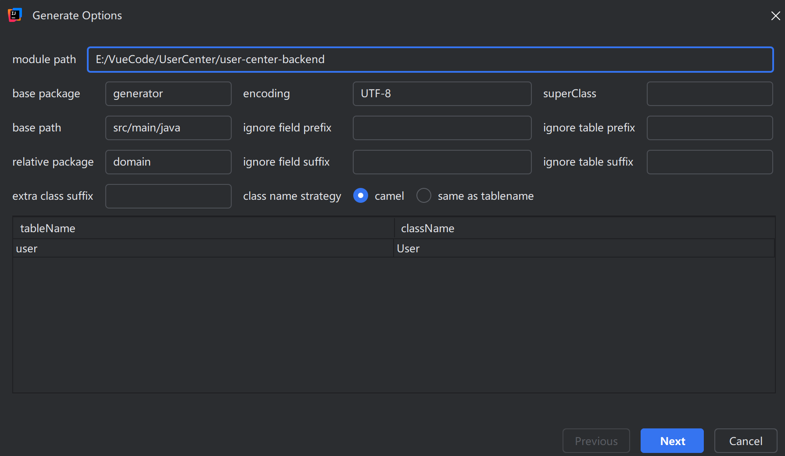

下一步

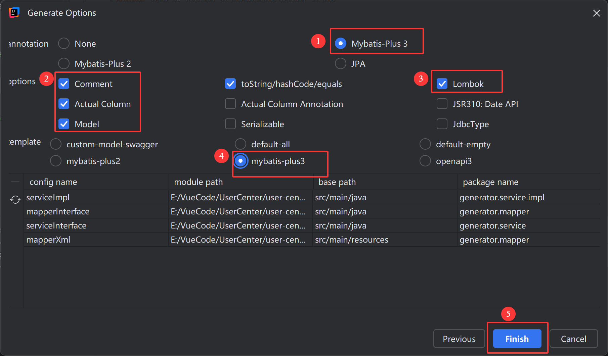

### 3.文档整合

文档生成在了generator包里，我们来整合，还是很方便的

domain放到model包

### 4.测试

鼠标放在UserService.java 文件的UserService上，按住Alt+Enter，选择创建测试

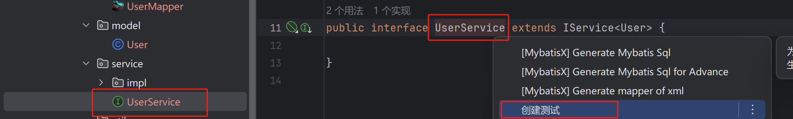

在测试类中添加如下代码

```java
    @Resource
    private UserService userService;

    @Test
    void testAddUser(){
        User user = new User();
        userService.save(user);
    }
```

安装插件GenerateAllSetter

> 一键调用一个对象的所有的set方法,get方法等
> 在方法上生成两个对象的转换

在user上Alt+Enter

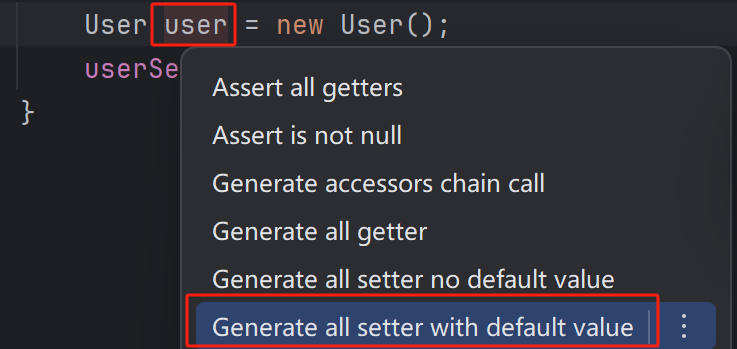

生成

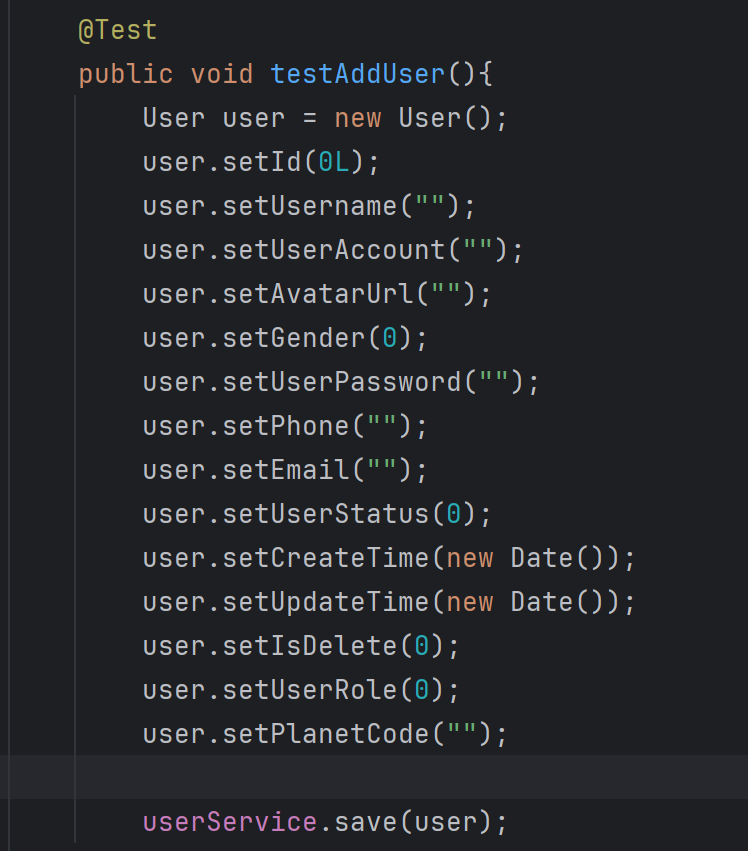

还是要删除挺多的，像是时间，密码，这些不用自动生成，先删除掉

执行测试

有报错

`org.springframework.jdbc.BadSqlGrammarException: Error updating database.  Cause: java.sql.SQLSyntaxErrorException: Unknown column 'user_account' in 'field list'`

#### 问题解决（debug）

- **问题原因**：MyBatisX自动开启从经典数据库列名 `A_COLUMN`（下划线命名）到经典 Java 属性名 `aColumn`（驼峰命名）的类似映射。

- **问题解决**：在 `yml` 文件中添加如下配置：

  yaml复制

  ```yaml
  mybatis-plus:
    configuration:
      map-underscore-to-camel-case: false
  ```

- **官网描述**：[使用配置 | MyBatis-Plus](https://baomidou.com/reference/#mapunderscoretocamelcase)

测试通过✔

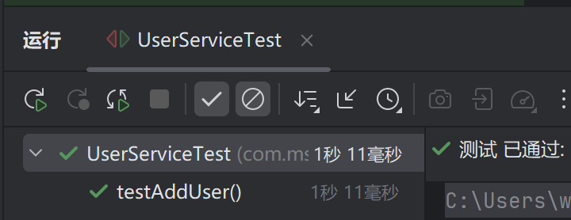

### 详细设计

1. 用户在前端传递账户和密码、以及校验码（todo）
2. 校验账户的账户、密码、检验密码是否符合要求
   - 账户不小于4位
   - 密码不小于8位
   - 账户不能重复
   - 账户不包含特殊字符
   - 密码和校验密码相同
3. 对密码进行加密（避免明文存储在数据库中）
4. 向数据库插入用户数据

### 接口测试开发

1.`src/main/java/com/msingbai/usercenter/service/UserService.java`编写`userRegister`方法并实现

```java
boolean userRegister(String userAccount, String userPassword, String checkPassword);
```

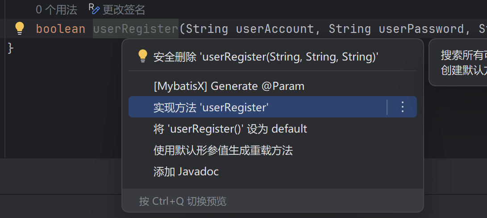

Alt+Enter 在Impl中实现

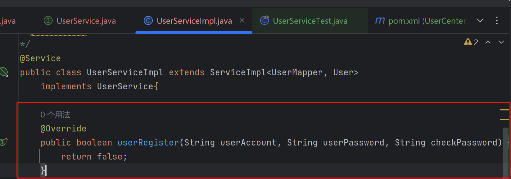

2.引入 Apache Commons Lang 3 库，这个库能够帮助我们进行字符串缩写、后缀判断、首字母转换、居中处理、去除特殊字符等操作

3.实现UserServiceImpl

完整代码

```java
package com.msingbai.usercenter.service.impl;

import com.baomidou.mybatisplus.core.conditions.query.QueryWrapper;
import com.baomidou.mybatisplus.extension.service.impl.ServiceImpl;
import com.msingbai.usercenter.model.User;
import com.msingbai.usercenter.service.UserService;
import com.msingbai.usercenter.mapper.UserMapper;
import jakarta.annotation.Resource;
import org.apache.commons.lang3.StringUtils;
import org.springframework.stereotype.Service;
import org.springframework.util.DigestUtils;

import java.util.regex.Matcher;
import java.util.regex.Pattern;


/**
* @author windows_yk
* @description 针对表【user(用户)】的数据库操作Service实现
* @createDate 2025-04-02 16:38:14
*/
@Service
public class UserServiceImpl extends ServiceImpl<UserMapper, User>
    implements UserService{

    @Resource
    private UserMapper userMapper;

    @Override
    public long userRegister(String userAccount, String userPassword, String checkPassword) {
        /* 1.检验 */
        if (StringUtils.isAnyBlank(userAccount, userPassword, checkPassword)) {
            return -1;
        }
        if (userAccount.length() < 4){
            return -1;
        }
        if (userPassword.length() < 8 || checkPassword.length() < 8){
            return -1;
        }

        //账户不能包含特殊字符
        String vaildateRegExp = "\\pP|\\pS|\\s+";
        Matcher matcher = Pattern.compile(vaildateRegExp).matcher(userAccount);
        if (!matcher.find()){
            return -1;
        }

        //校验密码是否相同
        if(!userPassword.equals(checkPassword)){
            return -1;
        }

        //账户不能重复
        QueryWrapper<User> queryWrapper = new QueryWrapper<>();
        queryWrapper.eq("userAccouunt", userAccount);
        Long count = userMapper.selectCount(queryWrapper);
        if (count == 0){
            return -1;
        }

        /* 2.加密 */
        final String SALT = "yupi";
        String encryptPassword = DigestUtils.md5DigestAsHex((SALT + userPassword).getBytes());

        /* 3.插入数据 */
        User user = new User();
        user.setUserAccount(userAccount);
        user.setUserPassword(encryptPassword);
        boolean saveResult = this.save(user);
        if (!saveResult){
            return -1;
        }

        return user.getId();
    }
}
```

`src/test/java/com/msingbai/usercenter/UserCenterApplicationTests.java`编写测试，执行是否加密成功

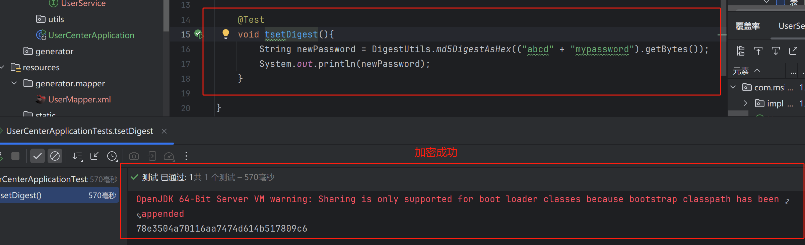

### 注册模块的单元测试

在Impl文件中执行注册的自动生成测试代码功能

`src/main/java/com/msingbai/usercenter/service/impl/UserServiceImpl.java`

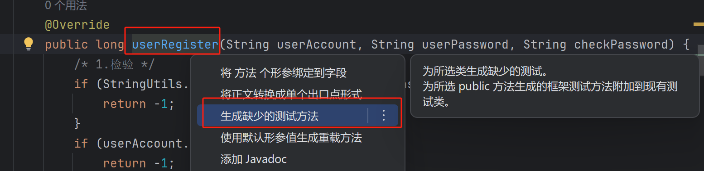

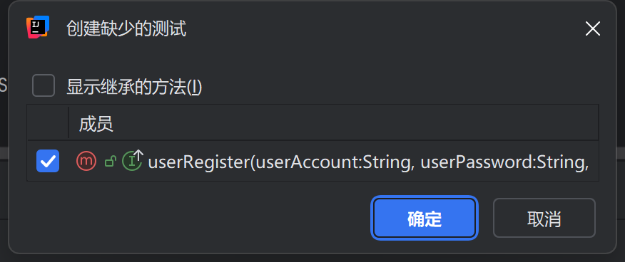

在`src/test/java/com/msingbai/usercenter/service/UserServiceTest.java`中编写测试代码

- 验证在不同输入条件下，用户注册功能是否按预期返回正确的结果。
- **覆盖多种场景**：包括账号长度不足、密码为空、密码不一致、账号包含特殊字符等。

**小Tip**

Ctrl+Shift+/是块注释/**/

```java
    @Test
    void userRegister() {

        /*测试用例1,密码位空*/
        String userAccount = "yupi";
        String userPassword = "";
        String checkPassword = "123456";
        long result = userService.userRegister(userAccount, userPassword, checkPassword);
        Assertions.assertEquals(-1, result);//返回-1 注册失败

        /* 测试用例2，账号长度不足 */
        userAccount = "yu";
        result = userService.userRegister(userAccount, userPassword, checkPassword);
        Assertions.assertEquals(-1, result);

        /*测试用例3，密码长度不足*/
        userAccount = "yupi";
        userPassword = "123456";
        result = userService.userRegister(userAccount, userPassword, checkPassword);
        Assertions.assertEquals(-1, result);

        /* 测试用例4，账号包含特殊字符 */
        userAccount = "yu pi";
        userPassword = "12345678";
        result = userService.userRegister(userAccount, userPassword, checkPassword);
        Assertions.assertEquals(-1, result);

        /* 测试用例5，密码不一致 */
        checkPassword = "123456789";
        result = userService.userRegister(userAccount, userPassword, checkPassword);
        Assertions.assertEquals(-1, result);

        /*测试用例6，测试一个已有的账户名，若已有则返回-1*/
        userAccount = "dogYupi";
        checkPassword = "12345678";
        result = userService.userRegister(userAccount, userPassword, checkPassword);
        Assertions.assertEquals(-1, result);

        /*注册成功*/
        userAccount = "yupi";
        result = userService.userRegister(userAccount, userPassword, checkPassword);
        Assertions.assertTrue(result > 0);
    }
}
```

遇到了报错

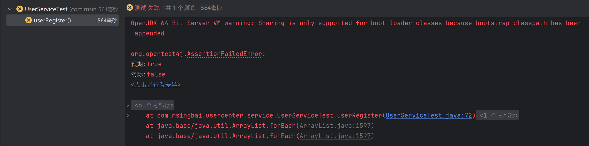

在测试中，`Assertions.assertTrue(result > 0)`断言失败。`result`的值小于或等于0，而预期它应该大于0。

修改Impl的代码，使得每个测试返回的result都不一样

改成-11 -12 -13等等，一个个匹配，方便我们定位实际错误代码

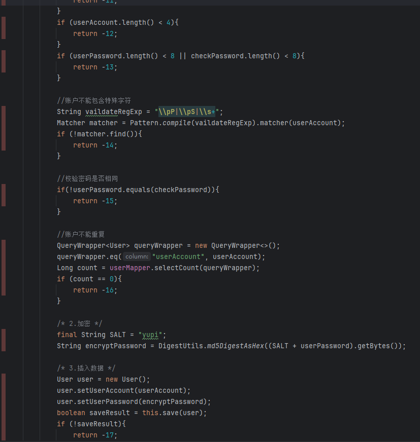

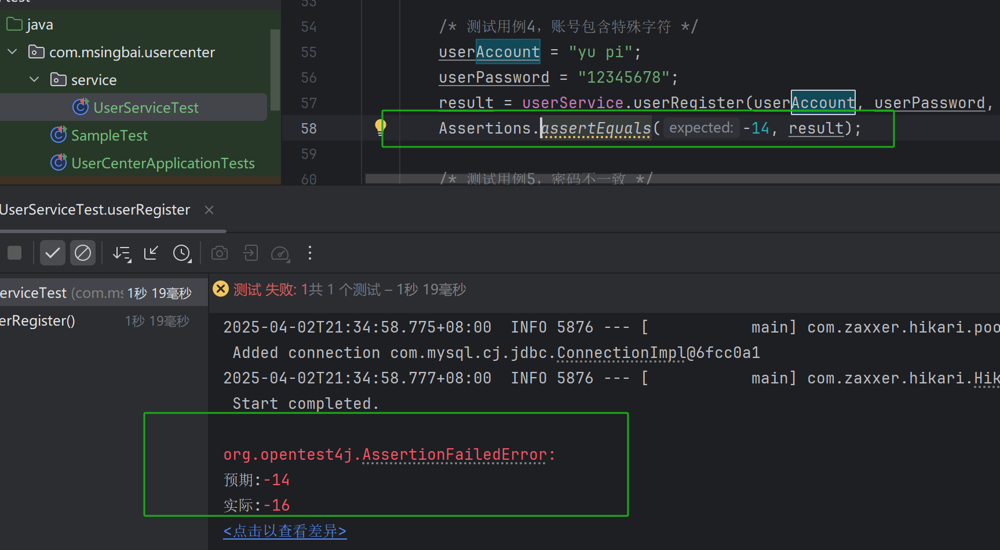

#### **debug**

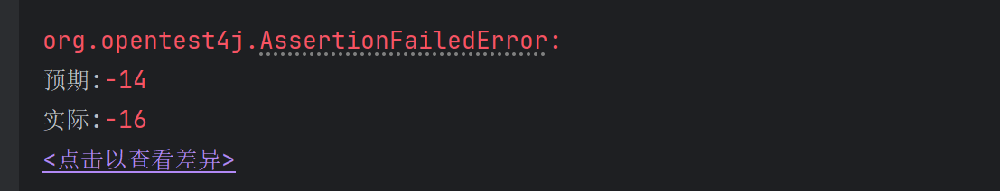

-14的过滤特殊字符的逻辑写错了

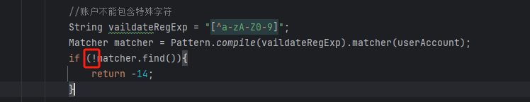

应该是如果发现了特殊字符，返回-14

去掉!，改为判断true的逻辑，执行成功

**debug**

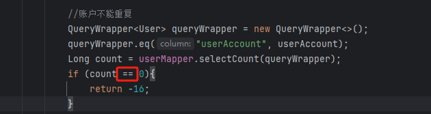

我的数据库里没有dogYupi，它也返回了-16

是代码逻辑错了，count是查询数据库里有多少个值，应该不为0时，return-16

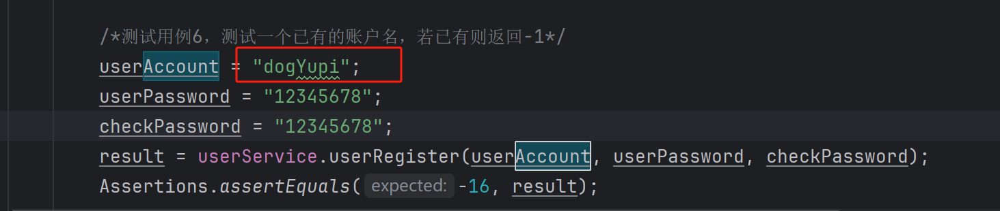

修改后，达到预期效果

#### 测试完成

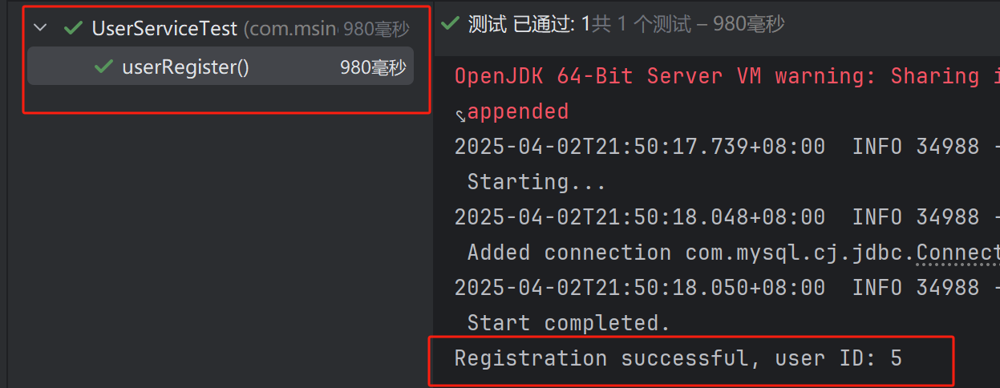

至此，全部用例测试成功


*文字写于：广东*