# 06.用户中心后端-4

后端部分的登录功能

<!-- more -->   

## 功能：用户登录

### 详细设计

**登录接口**

1. 接收参数：用户账户、密码
2. 请求类型：POST
3. 请求体：JSON格式的数据
4. 返回值：用户信息

**逻辑**

1. 检验用户账户和密码是否合法
   - 账户和密码不能是空
   - 账户不小于4位
   - 密码不小于8位
   - 账户不包含特殊字符
2. 检验密码是否输入正确，与数据库中的密文密码对比
3. 用户脱敏，隐藏敏感信息，防止数据库中的字段泄露
4. 记录用户的登录态（session），将其存到服务器上（用后端SpringBoot框架封装的服务器tomcat去记录）
   - cookie
5. 返回安全脱敏的用户信息


**编写代码**

1. 在`UserService`编写登录代码，写如下代码，Alt+Enter实现方法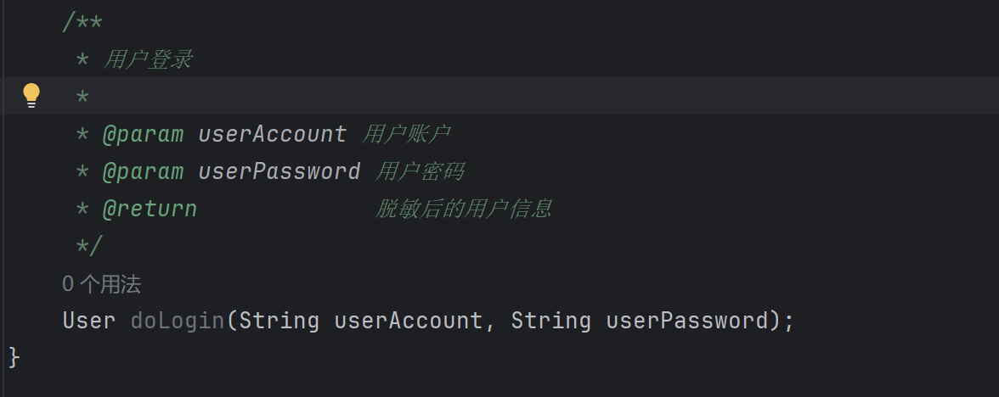

接下来我们要实现加密

### md5加密&盐值

（一）MD5摘要算法：

- MD5信息摘要算法广泛使用的密码散列函数
- MD5可以产生一个128位的散列值用于唯一标识源数据
- 项目中通常使用MD5作为敏感数据的加密算法

（二）特点：

- 压缩性，MD5生成的摘要长度固定
- 抗修改性，源数据哪怕有一个字节变化，MD5也会有巨大差异
- 不可逆，无法通过MD5反向推算源数据
- 计算速度快

MD5的加密也会在某些情景下变得易破解

**彩虹表：**由于MD5的计算速度很快，攻击者可以预先计算出大量常见密码的MD5值，形成彩虹表，用于快速破解密码。

**碰撞攻击：**存在不同的输入数据生成相同哈希值的可能性

MD5对应的加密之后的信息能够通过**彩虹表**得到解密，这让数据并不够安全，那怎么办呢？

（三）MD5+盐值

混淆加密，例如我们最初想要加密的字符串是test

我们在加密的时候可以给test加点“盐”

例如我们通过这个简单的算法：

```java
public static String md5Digest(String source,Integer salt){
    //source:需要加密的原始字符串。 salt：一个整数值，用于逐字符加盐。
        char[] ca=source.toCharArray();//将source转化为字符数组
        for(int i=0;i<ca.length;i++){
            ca[i]=(char)(ca[i]+salt);//给每个字符加上盐值
        }
        String target=new String(ca);//重新组合字符串变成target
        String md5=DigestUtils.md5Hex(target);//进行MD5加密
        return md5;
    }
```

这样就完成了md5+盐值混淆之后的数据

### **加密功能**

final是java的一种关键词，用于修饰内容表示其不可变。

将表示盐值的变量`private static final String SALT = "yupi";`

写在类的里面，方法的前面

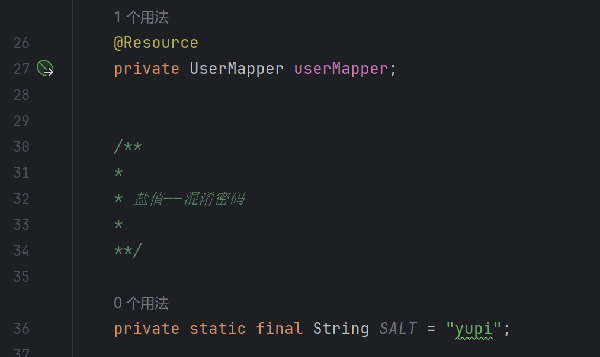

**注解 @Slf4j**

在类前加一个@Slf4j注解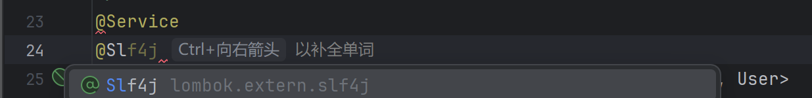

@Slf4j 是 Lombok 提供的一种注解，用于在类中自动生成一个名为 log 的日志对象。通过使用 @Slf4j 注解，可以方便地在代码中使用日志功能，而无需手动创建和初始化日志对象。

注解示例：

```java
 @Slf4j
 public class LogExample {
 }
```

在上述示例中，LogExample类被标记为使用 `@Slf4j` 注解，它将自动创建一个名为 `log` 的日志对象。

可见lombok的官方文档：[Slf4j (Lombok)](https://projectlombok.org/api/lombok/extern/slf4j/Slf4j)

### 逻辑编写

可以从注册功能把代码搬过来修改，主要是去掉了checkPassword

和注册不同的是，这里返回的是null，有不完美的地方，不能反馈具体的错误码

```java
    @Override
    public User doLogin(String userAccount, String userPassword) {
        /* 1.检验 */
        if (StringUtils.isAnyBlank(userAccount, userPassword)) {
            return null;//空白
        }
        if (userAccount.length() < 4){
            return null;
        }
        if (userPassword.length() < 8 ){
            return null;
        }

        //账户不能包含特殊字符
        String vaildateRegExp = "[^a-zA-Z0-9]";
        Matcher matcher = Pattern.compile(vaildateRegExp).matcher(userAccount);
        if (matcher.find()){
            return null;
        }

        /* 2.加密 */
        String encryptPassword = DigestUtils.md5DigestAsHex((SALT + userPassword).getBytes());
        //账户不能重复
        QueryWrapper<User> queryWrapper = new QueryWrapper<>();
        queryWrapper.eq("userAccount", userAccount);
        queryWrapper.eq("userPassword", encryptPassword);
        User user = userMapper.selectOne(queryWrapper);
        if (user == null){
            log.info("[UserCenter]User login failed,userAccount cannot match userPassword");
            return null;
        }
    return user;
    }
```

上面查询用户是否存在的功能存在问题，因为我们设置了isDelete属性，`0`表示存在状态，`1`表示删除状态，这是一种叫做逻辑删除的数据管理方法

> 通过在数据库中标记记录为“已删除”而非物理删除，来保留数据的历史痕迹，同时确保查询结果的整洁性。

在MyBatis-Plus中提供了此支持

[逻辑删除支持 | MyBatis-Plus](https://baomidou.com/guides/logic-delete/#步骤-1-配置全局逻辑删除属性)

MyBatis-Plus 的逻辑删除功能会在执行数据库操作时自动处理逻辑删除字段。以下是它的工作方式：

- **插入**：逻辑删除字段的值不受限制。
- **查找**：自动添加条件，过滤掉标记为已删除的记录。
- **更新**：防止更新已删除的记录。
- **删除**：将删除操作转换为更新操作，标记记录为已删除。

例如：

- **删除**：`update user set deleted=1 where id = 1 and deleted=0`
- **查找**：`select id,name,deleted from user where deleted=0`

**配置**：

1.在 `application.yml` 中配置 MyBatis-Plus 的全局逻辑删除属性：

```yml
mybatis-plus:
  global-config:
    db-config:
      logic-delete-field: deleted # 全局逻辑删除字段名
      logic-delete-value: 1 # 逻辑已删除值
      logic-not-delete-value: 0 # 逻辑未删除值
```

2.在User实体类中使用 `@TableLogic` 注解

```java
import com.baomidou.mybatisplus.annotation.TableLogic;

public class User {
    // 其他字段...

    @TableLogic
    private Integer isDelete;
}
```

## 后端登录态管理（Cookie和Session）

在前端会有一个服务端发给客户端的凭证，叫做Cookie：[Cookie是什么 ](../../06.后端/01.后端基础/04.cookie是什么.md)

方便服务端在接收客户端请求的时候认出客户端

**Session** 是存储在服务器端的用户会话数据。可以存储用户在网站上的临时状态，例如登录信息、购物车数据等。

当用户访问一个网站时，服务器会为该用户创建一个唯一的会话标识符（Session ID），并通过 **Cookie** 或其他方式（如URL参数）将该标识符发送给客户端。客户端在后续请求中会携带这个标识符，服务器通过它来识别用户并恢复对应的会话数据。

- **Cookie 存储了 Session ID**：

在大多数情况下，Session 的核心机制依赖于 Cookie。

服务器会将 Session ID 存储在 Cookie 中，并通过 Cookie 将它发送给客户端。

客户端在后续请求中会携带这个 Cookie，服务器通过解析 Cookie 中的 Session ID 来找到对应的会话数据。

- **Session 数据存储在服务器端**：

Cookie 本身并不存储用户的具体会话数据，而是存储一个标识符（Session ID）。真正的会话数据（如用户登录状态、购物车信息等）存储在服务器端，通常以文件或数据库的形式保存。

Cookie 和 Session 是一种协作关系。Cookie 负责在客户端存储和传递标识符，而 Session 负责在服务器端管理用户的具体数据。两者结合使用，可以实现用户状态的持久化和管理。

### 代码编写

1.在`UserService`与`UserServiceImpl`的dologin方法中添加`HttpServletRequest request`

> **HttpServletRequest是Java Servlet API中的一个接口，它封装了客户端发送的HTTP请求。当客户端通过HTTP协议访问服务器时，请求中的所有信息，包括请求头、参数等，都被封装在HttpServletRequest对象中。**

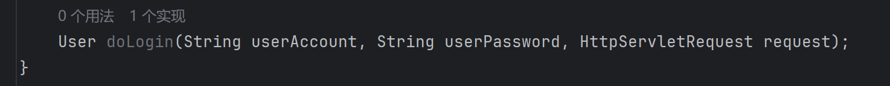

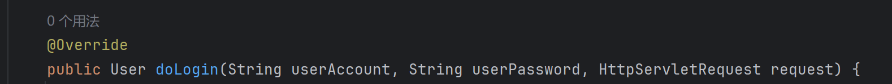

2.在Impl中编写代码

- 记录用户的登录态（tip：打出/**+Enter会有带参数的注释）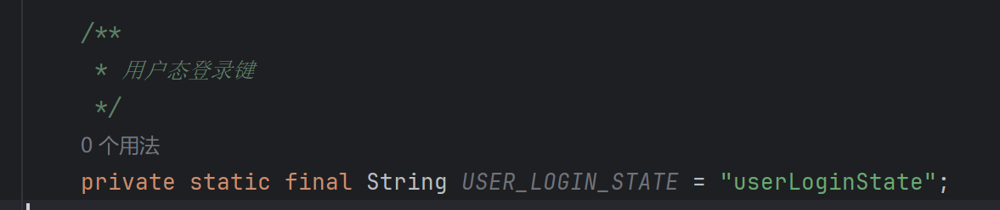

  *定义用户登录态*

  ------

  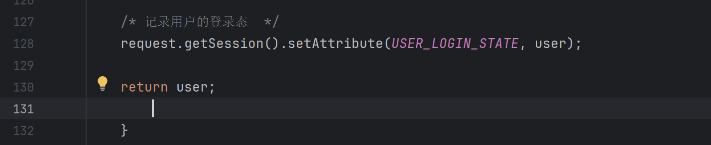

  *编写记录用户的登录态代码*

  ------

  **用户脱敏**

  脱敏的目的是避免将用户的所有信息直接暴露给调用方。例如，用户的密码、身份证号等敏感信息通常不会包含在返回的脱敏对象中。

  - `User safetyUser = new User();` 通过创建一个新的用户对象，只填充部分字段（如 `id`、`username`、`userAccount` 等），而不包含敏感信息（如密码）。
  - 这种方式确保了返回的用户对象是“干净的”，只包含前端需要的信息。

  **实现：**

  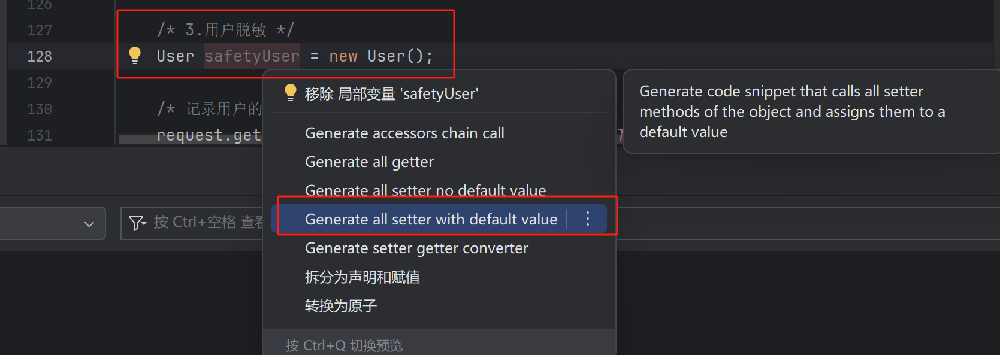

  修改生成好的代码

  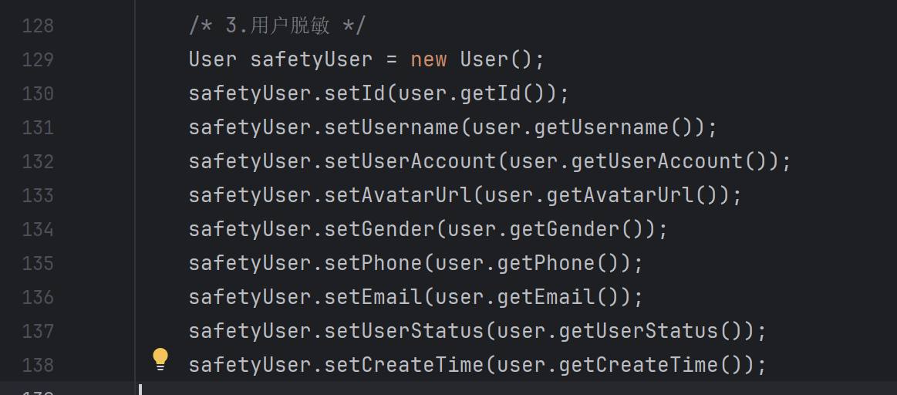

  记得将这一步的`user`改为`safetyUser`

  ```java
      /* 4.记录用户的登录态  */
      request.getSession().setAttribute(USER_LOGIN_STATE, user);
  ```

  ```java
      /* 3.用户脱敏 */
      User safetyUser = new User();
      safetyUser.setId(user.getId());
      safetyUser.setUsername(user.getUsername());
      safetyUser.setUserAccount(user.getUserAccount());
      safetyUser.setAvatarUrl(user.getAvatarUrl());
      safetyUser.setGender(user.getGender());
      safetyUser.setPhone(user.getPhone());
      safetyUser.setEmail(user.getEmail());
      safetyUser.setUserStatus(user.getUserStatus());
      safetyUser.setCreateTime(user.getCreateTime());
  
  
      /* 4.记录用户的登录态  */
      request.getSession().setAttribute(USER_LOGIN_STATE, safetyUser);
  
      return safetyUser;
  ```

## 后端接口开发及测试

**控制层Controller封装请求**

在`application.yml`指定一个全局接口api

```yml
server:
  servlet:
    context-path: /api
```

原本访问 `http://localhost:8080/users` 的请求，现在会改变为 `http://localhost:8080/api/users`

**Controller** 负责处理客户端的请求，并将处理结果返回给客户端。

- 它会接收来自客户端的 HTTP 请求（如 GET、POST、PUT、DELETE 等）。
- 通过注解（如 @RequestMapping、@GetMapping、@PostMapping 等）来定义哪些请求路径和方法会被哪个 Controller 方法处理。
- 它可以接收请求参数（如表单数据、JSON 数据等），并将其传递给业务逻辑层。
- Controller 方法会根据业务逻辑的处理结果，返回一个响应给客户端。响应可以是 HTML 页面、JSON 数据、XML 数据等。

### 1. 新建Controller类

Controller包下新建UserController.java

- 添加 `@RestController` 注解（这个类中所有的请求的接口返回值，相应的数据类型都是 `application/json`）
- 添加 `@RequestMapping` 注解（定义请求的路径）

```java
@RestController
@RequestMapping("/user")
public class UserController {
    
}
```

### 2. 下载插件

- 下载插件 `Auto filling Java call arguments` 【自动填充 java 参数】（安装完成记得重启）

### 3. 编写注册请求

UserController 类中编写 register 请求

- 编写注册请求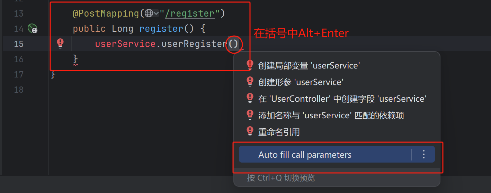自动填充了`userAccount, userPassword, checkPassword`

  - 封装专门用来接收请求参数的对象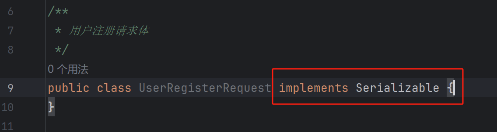继承`Serializable(序列化)`

    序列化是将 Java 对象转换为字节流的过程，以便在网络上传输或在磁盘上存储

    继承后表明该类的对象可以被序列化，我们的**`UserRegisterRequest`**是用于封装用户注册请求的参数的

  添加参数，打上`@Date`注解（是lombok提供的一个注解，能够简化Java类的编写，自动生成常见的get、set方法

- 回到UserController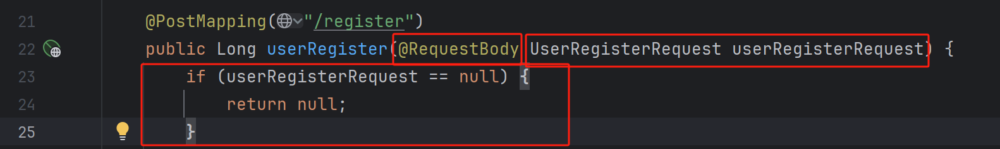 引用UserRegisterRequest;打上@RequestBody注解（使得UserRegisterRequest与前端传来的参数能够对应）；写一个判断是否为空的语句

- 完善代码逻辑

  ```java
      @PostMapping("/register")
      public Long userRegister(@RequestBody UserRegisterRequest userRegisterRequest) {
          if (userRegisterRequest == null) {
              return null;
          }
          String userAccount = userRegisterRequest.getUserAccount();
          String userPassword = userRegisterRequest.getUserPassword();
          String checkPassword = userRegisterRequest.getCheckPassword();
          if (StringUtils.isAnyBlank(userAccount, userPassword, checkPassword)) {
              return null;
          }
          return userService.userRegister(userAccount, userPassword, checkPassword);
      }
  ```

### 4. 编写登录请求

- 复制注册模块的请求，进行修改(将UserService中的doLogin方法重构为**userLogin**方法)

```java
    @PostMapping("/login")
    public User userLogin(@RequestBody UserLoginRequest userLoginRequest,HttpServletRequest request) {
        if (userLoginRequest == null) {
            return null;
        }
        String userAccount = userLoginRequest.getUserAccount();
        String userPassword = userLoginRequest.getUserPassword();
        if (StringUtils.isAnyBlank(userAccount, userPassword)) {
            return null;
        }
        return userService.userLogin(userAccount, userPassword, request);
    }
```

- 在model.request包中新建UserRegisterLogin类，只需要复制UserRegisterRequest类，删除其中的checkPassword重构即可

### 5.测试

创建一个HTTP Client，验证和测试服务器端的API或Web服务是否按预期工作。

它会模拟客户端请求，通过发送（GET、POST、PUT、DELETE等），验证API、服务器的响应是否符合预期。

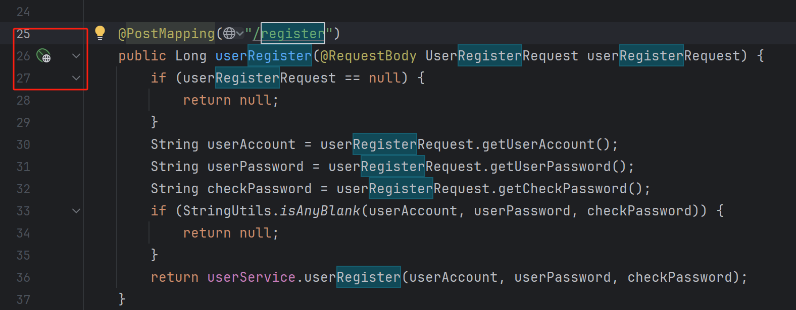

生成一个POST请求，添加参数进行测试

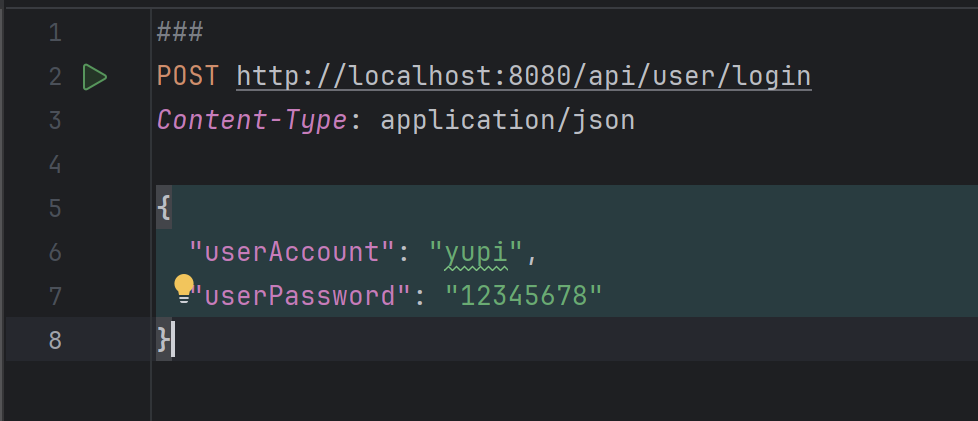以Debug的方式启动项目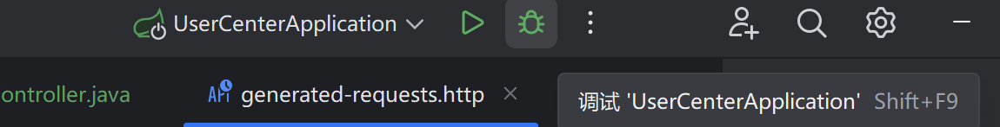

**打断点测试**（断点测试使程序在执行到该位置时暂停。）

点击左侧空白处打断点

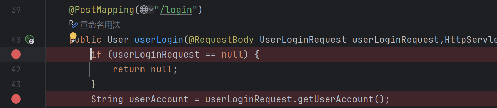

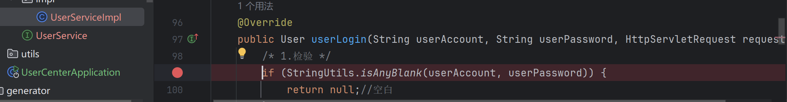

回到HTTP Client发送请求

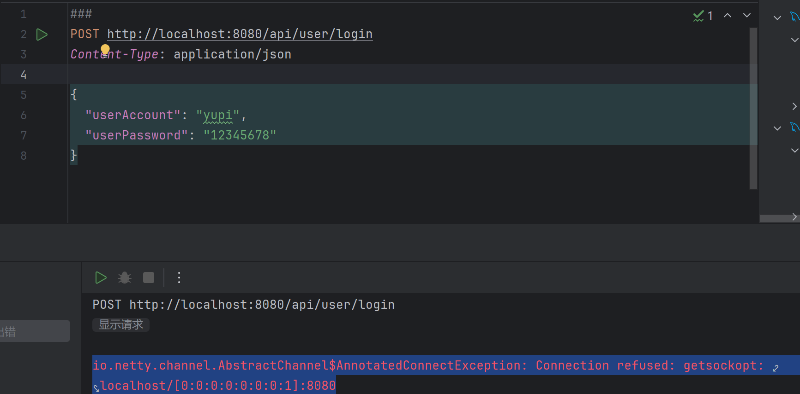

报错了( ´•̥̥̥ω•̥̥̥` )

原因是不知道什么时候在Class.java里面打了一个断点，导致出现了内部异常断点，导致程序执行异常。取消即可

**测试完成**ヾ(*´∀ ˋ*)ﾉ

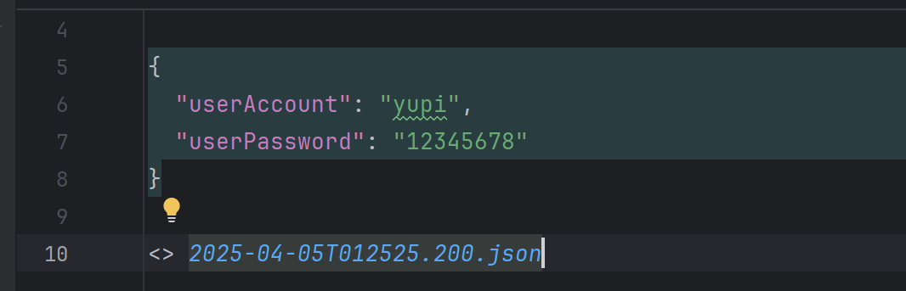

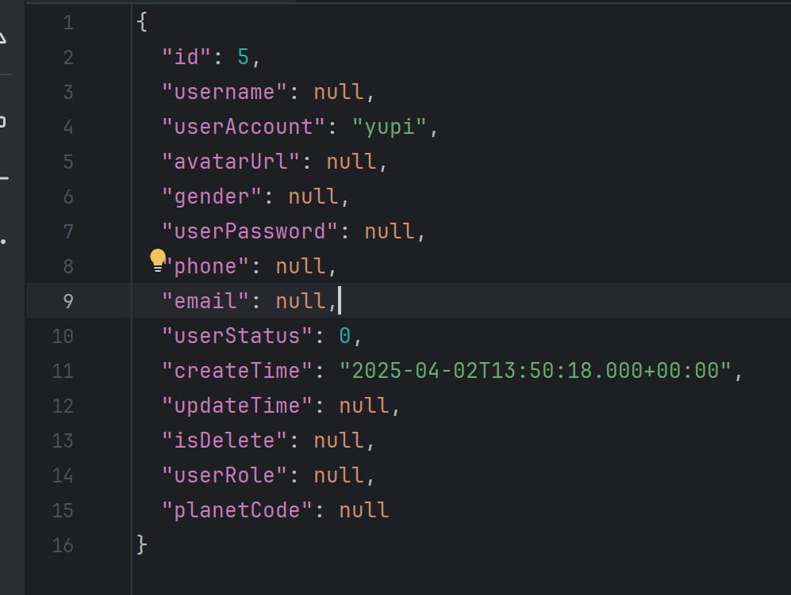

再测一下逻辑删除

- 再数据库中把yupi的isDelete字段改为1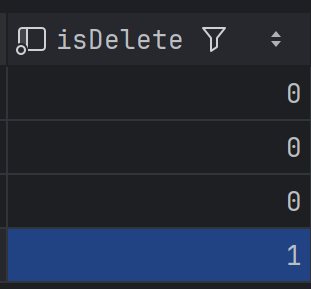
- 启动POST请求，测试完成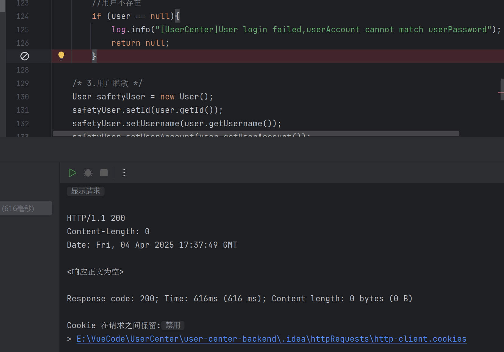

*文字写于：广东*