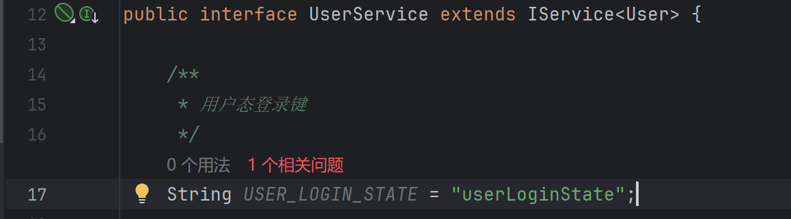
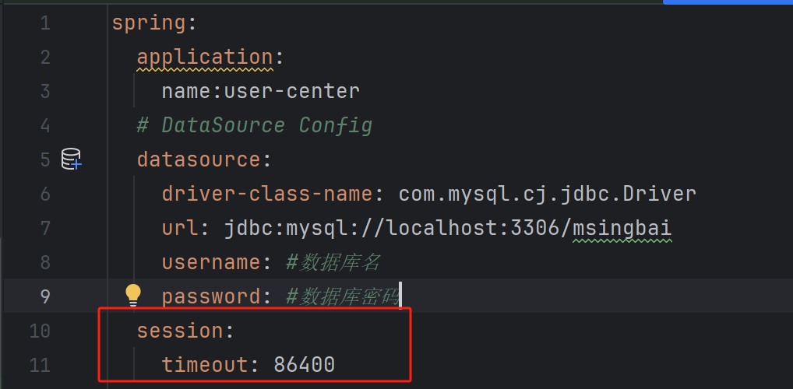
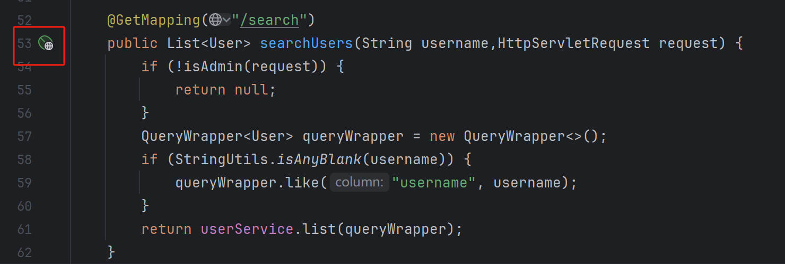

# 07.用户管理（前后端）

用户中心系统的**管理功能**，包含前后端

<!-- more -->   

需求设计

- 1.查询用户（根据用户名查询）
- 2.删除用户

## 后端开发

1.`UserController`里编写查询用户请求

```java
    @GetMapping("/search")
    public List<User> searchUsers(String username) {
        QueryWrapper<User> queryWrapper = new QueryWrapper<>();
        if (StringUtils.isAnyBlank(username)) {
            queryWrapper.like("username", username);
        }
        return userService.list(queryWrapper);
    }
```

2.`UserController`里编写删除用户请求

```java
    @PostMapping("delete")
    public boolean deleteUser(@RequestBody long id) {
        if (id <= 0) {
            return false;
        }
        return userService.removeById(id);
    }
```

3.我们还需要一个管理人员的检验，使得接口需要获得权限后方可调用

在`UserServiceImpl`中的用户脱敏加入一行

```java
safetyUser.setUserRole(user.getUserRole());
```

我们需要实现调用的方法，在UserService文件里加入Impl写过的用户登录态键



在`UserController`里写判断角色权限的方法

```java
    /**
     *
     * 是否为管理员
     */
    private boolean isAdmin(HttpServletRequest request) {
        //仅管理员可查询
        Object userObj = request.getSession().getAttribute(UserService.USER_LOGIN_STATE);
        User user = (User) userObj;
        return user != null && user.getUserRole() == 1;
    }
```

在delete和search接口中调用isAdmin

```java
    @GetMapping("/search")
    public List<User> searchUsers(String username,HttpServletRequest request) {
        if (!isAdmin(request)) {
            return null;
        }
        QueryWrapper<User> queryWrapper = new QueryWrapper<>();
        if (StringUtils.isAnyBlank(username)) {
            queryWrapper.like("username", username);
        }
        return userService.list(queryWrapper);
    }

    @PostMapping("/delete")
    public boolean deleteUser(@RequestBody long id, HttpServletRequest request) {
        if(!isAdmin(request)) {
            return false;
        }
        if (id <= 0) {
            return false;
        }
        return userService.removeById(id);
    }
```

4.在application.yml配置文件里增加session的失效时间



5.测试

在`UserController`中创建一个新的HTTP Client执行GET请求


*文字写于：广东*