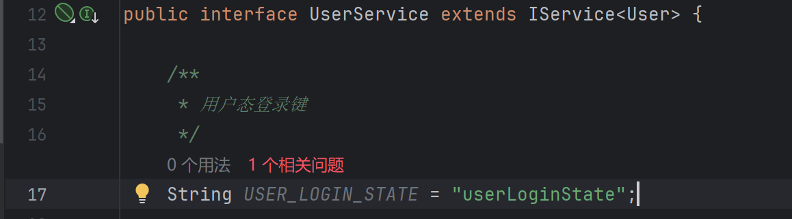
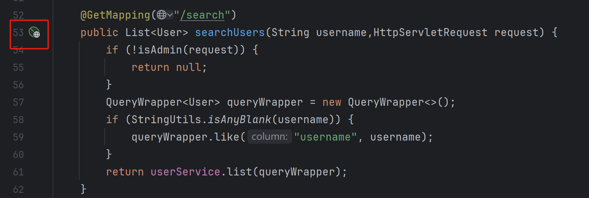

# 07.管理模块（后端）

用户中心系统的**管理功能**

<!-- more -->   

需求设计

- 1.查询用户（根据用户名查询）
- 2.删除用户

## 后端开发

1.`UserController`里编写查询用户请求

```java
    @GetMapping("/search")
    public List<User> searchUsers(String username) {
        QueryWrapper<User> queryWrapper = new QueryWrapper<>();
        if (StringUtils.isAnyBlank(username)) {
            queryWrapper.like("username", username);
        }
        return userService.list(queryWrapper);
    }
```

2.`UserController`里编写删除用户请求

```java
    @PostMapping("delete")
    public boolean deleteUser(@RequestBody long id) {
        if (id <= 0) {
            return false;
        }
        return userService.removeById(id);
    }
```

3.我们还需要一个管理人员的检验，使得接口需要获得权限后方可调用

在`UserServiceImpl`中的用户脱敏加入一行

```java
safetyUser.setUserRole(user.getUserRole());
```

我们需要实现调用的方法，在UserService文件里加入Impl写过的用户登录态键



在`UserController`里写判断角色权限的方法

```java
    /**
     *
     * 是否为管理员
     */
    private boolean isAdmin(HttpServletRequest request) {
        //仅管理员可查询
        Object userObj = request.getSession().getAttribute(UserService.USER_LOGIN_STATE);
        User user = (User) userObj;
        return user != null && user.getUserRole() == 1;
    }
```

在delete和search接口中调用isAdmin

```java
    @GetMapping("/search")
    public List<User> searchUsers(String username,HttpServletRequest request) {
        if (!isAdmin(request)) {
            return null;
        }
        QueryWrapper<User> queryWrapper = new QueryWrapper<>();
        if (StringUtils.isAnyBlank(username)) {
            queryWrapper.like("username", username);
        }
        return userService.list(queryWrapper);
    }

    @PostMapping("/delete")
    public boolean deleteUser(@RequestBody long id, HttpServletRequest request) {
        if(!isAdmin(request)) {
            return false;
        }
        if (id <= 0) {
            return false;
        }
        return userService.removeById(id);
    }
```

4.在application.yml配置文件里增加session的失效时间


5.测试

在`UserController`中创建一个新的HTTP Client执行GET请求

发现什么也没有返回

设计方法进行测试


提示没有管理员权限，于是先进行登录管理员账户，以管理员账户的权限去发送search请求

```http
### 登录请求
POST http://localhost:8080/api/user/login
Content-Type: application/json

{
  "userAccount": "yupi",
  "userPassword": "12345678"
}

### 提取会话 ID 或 JWT
@sessionId = {{response-headers.JSESSIONID}}
@jwtToken = {{response-body.token}}

### 全部搜索（带会话 ID）
GET http://localhost:8080/api/user/search
Cookie: JSESSIONID={{sessionId}}

### 精确搜索（带会话 ID）
GET http://localhost:8080/api/user/search?username=yupi
Cookie: JSESSIONID={{sessionId}}
```

但返回的还是空白，咋回事？

原来是代码逻辑问题= = （本教程是根据做过的人写的教程复刻的，对方运行成功了，而我发现已有两处是写了相反逻辑的步骤) 无妨，这锻炼了自己debug的能力

最后执行结果


完整代码

```java
    @GetMapping("/search")
    public List<User> searchUsers(String username,HttpServletRequest request) {
        if (!isAdmin(request)) {
            System.out.println("非管理员权限");
            return null;
        }
        QueryWrapper<User> queryWrapper = new QueryWrapper<>();
        if (StringUtils.isNotBlank(username)) {
            queryWrapper.like("username", username);
        }
        System.out.println("查询成功");
        return userService.list(queryWrapper);
    }

    @PostMapping("/delete")
    public boolean deleteUser(@RequestBody long id, HttpServletRequest request) {
        if(!isAdmin(request)) {
            System.out.println("非管理员权限");
            return false;
        }
        if (id <= 0) {
            System.out.println("数据库中无人员");
            return false;
        }
        System.out.println("返回成功");
        return userService.removeById(id);
    }

    /**
     *
     * 是否为管理员
     */
    private boolean isAdmin(HttpServletRequest request) {
        //仅管理员可查询
        Object userObj = request.getSession().getAttribute(UserConstant.USER_LOGIN_STATE);
        User user = (User) userObj;
        return user != null && user.getUserRole() == UserConstant.ADMIN_ROLE;
    }
```

我把USER_LOGIN_STATE和ADMIN_ROLE放到了新的包constant的UserConstant接口类里，方便调用

```java
package com.msingbai.usercenter.constant;

public interface UserConstant {

    /**
     * 用户态登录键
     */
    String USER_LOGIN_STATE = "userLoginState";
    Integer ADMIN_ROLE = 1;

}
```

### 用户脱敏

在`UserServicImpl`中新建一个`getSafetyUser`方法，将原来用户脱敏的代码复制进去。将原来用户脱敏的位置改成调用该方法。在方法前加上`@Override`标签，在`UserService`引入该方法


*文字写于：广东*