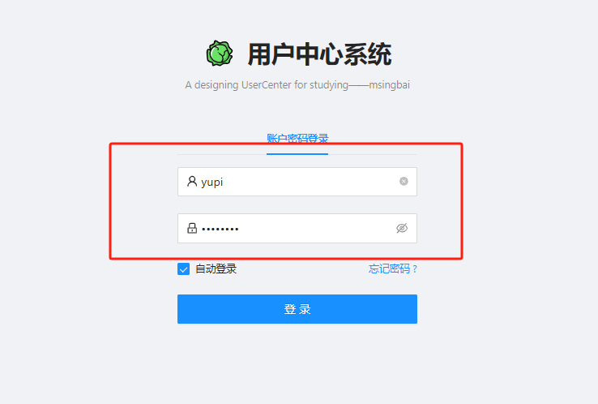

# 08.用户中心前端-1

由于更换了更详细的教程，前端部分和后端部分对接不上，把前端部分重新初始化一次

<!-- more -->   

## 项目初始化

### 组件安装

打开cmd，下载蚂蚁金服的设计组件ant-design-pro

`npm i @ant-design/pro-cli@3.1.0 -g`

进入要创建项目的文件目录下，输入

`pro create myapp`


选择umi@3、simple

用WebStorm打开，右下角会提示可以运行npm的安装，等待依赖自动安装

安装完成后，在`package.json`的`start`运行项目

注意自己使用的node版本，若版本太高可能需要将start修改成

`"start": "cross-env NODE_OPTIONS=--openssl-legacy-provider UMI_ENV=dev umi dev"`

否则会出现错误，这个错误是因为 Node.js v22.14.0 默认使用了更严格的 OpenSSL 安全策略导致的

运行start后


顺便把`start:dev`也改一下

`"start:dev": "cross-env REACT_APP_ENV=dev MOCK=none  NODE_OPTIONS=--openssl-legacy-provider UMI_ENV=dev umi dev",`

dev模式中的MOCK = none 是关闭模拟数据 此时不涉及后台数据

### 配置umi UI

点击终端，输入`npm install --save-dev @umijs/preset-ui`

安装好后，启动start，打开local地址可以看到右下角的ui

### 框架瘦身

在`package.json`中找到`i18n-remove`（移除国际化脚本）执行

### 项目目录

```yml
├── config            # umi 配置，包含路由，构建等配置【下面的oneapi.json（定义整个项目用到的接口）】
├── mock              # 本地模拟数据
├── public
│   └── favicon.png   # 一些静态资源（logo、图标等）
│                   # Favicon
├── src
│   ├── assets        # 本地静态资源
│   ├── components    # 业务通用组件
│   ├── e2e           # 集成测试用例【可删】
│   ├── layouts       # 通用布局
│   ├── models        # 全局 dva model
│   ├── pages         # 业务页面入口和常用模板
│   ├── services      # 后台接口服务【下面的swagger（接口文档工具）可删】
│   ├── utils         # 工具库
│   ├── locales       # 国际化资源【可删】
│   ├── global.less   # 全局样式
│   └── global.ts     # 全局 JS【可删】
├── tests            # 测试工具【可删】
├── README.md
├── package.json
├── jest.config.ts   # 测试工具【可删】
└── playwright.config.ts # 自动化测试工具，帮助在火狐、谷歌自动测试，不用真实打开浏览器【删】
```

其他文件介绍

以下是图中内容的转录：

| 文件名               | 描述                                                         |
| -------------------- | ------------------------------------------------------------ |
| app.tsx              | 项目全局入口文件，定义了整个项目中使用的公共数据（比如用户信息） |
| global.less          | 全局引用样式（尽量不动），可理解为 css                       |
| global.tsx           | 全局脚本文件，可理解为 js                                    |
| service-worker.js    | 一些前端页面的缓存                                           |
| typings.d.ts         | 定义了一些 ts 的类型，类似C语言中的宏定义（#）               |
| .editorconfig        | 编辑器的配置                                                 |
| .eslintrc.js         | 检查 js 语法是否规范                                         |
| prettierrc.js        | 美化前端代码的工具                                           |
| jest.config.js       | 测试工具【可删】                                             |
| stylelintrc.js       | 检查 css 语法是否规范                                        |
| playwright.config.ts | 自动化测试工具，帮助在火狐、谷歌自动测试，不用真实打开浏览器【可删】 |
| assess.ts            | 控制用户的访问权限【链接】                                   |

### 标签页logo和标题

[标题和加载页 - Ant Design Pro](https://pro.ant.design/zh-CN/docs/title-landing/)

## 前端页面开发及验证

### 修改footer

1.在`src/components/Footer/index.tsx`修改

2.修改国际化文件：`\src\locales\zh-CN.js`(已进行框架瘦身，此步骤可省去)

### 修改Logo

1.新建constants包，新建index.tx文件，编写全局常量

### 精简功能

注释掉手机号登录、微博、微信等功能

```tsx
import Footer from '@/components/Footer';
import { login } from '@/services/ant-design-pro/api';
import { getFakeCaptcha } from '@/services/ant-design-pro/login';
import {
  AlipayCircleOutlined,
  LockOutlined,
  MobileOutlined,
  TaobaoCircleOutlined,
  UserOutlined,
  WeiboCircleOutlined,
} from '@ant-design/icons';
import {
  LoginForm,
  ProFormCaptcha,
  ProFormCheckbox,
  ProFormText,
} from '@ant-design/pro-components';
import { Alert, message, Tabs } from 'antd';
import React, { useState } from 'react';
import { history, useModel } from 'umi';
import styles from './index.less';
import { SYSTEM_LOGO } from '@/constants';
const LoginMessage: React.FC<{
  content: string;
}> = ({ content }) => (
  <Alert
    style={{
      marginBottom: 24,
    }}
    message={content}
    type="error"
    showIcon
  />
);
const Login: React.FC = () => {
  const [userLoginState, setUserLoginState] = useState<API.LoginResult>({});
  const [type, setType] = useState<string>('account');
  const { initialState, setInitialState } = useModel('@@initialState');
  const fetchUserInfo = async () => {
    const userInfo = await initialState?.fetchUserInfo?.();
    if (userInfo) {
      await setInitialState((s) => ({
        ...s,
        currentUser: userInfo,
      }));
    }
  };
  const handleSubmit = async (values: API.LoginParams) => {
    try {
      // 登录
      const msg = await login({
        ...values,
        type,
      });
      if (msg.status === 'ok') {
        const defaultLoginSuccessMessage = '登录成功！';
        message.success(defaultLoginSuccessMessage);
        await fetchUserInfo();
        /** 此方法会跳转到 redirect 参数所在的位置 */
        if (!history) return;
        const { query } = history.location;
        const { redirect } = query as {
          redirect: string;
        };
        history.push(redirect || '/');
        return;
      }
      console.log(msg);
      // 如果失败去设置用户错误信息
      setUserLoginState(msg);
    } catch (error) {
      const defaultLoginFailureMessage = '登录失败，请重试！';
      message.error(defaultLoginFailureMessage);
    }
  };
  const { status, type: loginType } = userLoginState;
  return (
    <div className={styles.container}>
      <div className={styles.content}>
        <LoginForm
          // logo={}
          logo={}
          title="用户中心系统"
          subTitle={'A designing UserCenter for studying——msingbai'}
          initialValues={{
            autoLogin: true,
          }}
          // actions={[
          //   '其他登录方式 :',
          //   <AlipayCircleOutlined key="AlipayCircleOutlined" className={styles.icon} />,
          //   <TaobaoCircleOutlined key="TaobaoCircleOutlined" className={styles.icon} />,
          //   <WeiboCircleOutlined key="WeiboCircleOutlined" className={styles.icon} />,
          // ]}
          onFinish={async (values) => {
            await handleSubmit(values as API.LoginParams);
          }}
        >
          <Tabs activeKey={type} onChange={setType}>
            <Tabs.TabPane key="account" tab={'账户密码登录'} />
            {/*<Tabs.TabPane key="mobile" tab={'手机号登录'} />*/}
          </Tabs>

          {status === 'error' && loginType === 'account' && (
            // <LoginMessage content={'错误的用户名和密码(admin/ant.design)'} />
            <LoginMessage content={'错误的账号和密码'} />
          )}
          {type === 'account' && (
            <>
              <ProFormText
                name="username"
                fieldProps={{
                  size: 'large',
                  prefix: <UserOutlined className={styles.prefixIcon} />,
                }}
                // placeholder={'用户名: admin or user'}
                placeholder={'请输入账号'}
                rules={[
                  {
                    required: true,
                    // message: '用户名是必填项！',
                    message: '账号是必填项！',
                  },
                ]}
              />
              <ProFormText.Password
                name="password"
                fieldProps={{
                  size: 'large',
                  prefix: <LockOutlined className={styles.prefixIcon} />,
                }}
                // placeholder={'密码: ant.design'}
                placeholder={'请输入密码'}
                rules={[
                  {
                    required: true,
                    message: '密码是必填项！',
                  },
                ]}
              />
            </>
          )}

          {status === 'error' && loginType === 'mobile' && <LoginMessage content="验证码错误" />}
          {/*{type === 'mobile' && (*/}
          {/*  <>*/}
          {/*    <ProFormText*/}
          {/*      fieldProps={{*/}
          {/*        size: 'large',*/}
          {/*        prefix: <MobileOutlined className={styles.prefixIcon} />,*/}
          {/*      }}*/}
          {/*      name="mobile"*/}
          {/*      placeholder={'请输入手机号！'}*/}
          {/*      rules={[*/}
          {/*        {*/}
          {/*          required: true,*/}
          {/*          message: '手机号是必填项！',*/}
          {/*        },*/}
          {/*        {*/}
          {/*          pattern: /^1\d{10}$/,*/}
          {/*          message: '不合法的手机号！',*/}
          {/*        },*/}
          {/*      ]}*/}
          {/*    />*/}
          {/*    <ProFormCaptcha*/}
          {/*      fieldProps={{*/}
          {/*        size: 'large',*/}
          {/*        prefix: <LockOutlined className={styles.prefixIcon} />,*/}
          {/*      }}*/}
          {/*      captchaProps={{*/}
          {/*        size: 'large',*/}
          {/*      }}*/}
          {/*      placeholder={'请输入验证码！'}*/}
          {/*      captchaTextRender={(timing, count) => {*/}
          {/*        if (timing) {*/}
          {/*          return `${count} ${'秒后重新获取'}`;*/}
          {/*        }*/}
          {/*        return '获取验证码';*/}
          {/*      }}*/}
          {/*      name="captcha"*/}
          {/*      rules={[*/}
          {/*        {*/}
          {/*          required: true,*/}
          {/*          message: '验证码是必填项！',*/}
          {/*        },*/}
          {/*      ]}*/}
          {/*      onGetCaptcha={async (phone) => {*/}
          {/*        const result = await getFakeCaptcha({*/}
          {/*          phone,*/}
          {/*        });*/}
          {/*        if (result === false) {*/}
          {/*          return;*/}
          {/*        }*/}
          {/*        message.success('获取验证码成功！验证码为：1234');*/}
          {/*      }}*/}
          {/*    />*/}
          {/*  </>*/}
          {/*)}*/}
          <div
            style={{
              marginBottom: 24,
            }}
          >
            <ProFormCheckbox noStyle name="autoLogin">
              自动登录
            </ProFormCheckbox>
            <a
              style={{
                float: 'right',
              }}
              // href="{PLANET_LINK}"
              // target="_blank" rel="noreferrer"
            >
              忘记密码 ?
            </a>
          </div>
        </LoginForm>
      </div>
      <Footer />
    </div>
  );
};
export default Login;
```

#### 精简后的界面


### 查看登录的提交方式

进入此参数

将账号和密码的参数重构，与后端字段保持一致


进入/login方法


找到LoginResult


记录此格式

```ts
  type LoginResult = {
    status?: string;
    type?: string;
    currentAuthority?: string;
  };
```

## 前后端联调

- 前端需要向后端发送请求

- 前端ajax请求后端

- axios封装了ajax

- request由ant design进行了再封装

  - 追踪request的源码：用到了umi的插件、requestConfig是一个配置

    进入request

    

    进入getRequestMethod方法

    

    找到plugin，显示是umi插件

    

#### Ant Design Pro请求

1.在Ant Design Pro搜索请求


2.复制代码粘贴到app.tsx文件中修改


3.修改api.ts文件中的登陆接口访问的地址


4.进行登陆测试



使用开发者工具查看-网络-login-标头


#### 跨域

前端的地址：http://localhost:8000/

后端的地址：http://localhost:8080/

**跨域是什么：**

端口不一样，就是跨域。两个页面的协议（protocol），主机（host）和端口号（port）任意不同即为跨域

协议不同：（http/https）

域名不同：（google/baidu）

端口号不同（8000/8080）

**解决**：有两种方案可以解决跨域（1.搭建代理   2.后端支持跨域（不够安全，可能会允许其他网站访问资源。））

**以下文字摘自：**[终于有人把正向代理和反向代理解释的明明白白了！-腾讯云开发者社区-腾讯云](https://cloud.tencent.com/developer/article/1418457) 

**正向代理：**位于客户端和目标服务器（后端）之间，客户端通过代理服务器来请求目标服务器的资源。主要服务于客户端


通过正向代理服务器访问目标服务器，目标服务器是不知道真正的客户端是谁的，甚至不知道访问自己的是一个代理

- 通过代理服务器，可以突破自身IP访问限制，访问国外网站，教育网等。
- 提高了访问速度。通常代理服务器都设置一个较大的硬盘缓冲区，会将部分请求的响应保存到缓冲区中，当其他用户再访问相同的信息时， 则直接由缓冲区中取出信息，传给用户，以提高访问速度。
- 上网者也可以通过这种方法隐藏自己的IP，免受攻击。但代理服务器知道

------

**反向代理：**位于服务器和客户端之间，客户端请求首先到达反向代理服务器，然后由代理服务器将请求转发到一个或多个后端服务器。主要服务于服务器


**反向代理，其实是"代理服务器"代理了"目标服务器"，去和"客户端"进行交互。**

通过反向代理服务器访问目标服务器时，客户端是不知道真正的目标服务器是谁的，甚至不知道自己访问的是一个代理。

反向代理的用途有：

- 1.**隐藏服务器真实IP**。使用反向代理，可以对客户端隐藏服务器的IP地址。
- 2.**负载均衡**。反向代理服务器可以做负载均衡，根据所有真实服务器的负载情况，将客户端请求分发到不同的真实服务器上。
- 3.**提高访问速度**。反向代理服务器可以对于静态内容及短时间内有大量访问请求的动态内容提供缓存服务，提高访问速度。

**正向代理一般是客户端架设的**，比如在自己的机器上安装一个代理软件。而**反向代理一般是服务器架设的**，比如在自己的机器集群中部署一个反向代理服务器。

#### 设置代理

在`proxy.tx`文件里修改代理到哪个域名


在`api.ts`文件里修改api访问路径


进行登录测试


可以看到url的地址是正确的

但是怎么是OPTIONS请求？正是我们做了代理，**遇到了CORS策略**。

当涉及到跨域时，并且是**POST**请求时，本地服务器会先发送一个OPTIONS请求到服务器，如果服务器认为OPTIONS请求时无危险性且认可的，那么在允许本地服务器发送POST请求；

但是如果后端认为OPTIONS请求是危险且不成功的那么会直接阻止本地服务器发送其他请求。

**debug**

服务端阻止了接收这个请求

- 我们在服务端新建一个config包

- 创建一个新的 Java 类文件 `GlobalCorsConfig.java`。

- 编写代码，实现 `WebMvcConfigurer` 接口，并重写 `addCorsMappings` 方法。

```java
package com.msingbai.usercenter.config;

import org.springframework.context.annotation.Bean;
import org.springframework.context.annotation.Configuration;
import org.springframework.web.servlet.config.annotation.CorsRegistry;
import org.springframework.web.servlet.config.annotation.WebMvcConfigurer;

@Configuration
public class GlobalCorsConfig implements WebMvcConfigurer {
    @Override
    public void addCorsMappings(CorsRegistry registry) {
        // 配置允许跨域的路径
        registry.addMapping("/**") // 允许所有路径跨域
                .allowedOrigins("http://localhost:8000") // 允许的来源
                .allowedMethods("GET", "POST", "PUT", "DELETE", "OPTIONS") // 允许的 HTTP 方法
                .allowedHeaders("*") // 允许的请求头
                .allowCredentials(true) // 是否允许携带凭证（如 cookies）
                .maxAge(3600); // 预检请求的结果有效期（单位：秒）
    }
}
```

**断点测试**

在后端的UserController中这个位置打一个断点，再进行测试


大功告成！


*文字写于：广东*