# 09.用户中心前端-2

这是用户中心**前端**部分的**登录功能**和**注册功能**

<!-- more -->   

## 登录功能

- 在`pages\user\Login\index.tsx`中

`username => userAccount`、`password => userPassword`,与后端保持一致【Ctrl+R】

- 对密码进行长度校验【Ant Design】

  | 名称 | 说明                                                         | 类型   |
  | ---- | ------------------------------------------------------------ | ------ |
  | min  | 必须设置，type：string 类型为字符串最小长度；number 类型时为最小值；array 类型时为数组最小长度 | number |

```tsx
                placeholder={'请输入密码'}
                rules={[
                  {
                    required: true,
                    message: '密码是必填项！',
                  },
                  //增加长度检验
                  {
                    min: 8,
                    type: 'string',
                    message: '密码长度不能小于8位！',
                  },
```

- 修改登录判断逻辑`const handleSubmit` 

```tsx
  const handleSubmit = async (values: API.LoginParams) => {
    try {
      // 登录
      // const msg = await login({
      const user = await login({
        ...values,
        type,
      });
      // if (msg.status === 'ok') {
      if (user.status === 'ok') {//需要修改
        const defaultLoginSuccessMessage = '登录成功！';
        message.success(defaultLoginSuccessMessage);
        await fetchUserInfo();
        /** 此方法会跳转到 redirect 参数所在的位置 */
        if (!history) return;
        const { query } = history.location;
        const { redirect } = query as {
          redirect: string;
        };
        history.push(redirect || '/');
        return;
      }
      // console.log(msg);
      // // 如果失败去设置用户错误信息
      // setUserLoginState(msg);
      setUserLoginState(user);
    } catch (error) {
      const defaultLoginFailureMessage = '登录失败，请重试！';
      message.error(defaultLoginFailureMessage);
    }
  };
```

此时遇到一个问题

响应成功了，登录的提示没成功弹出

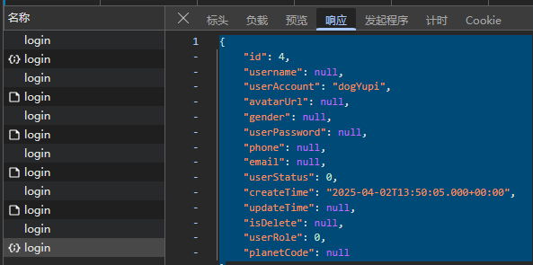

原因是前端的逻辑里，有一句`if (user.status === 'ok') `

这个在后端还没实现，我们直接把它改为`if (user) `

登录逻辑成功

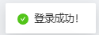

## 注册功能

- 复制Login文件夹粘贴为Register

- 将下面两个位置的`Login = > Register`

```tsx
const Register: React.FC = () => {
  ......
};
export default Register;
```

- `config/routes.ts`文件中增加`register`的路由（即地址栏中输入的跳转）

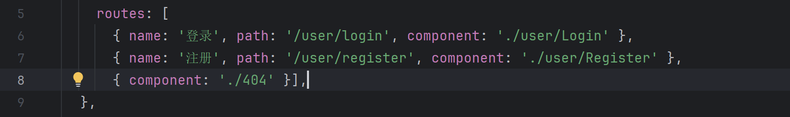

此时访问 `user/register` 页面会自动重定向到 `user/login` 页面，无法进入 register 页面

原因： `app.tsx` 是项目的全局文件，里面有两个判断逻辑会对每个页面进行校验，不允许进入任何页面是合适的

```tsx
  const fetchUserInfo = async () => {
    try {
      const msg = await queryCurrentUser();
      return msg.data;
    } catch (error) {
      history.push(loginPath);
    }
    return undefined;
  };
  // 页面路径判断 如果不是登录页面，执行
  if (history.location.pathname !== loginPath) {
    const currentUser = await fetchUserInfo();
    return {
      fetchUserInfo,
      currentUser,
      settings: defaultSettings,
    };
  }
//如果用户未登录（fetchUserInfo 抛出错误），则将用户重定向到登录页面。
//如果用户已登录，获取用户信息并将其传递给应用的其他部分。
```

### 路由跳转逻辑

修改下面两处逻辑，检测若未登录不做跳转

定义一个白名单数组，包含不需要登录就可以访问的路径，如**注册页面**和**登录页面**。

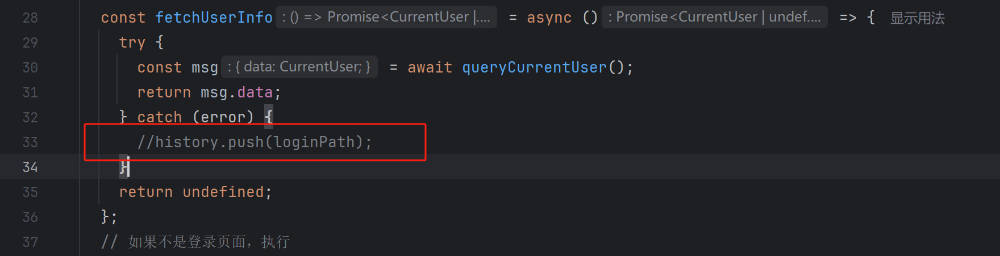

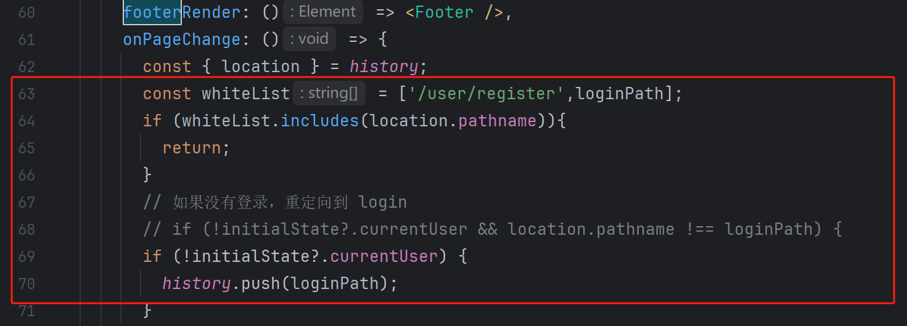

```tsx
const fetchUserInfo = async () => {
  try {
    const msg = await queryCurrentUser();
    return msg.data;
  } catch (error) {
    // history.push(loginPath);
  }
  return undefined;
};

const whiteList = ['/user/register', loginPath];
if (whiteList.includes(location.pathname)) {
  return;
}

// 如果没有登录，重定向到 Login
if (!(initialState?.currentUser)) {
  history.push(loginPath);
}
```

### 修改前端样式

在`Register\index.tsx`中

- 增加确认密码框
- 删改部分逻辑

**完整代码**

```tsx
import Footer from '@/components/Footer';
import { login } from '@/services/ant-design-pro/api';
import { getFakeCaptcha } from '@/services/ant-design-pro/login';
import {
  AlipayCircleOutlined,
  LockOutlined,
  MobileOutlined,
  TaobaoCircleOutlined,
  UserOutlined,
  WeiboCircleOutlined,
} from '@ant-design/icons';
import {
  LoginForm,
  ProFormCaptcha,
  ProFormCheckbox,
  ProFormText,
} from '@ant-design/pro-components';
import { Alert, message, Tabs } from 'antd';
import React, { useState } from 'react';
import { history, useModel } from 'umi';
import styles from './index.less';
import { SYSTEM_LOGO } from '@/constants';
const LoginMessage: React.FC<{
  content: string;
}> = ({ content }) => (
  <Alert
    style={{
      marginBottom: 24,
    }}
    message={content}
    type="error"
    showIcon
  />
);
const Register: React.FC = () => {
  const [userLoginState, setUserLoginState] = useState<API.LoginResult>({});
  const [type, setType] = useState<string>('account');

  const handleSubmit = async (values: API.LoginParams) => {
    try {
      // 注册
      const user = await login({
        ...values,
        type,
      });
      // if (msg.status === 'ok') {
      if (user) {
        const defaultLoginSuccessMessage = '注册成功！';
        message.success(defaultLoginSuccessMessage);
        /** 此方法会跳转到 redirect 参数所在的位置 */
        if (!history) return;
        const { query } = history.location;
        const { redirect } = query as {
          redirect: string;
        };
        history.push(redirect || '/');
        return;
      }
      setUserLoginState(user);
    } catch (error) {
      const defaultLoginFailureMessage = '注册失败，请重试！';
      message.error(defaultLoginFailureMessage);
    }
  };
  const { status, type: loginType } = userLoginState;
  return (
    <div className={styles.container}>
      <div className={styles.content}>
        <LoginForm
          // logo={}
          logo={}
          title="用户中心系统"
          subTitle={'A designing UserCenter for studying——msingbai'}
          initialValues={{
            autoLogin: true,
          }}
          onFinish={async (values) => {
            await handleSubmit(values as API.LoginParams);
          }}
        >
          <Tabs activeKey={type} onChange={setType}>
            <Tabs.TabPane key="account" tab={'账户密码注册'} />
            {/*<Tabs.TabPane key="mobile" tab={'手机号注册'} />*/}
          </Tabs>

          {status === 'error' && loginType === 'account' && (
            // <LoginMessage content={'错误的用户名和密码(admin/ant.design)'} />
            <LoginMessage content={'错误的账号和密码'} />
          )}
          {type === 'account' && (
            <>
              <ProFormText
                name="userAccount"
                fieldProps={{
                  size: 'large',
                  prefix: <UserOutlined className={styles.prefixIcon} />,
                }}
                // placeholder={'用户名: admin or user'}
                placeholder={'请输入账号'}
                rules={[
                  {
                    required: true,
                    // message: '用户名是必填项！',
                    message: '账号是必填项！',
                  },
                ]}
              />
              <ProFormText.Password
                name="userPassword"
                fieldProps={{
                  size: 'large',
                  prefix: <LockOutlined className={styles.prefixIcon} />,
                }}
                // placeholder={'密码: ant.design'}
                placeholder={'请输入密码'}
                rules={[
                  {
                    required: true,
                    message: '密码是必填项！',
                  },
                  //增加长度检验
                  {
                    min: 8,
                    type: 'string',
                    message: '密码长度不能小于8位！',
                  },
                ]}
              />
              {/*确认密码*/}
              <ProFormText.Password
                name="checkPassword"
                fieldProps={{
                  size: 'large',
                  prefix: <LockOutlined className={styles.prefixIcon} />,
                }}
                // placeholder={'密码: ant.design'}
                placeholder={'请确认密码'}
                rules={[
                  {
                    required: true,
                    message: '确认密码是必填项！',
                  },
                  //增加长度检验
                  {
                    min: 8,
                    type: 'string',
                    message: '密码长度不能小于8位！',
                  },
                ]}
              />
            </>
          )}

          {status === 'error' && loginType === 'mobile' && <LoginMessage content="验证码错误" />}
        </LoginForm>
      </div>
      <Footer />
    </div>
  );
};
export default Register;
```

##### 样式预览

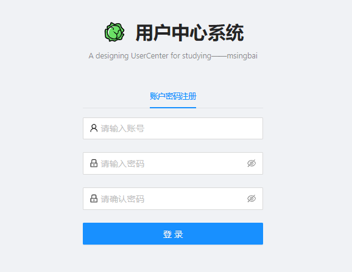

此时登录按钮没有变成注册，是因为looginForm组件的原因

### 前端-表单组件使用

#### 按钮修改

找到组件库的源文件

`node_modules/@ant-design/pro-form/lib/layouts/LoginForm/index.js`

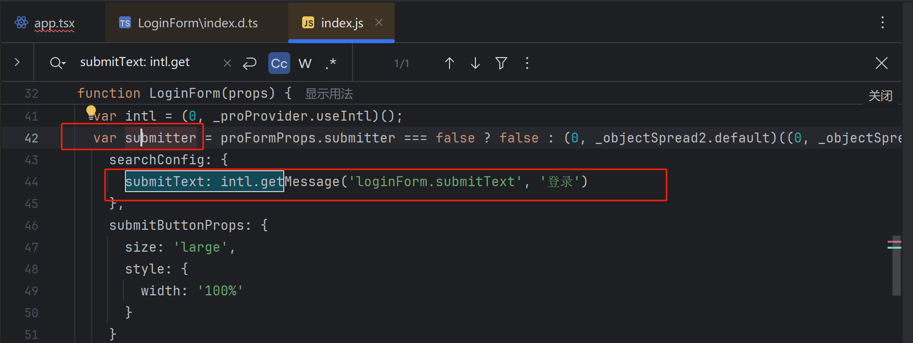

回到注册页面 将按钮组件改标题

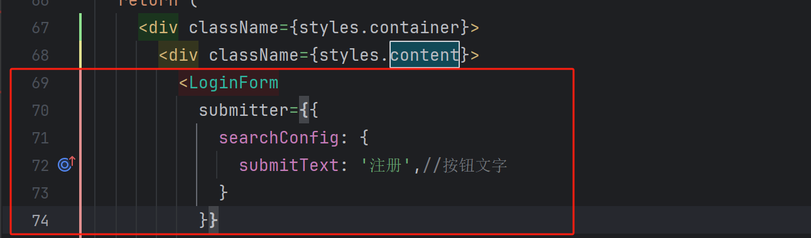

可以看到已经改动成功啦

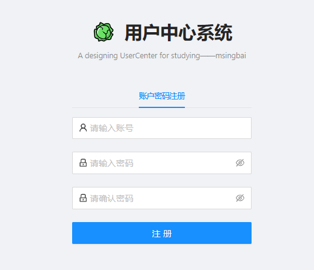

#### 提交逻辑

定位到LoginParams（`src/services/ant-design-pro/typings.d.ts`）

新增注册的参数

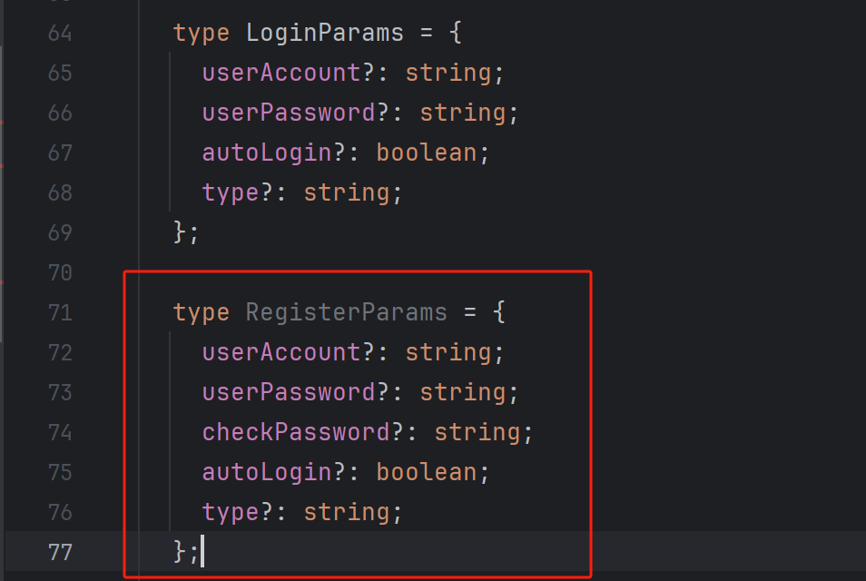

回到`index.tsx`将LoginParams替换成RegisterParams

#### 注册逻辑

增加校验密码逻辑

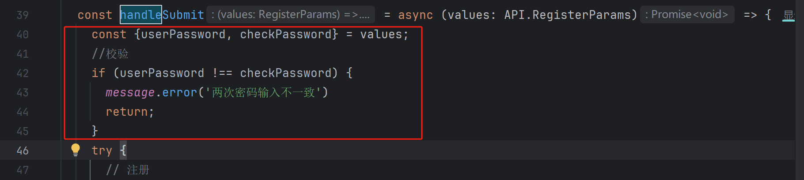

增加注册接口

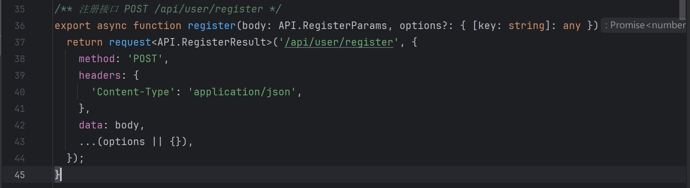

RegisterResult`src/services/ant-design-pro/typings.d.ts`

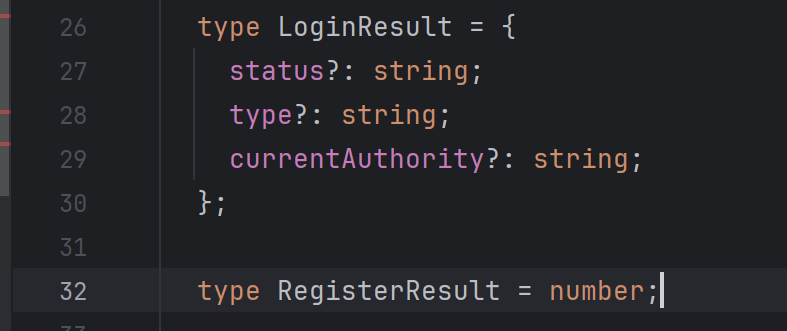

删除Login相关，Register无关的代码

```tsx
// `const` LoginMessage: React.FC<{
//   `content`: string;
// }> = ({ `content` }) => (
//   <Alert
//     style={{
//       marginBottom: 24,
//     }}
//     message={`content`}
//     type="error"
//     showIcon
//   />
// );

`const` Register: React.FC = () => {
  // `const` [userLoginState, setUserLoginState] = `useState`<API.LoginResult>({});
  `const` [type, setType] = `useState`<string>('account');

  // 表单提交
  `const` handleSubmit = `async` (values: API.RegisterParams) => {
    `const` { userPassword, checkPassword } = values;
    // 校验
    `if` (userPassword !== checkPassword) {
      message.error('两次密码输入不一致');
      `return`;
    }

    `try` {
      // 注册
      `const` id = `await` register(values); //user改为id
      `if` (id > 0) {
        `const` defaultLoginSuccessMessage = '注册成功！';
        message.success(defaultLoginSuccessMessage);

        /** 此方法会跳转到 redirect 参数所在的位置 */
        `if` (history) `return`;
        `const` { query } = history.location;
        `const` { redirect } = query as {
          redirect: string;
        };
        history.push(`/user/login?redirect=` <u>{ redirect }</u>);
        `return`;
      } `else` {
        `throw` `new` Error(`register error id = ` <u>${ id }</u>`);
      }
    } `catch` (error) {
      `const` defaultLoginFailureMessage = '注册失败，请重试！';
      message.error(defaultLoginFailureMessage);
    }
  };

  // `const` { status, type: loginType } = userLoginState;
  `return` (
    <>
      <Tabs activeKey={type} onChange={setType}>
        <Tabs.TabPane key="account" tab=<u>{'账户密码注册'}</u> />
      </Tabs>

      // {status === 'error' && loginType === 'account' && (
      //   <LoginMessage content=<u>{'错误的账户和密码'}</u> />
      // )}
      
      ......

      // {status === 'error' && loginType === 'mobile' && <LoginMessage content="验证码错误" />}
    </LoginForm>
    .....
};
```

#### 断点测试

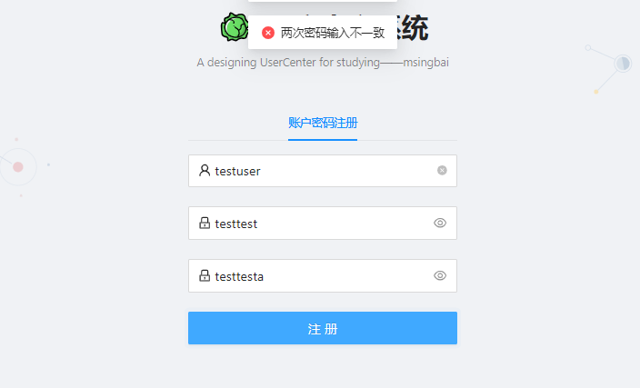

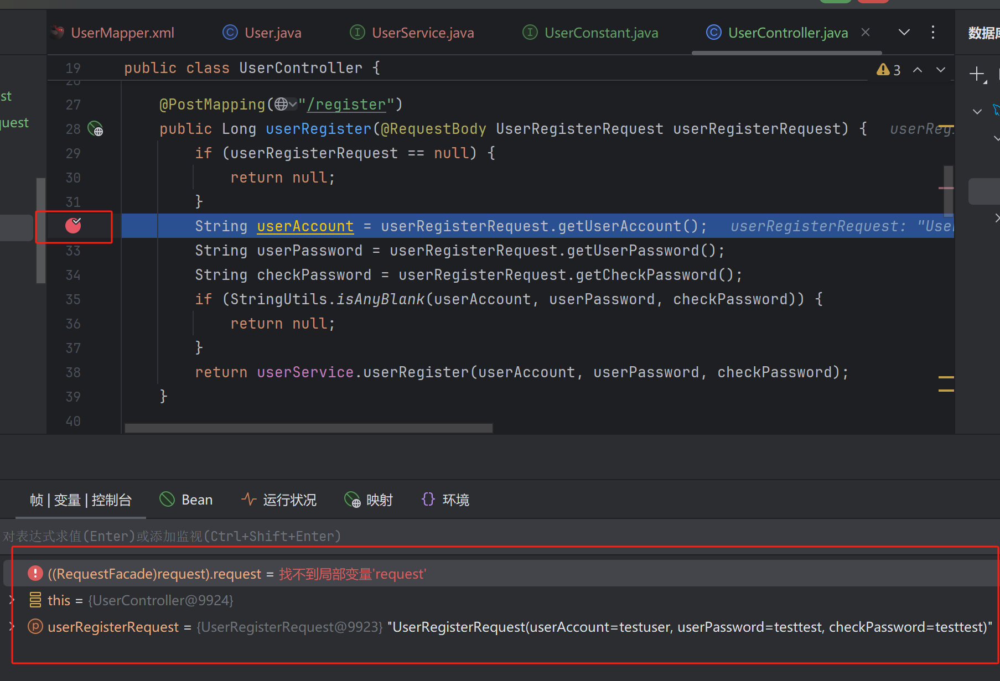

注册失败

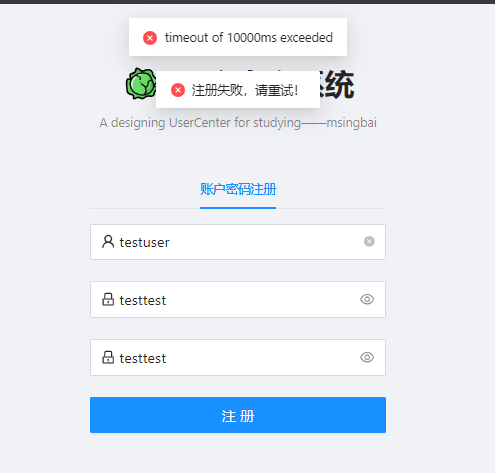

判断是前端的问题，

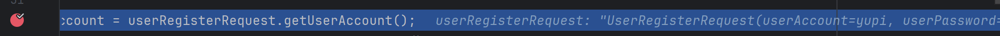

灰色部分为前端发送的请求，里面多了一个UserRegisterRequest套住了，获取不到

ms是毫秒，千分之一秒

测试了一下Login的功能，前端没有问题，格式也是一致的

取消断点

测试已有账号的注册，返回正常

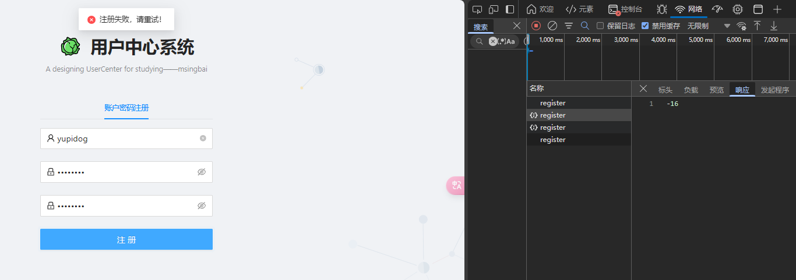测试新账号，能够注册成功，回到登陆界面

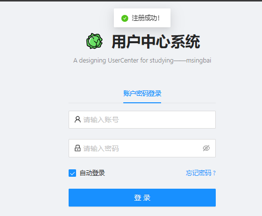

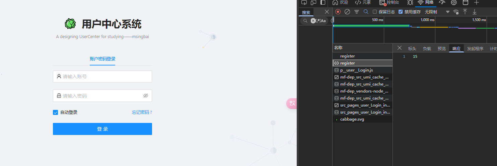

此时有一个问题

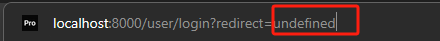

用户没有rediact参数

删除+修改注册页面的这段代码

```tsx
        //const {redirect} = query as {
          //redirect: string;
        //};删除
        history.push({
          pathname: 'user/login',
          query,
        })
```

## 登录页面优化

完整代码

```tsx
          <div
            style={{
              display: 'flex',                   //将div设置为flex容器
              marginBottom: 24,
              justifyContent: 'space-between',  //将子元素均分在容器内，使得他们间距相等
              alignItems: 'center',             //使得子元素在垂直方向上居中对齐
            }}
          >
            <ProFormCheckbox noStyle name="autoLogin">
              自动登录
            </ProFormCheckbox>
            <Link to="/user/register" > 注册账号 </Link>
            <a
              style={{
                float: 'right',
              }}
              href = "mailto:xxx@email.com"//发邮件联系管理员
              target="_blank" rel="noreferrer"
            >
              忘记密码 ?
            </a>
          </div>
```

### 优化后效果

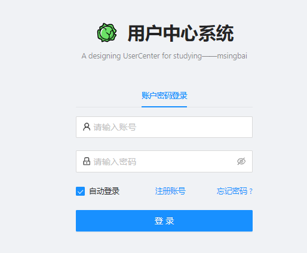

*文字写于：广东*

