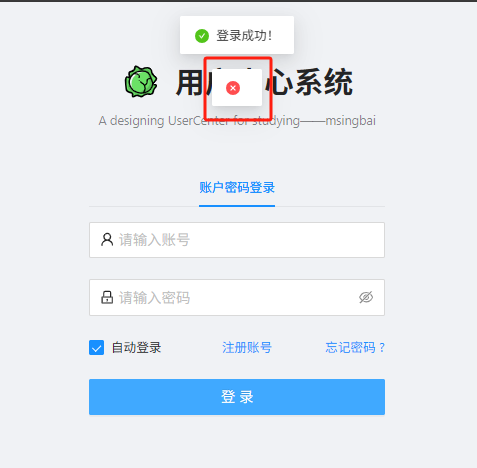
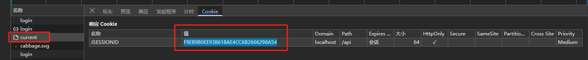
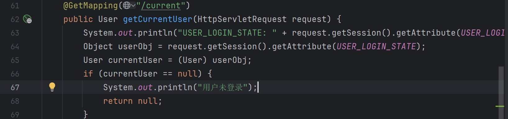

# 10.用户中心前端-3

**用户管理**功能➕**登录态管理**(currrent)

<!-- more -->   

## 登录态管理（currrent）

### **后端**

在UserController添加接口以获取当前登陆状态、信息

```java
    @GetMapping("/current")
    public User getCurrentUser(HttpServletRequest request) {
        Object userObj = request.getSession().getAttribute(UserConstant.USER_LOGIN_STATE);
        User currentUser = (User) userObj;//(User)表示强制转换
        if (currentUser == null) {
            return null;
        }
        long userId = currentUser.getId();
        //todo校验用户是否合法
        User user = userService.getById(userId);
        return userService.getSafetyUser(user);
    }
```

在UserServiceImpl中的getSafetyUser加一个判断，用户是否为空

```java
    @Override
    public User getSafetyUser(User originUser) {
        if (originUser == null){
            return null;
        }
        ....
        }
```

### 前端

- `app.tsx`中点击`queryCurrentUser`进入`api.ts`，修改代码，点击`CurrentUser`查看其返回的数据，结合数据库字段设计代码

```ts
api.ts
/** 获取当前的用户 GET /api/currentUser */
export async function currentUser(options?: { [key: string]: any }) {
  return request<API.CurrentUser>('/api/user/currentUser', {
    method: 'GET',
    ...(options || {}),
  });
}

typings.d.ts
declare namespace API {
  type CurrentUser = {
    id: number;
    username: string;
    userAccount: string;
    avatarUrl?: string;
    gender: number;
    phone: string;
    email: string;
    userStatus: number;
    userRole: number;
    createTime: Data;
    };
    address?: string;
    phone?: string;
  };
```

- 将 `app.tsx` 中之前定义的白名单的代码提到前面，修改变量名，修改引用的变量名


```ts
const isDev = process.env.NODE_ENV === 'development';
const loginPath = '/user/login';
/**
 * 无需用户登录态的页面
 */
const NO_NEED_LOGIN_WHITE_LIST = ['/user/register',loginPath];

......

// ProLayout 支持的api https://procomponents.ant.design/components/layout
export const layout: RunTimeLayoutConfig = ({ initialState, setInitialState }) => {
  return {      
      .....
      if (NO_NEED_LOGIN_WHITE_LIST.includes(location.pathname)){
        return;
      }
      ....
```

- 修改`app.tsx` 的下面代码


```
/**
 * @see  https://umijs.org/zh-CN/plugins/plugin-initial-state
 * */
.....
  const fetchUserInfo = async () => {
    try {
      return await queryCurrentUser();
    } catch (error) {
      history.push(loginPath);
    }
    return undefined;
  };
  // 如果不需要登录页面，bu执行
  if (NO_NEED_LOGIN_WHITE_LIST.includes(history.location.pathname)) {
    return {
      //@ts-ignore
      fetchUserInfo,
      settings: defaultSettings,
    };
  }
  const currentUser = await fetchUserInfo();
  return {
    //@ts-ignore
    fetchUserInfo,
    currentUser,
    settings: defaultSettings,
  };
}

// ProLayout 支持的api https://procomponents.ant.design/components/layout
export const layout: RunTimeLayoutConfig = ({ initialState, setInitialState }) => {
  return {
    rightContentRender: () => <RightContent />,
    disableContentMargin: false,
    waterMarkProps: {
      content: initialState?.currentUser?.username,
    },
```

- 登陆测试，发现一直有一个问题，登陆后会显示登陆成功，但是有一个空白的错误



今天知道了可以用开发者工具查看前端的控制台


有很多错误，一个一个来

第一个就是前端的api.ts文件里，接口名字和后端的不匹配

```ts
/** 获取当前的用户 GET /api/currentUser */
改成
/** 获取当前的用户 GET /api/current */
```

改好后，请求成功了，发现登陆状态没有被记录


一步步排查 首先是UserController中

```java
/**
 * 用户态登录键
 */
 //private static final String USER_LOGIN_STATE = "userLoginState"; 注释掉，改成
String USER_LOGIN_STATE = "userLoginState";
```

UserConstant.java补充代码

```java
    /**
     * 默认权限
     */
    int DEFAULT_ROLE = 0;

    /**
     * 管理员权限
     */
    int ADMIN_ROLE = 1;
}
```

用户态登录键是一个键名，safetyUser是键值

判断是/current请求没有任何信息，因为cookie值不一样了，表示在不同会话，并且后台发现/current的值是空






先不管了 直接做下面的

------

在论坛里找到了别人遇到同样问题的解决办法[用户管理项目关于两次请求sessioni - 编程导航 - 程序员编程学习交流社区](https://www.codefather.cn/post/1855116387300392962)

> 在request里设置credentials=='include'就行 app.tsx：


```tsx
export const request: RequestConfig = {
  prefix: 'http://localhost:8080',
  timeout: 10000,
  credentials:'include',
};
```

根据这篇：[credentials: 'include'跨域问题解决方案-CSDN博客](https://blog.csdn.net/wangpengblog/article/details/103057171)

问题在于前端设置： **credentials: ‘include’，（ 允许 cookie 共享，跨域问题，传Cookie是必须配置）**

**不传递Cookie时，不允许配置credentials**

## 用户管理功能

*文字写于：广东*