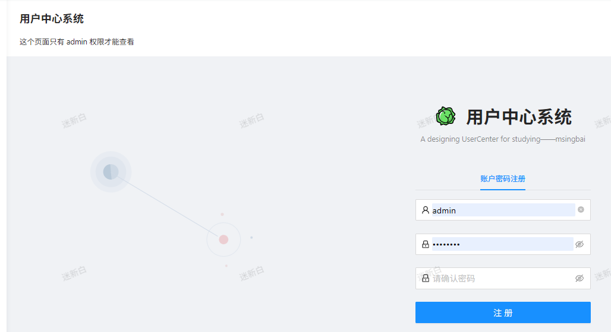

# 10.管理模块+登录状态（前端）

**用户管理**功能➕**登录态管理**(currrent)

<!-- more -->   

## 登录态管理（currrent）

### **后端**

在UserController添加接口以获取当前登陆状态、信息

```java
    @GetMapping("/current")
    public User getCurrentUser(HttpServletRequest request) {
        Object userObj = request.getSession().getAttribute(UserConstant.USER_LOGIN_STATE);
        User currentUser = (User) userObj;//(User)表示强制转换
        if (currentUser == null) {
            return null;
        }
        long userId = currentUser.getId();
        //todo校验用户是否合法
        User user = userService.getById(userId);
        return userService.getSafetyUser(user);
    }
```

在UserServiceImpl中的getSafetyUser加一个判断，用户是否为空

```java
    @Override
    public User getSafetyUser(User originUser) {
        if (originUser == null){
            return null;
        }
        ....
        }
```

### 前端

- `app.tsx`中点击`queryCurrentUser`进入`api.ts`，修改代码，点击`CurrentUser`查看其返回的数据，结合数据库字段设计代码

```ts
api.ts
/** 获取当前的用户 GET /api/currentUser */
export async function currentUser(options?: { [key: string]: any }) {
  return request<API.CurrentUser>('/api/user/currentUser', {
    method: 'GET',
    ...(options || {}),
  });
}

typings.d.ts
declare namespace API {
  type CurrentUser = {
    id: number;
    username: string;
    userAccount: string;
    avatarUrl?: string;
    gender: number;
    phone: string;
    email: string;
    userStatus: number;
    userRole: number;
    createTime: Data;
    };
    address?: string;
    phone?: string;
  };
```

- 将 `app.tsx` 中之前定义的白名单的代码提到前面，修改变量名，修改引用的变量名


```ts
const isDev = process.env.NODE_ENV === 'development';
const loginPath = '/user/login';
/**
 * 无需用户登录态的页面
 */
const NO_NEED_LOGIN_WHITE_LIST = ['/user/register',loginPath];

......

// ProLayout 支持的api https://procomponents.ant.design/components/layout
export const layout: RunTimeLayoutConfig = ({ initialState, setInitialState }) => {
  return {      
      .....
      if (NO_NEED_LOGIN_WHITE_LIST.includes(location.pathname)){
        return;
      }
      ....
```

- 修改`app.tsx` 的下面代码


```
/**
 * @see  https://umijs.org/zh-CN/plugins/plugin-initial-state
 * */
.....
  const fetchUserInfo = async () => {
    try {
      return await queryCurrentUser();
    } catch (error) {
      history.push(loginPath);
    }
    return undefined;
  };
  // 如果不需要登录页面，bu执行
  if (NO_NEED_LOGIN_WHITE_LIST.includes(history.location.pathname)) {
    return {
      //@ts-ignore
      fetchUserInfo,
      settings: defaultSettings,
    };
  }
  const currentUser = await fetchUserInfo();
  return {
    //@ts-ignore
    fetchUserInfo,
    currentUser,
    settings: defaultSettings,
  };
}

// ProLayout 支持的api https://procomponents.ant.design/components/layout
export const layout: RunTimeLayoutConfig = ({ initialState, setInitialState }) => {
  return {
    rightContentRender: () => <RightContent />,
    disableContentMargin: false,
    waterMarkProps: {
      content: initialState?.currentUser?.username,
    },
```

- 登陆测试，发现一直有一个问题，登陆后会显示登陆成功，但是有一个空白的错误


今天知道了可以用开发者工具查看前端的控制台


有很多错误，一个一个来

第一个就是前端的api.ts文件里，接口名字和后端的不匹配

```ts
/** 获取当前的用户 GET /api/currentUser */
改成
/** 获取当前的用户 GET /api/current */
```

改好后，请求成功了，发现登陆状态没有被记录


一步步排查 首先是UserController中

```java
/**
 * 用户态登录键
 */
 //private static final String USER_LOGIN_STATE = "userLoginState"; 注释掉，改成
String USER_LOGIN_STATE = "userLoginState";
```

UserConstant.java补充代码

```java
    /**
     * 默认权限
     */
    int DEFAULT_ROLE = 0;

    /**
     * 管理员权限
     */
    int ADMIN_ROLE = 1;
}
```

用户态登录键是一个键名，safetyUser是键值

判断是/current请求没有任何信息，因为cookie值不一样了，表示在不同会话，并且后台发现/current的值是空


先不管了 直接做下面的

------

在论坛里找到了别人遇到同样问题的解决办法[用户管理项目关于两次请求sessioni - 编程导航 - 程序员编程学习交流社区](https://www.codefather.cn/post/1855116387300392962)

> 在request里设置credentials=='include'就行 app.tsx：


```tsx
export const request: RequestConfig = {
  prefix: 'http://localhost:8080',
  timeout: 10000,
  credentials:'include',
};
```

根据这篇：[credentials: 'include'跨域问题解决方案-CSDN博客](https://blog.csdn.net/wangpengblog/article/details/103057171)

问题在于前端设置： **credentials: ‘include’，（ 允许 cookie 共享，跨域问题，传Cookie是必须配置）**

**不传递Cookie时，不允许配置credentials**

### 设置头像

`src/components/RightContent/AvatarDropdown.tsx`


## 用户管理功能

### 前端开发（一）

1. 文件夹`src/pages`下新建`Admin`文件夹，复制同级目录`user`文件夹下的`Register`文件夹粘贴到`Admin`文件夹，更名为`UserManage`										

2. 到`config/routes.ts`文件中添加路由

3. 访问这个地址,显示没有权限原因在于routes.ts文件中有一个属性是设置判断权限的路由组件是如何判断账号的权限呢？从某个地方可以全局获取

   ------

   - 首次访问页面（刷新页面），会进入`app.tsx`，执行[getInitialState](https://v3.umijs.org/zh-CN/plugins/plugin-initial-state#getinitialstate)方法，其返回值会作为全局共享的数据
   - `services/access.tx`文件中判断用户的访问权限，`canAdmin`的值为`true`时会被认为是具有管理员权限
   - 进入文件中修改判断代码

4. 修改好后，进入管理页面进行测试，显示的是预期的注册功能（因为pages是从注册文件夹复制过来的）

5. 在路由配置中修改补充代码

### 前端开发（二）

使用ProComponents高级表单

- 
- u
  - 是
  - 是
  - 是

1. 删除`src/pages/user/Register/index.tsx`的代码，只保留初始化的部分

   ------

   补充代码

   ```tsx
   import React from "react";
   
   const Register: React.FC = () => {
     return (
       <div id="userManage">
       </div>
     );
   };
   export default Register;
   ```

   

2. 到[ProTable - 高级表格 - ProComponents](https://procomponents.ant.design/components/table)找到合适的表格复制代码（这里复制第一个）

3. 删除不需要用到的组件代码，修改我们需要的属性

   ```tsx
   import { EllipsisOutlined, PlusOutlined } from '@ant-design/icons';
   import type { ActionType, ProColumns } from '@ant-design/pro-components';
   import { ProTable, TableDropdown } from '@ant-design/pro-components';
   import {Button, Dropdown, Image, Space, Tag} from 'antd';
   import { useRef } from 'react';
   import request from 'umi-request';
   import CurrentUser = API.CurrentUser;
   export const waitTimePromise = async (time: number = 100) => {
     return new Promise((resolve) => {
       setTimeout(() => {
         resolve(true);
       }, time);
     });
   };
   
   export const waitTime = async (time: number = 100) => {
     await waitTimePromise(time);
   };
   
   const columns: ProColumns<API.CurrentUser>[] = [
     {
       dataIndex: 'id',
       valueType: 'indexBorder',
       width: 48,
     },
     {
       title: '用户名',
       dataIndex: 'username',
       copyable: true,
     },
     {
       title: '用户账户',
       dataIndex: 'userAccount',
       copyable: true,
     },
     {
       title: '头像',
       dataIndex: 'avatarUrl',
       render: (_,record) => (
         <div>
           <Image src={record.avatarUrl} width={50} height={50}/>  //高度限制规格
         </div>
       ),
     },
     {
       title: '性别',
       dataIndex: 'gender',
     },
     {
       title: '电话',
       dataIndex: 'phone',
       copyable: true,
     },
     {
       title: '邮件',
       dataIndex: 'email',
       copyable: true,
     },
     {
       title: '状态',
       dataIndex: 'userStatus',
     },
     {
       title: '角色',
       dataIndex: 'userRole',
       valueType: 'select',
       valueEnum: {
         0: { text: '普通用户', status:'Default', },
         1: {
           text: '管理员',
           status: 'Success',
         },
       },
     },
     {
       title: '创建时间',
       key: 'createTime',
       valueType: 'dateTime',
     },
     {
       title: '操作',
       valueType: 'option',
       key: 'option',
       render: (text, record, _, action) => [
         <a
           key="editable"
           onClick={() => {
             action?.startEditable?.(record.id);
           }}
         >
           编辑
         </a>,
         <a href={record.url} target="_blank" rel="noopener noreferrer" key="view">
           查看
         </a>,
         <TableDropdown
           key="actionGroup"
           onSelect={() => action?.reload()}
           menus={[
             { key: 'copy', name: '复制' },
             { key: 'delete', name: '删除' },
           ]}
         />,
       ],
     },
   ];
   
   export default () => {
     const actionRef = useRef<ActionType>();
     return (
       <ProTable<API.CurrentUser>
         columns={columns}
         actionRef={actionRef}
         cardBordered
         request={async (params, sort, filter) => {
           console.log(sort, filter);
           await waitTime(2000);
           return request<{
             data: CurrentUser[];
           }>('https://proapi.azurewebsites.net/github/issues', {
             params,
           });
         }}
         editable={{
           type: 'multiple',
         }}
         columnsState={{
           persistenceKey: 'pro-table-singe-demos',
           persistenceType: 'localStorage',
           defaultValue: {
             option: { fixed: 'right', disable: true },
           },
           onChange(value) {
             console.log('value: ', value);
           },
         }}
         rowKey="id"
         search={{
           labelWidth: 'auto',
         }}
         options={{
           setting: {
             listsHeight: 400,
           },
         }}
         form={{
           // 由于配置了 transform，提交的参数与定义的不同这里需要转化一下
           syncToUrl: (values, type) => {
             if (type === 'get') {
               return {
                 ...values,
                 created_at: [values.startTime, values.endTime],
               };
             }
             return values;
           },
         }}
         pagination={{
           pageSize: 5,
           onChange: (page) => console.log(page),
         }}
         dateFormatter="string"
         headerTitle="高级表格"
         toolBarRender={() => [
           /*
           新建与选择菜单组件
            */
           <Button
             key="button"
             icon={<PlusOutlined />}
             onClick={() => {
               actionRef.current?.reload();
             }}
             type="primary"
           >
             新建
           </Button>,
           <Dropdown
             key="menu"
             menu={{
               items: [
                 {
                   label: '1st item',
                   key: '1',
                 },
                 {
                   label: '2nd item',
                   key: '2',
                 },
                 {
                   label: '3rd item',
                   key: '3',
                 },
               ],
             }}
           >
             <Button>
               <EllipsisOutlined />
             </Button>
           </Dropdown>,
         ]}
       />
     );
   };
   ```

4. 此时前端页面显示如下

   ------

   修改`src/pages/Admin.tsx`文件

   ```tsx
   import { PageHeaderWrapper } from '@ant-design/pro-components';
   import React from 'react';
   
   const Admin: React.FC = (props) => {
     const {children} = props;
     return (
       <PageHeaderWrapper>
         {children}
       </PageHeaderWrapper>
     );
   };
   export default Admin;
   ```

   显示效果如下

5. `api.ts`文件里定义一个searchUsers接口（复制notices接口，进行修改）

```ts
/** 搜索用户 GET /api/search */
export async function searchUsers(options?: { [key: string]: any }) {
  return request<API.NoticeIconList>('/api/user/search', {
    method: 'GET',
    ...(options || {}),
  });
}
```

发现函数没有被使用

原因就在于这里，要改成自己的api，原地址是一个测试文件

```tsx
}>('http://localhost:8080/api/user/search', {
```

改完发现还是有问题的，因为没有传递管理页相关的参数，后端始终报错


在编程导航网站里找到了其他朋友写好的代码[跟着鱼皮直播（终）做到用户管理的时候，引 - 编程导航 - 程序员编程学习交流社区](https://www.codefather.cn/essay/1851091797771653122)

这一段的代码应该改成下面的

```tsx
      request={async (params, sort, filter) => {
        console.log(sort, filter);
        await waitTime(2000);
        const userList = await searchUsers();
        return {
          data: userListt
        }
      }}
```

这样就显示出来了

但还可以发现，创建时间是错误的，更新时间加上去之后也是错误的

对比数据库里的数据


对比前端发送请求得到响应的数据


后端在把数据发送给前端时，数据被转化成了 ISO 8601 格式（`2025-03-28T10:56:52.000+00:00`）

 Protable支持的属性：[通用配置 - ProComponents](https://procomponents.ant.design/components/schema#valuetype)

**无语了(ˉ▽ˉ；)...  原因在于 key应该改为dataIndex**

```tsx
  {
    title: '创建时间',
    key: 'createTime',
    valueType: 'dateTime',
  },
```


*文字写于：广东*