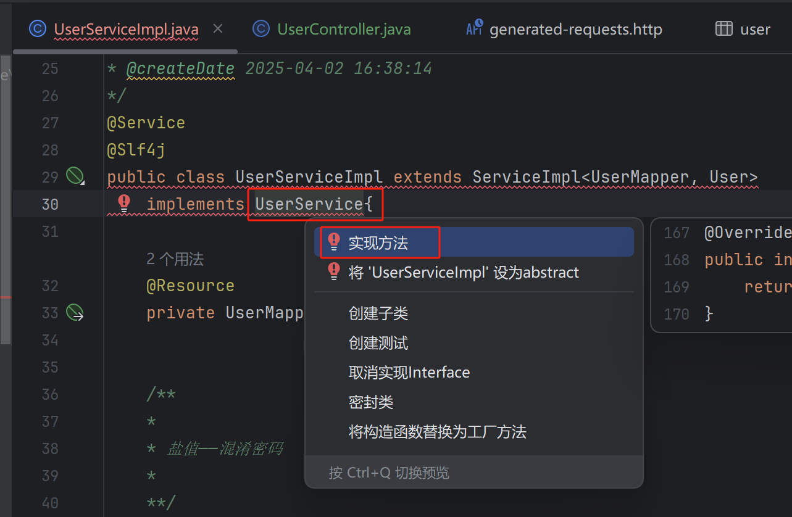

# 11.用户中心后端-6

用户中心的**注销模块**和**校验模块**，每个模块有两个部分，**前端**和**后端**一起o(*￣▽￣*)ブ

<!-- more -->   

## 用户注销

### 后端开发

1. 业务逻辑层

   - UserServic中写userLogout方法

     ------

       UserServiceImpl中实现方法    

   - 修改一下代码，获取 session 中的数据，鼠标指示在 removeAttribute 上，发现返回值是 void，修改一下返回值【后续注销失败抛出异常即可，不需要定义一个返回值】，UserService中也修改一下

2. UserController中编写接口

   - ```java
         @PostMapping("/logout")
         public Integer logout(HttpServletRequest request) {
             if (request == null){
                 return null;
             }
             return userService.userLogout(request);
         }
     ```

   - 将Service和UserServiceImpl的返回类型再改回去，改为int。注销成功返回为1，将Impl的返回值改为1

     ```java
         @Override
         public int userLogout(HttpServletRequest request) {
             //移除用户登录态
             request.getSession().removeAttribute(USER_LOGIN_STATE);
             return 1;
         }
     ```

3. 文件中修改代码

   - UserService

     ```java
         /**
          * 用户注销
          * 
          * @param request
          * @return
          */
         int userLogout(HttpServletRequest request);
     ```

   - UserServiceImpl

     ```java
         /**
          * 用户注销
          * @param request
          * @return
          */
         @Override
         public int userLogout(HttpServletRequest request) {
             //移除用户登录态
             request.getSession().removeAttribute(USER_LOGIN_STATE);
             return 1;
         }
     ```

   - UserController

     ```java
         @PostMapping("/logout")
         public Integer logout(HttpServletRequest request) {
             if (request == null){
                 return null;
             }
             return userService.userLogout(request);
         }
     ```

### 前端开发

1. 启动前后端代码（后端：debug、前端：star-dev），登陆一个管理员账号

2. 修改代码实现用户注销

   > 退出登录按钮在导航条上，导航条是所有页面都有的组件（components），页面触发注销的位置是头像的下拉菜单（AvatarDropdown），所以我们定位到 `src/components/RightContent/AvatarDropdown.tsx` 文件

   - 搜索 `logout`，找到并进入 loginOut 方法
   - 进入 outLogin 方法   
   - 就进入了到 api.ts 文件，修改 outLogin 的接口，保持名称和后端一致
     - 测试一下，返回的响应值已经是1了	

## 用户校验

用户校验是给使用这个系统的用户增加一个属性，planetcode，表示使用者需要凭借知识星球的编号方可注册使用，暂时用不上，跳过这个功能

## 后端代码优化

### 通用返回对象

- 目的是给对象补充一些信息，告诉这个请求再业务层面是成功还是失败

  > 后端直接返回对象给前端，如果数据出现问题、后端报错、查询不到数据，前端不知道是为什么报错，之前我们在后端有设计这种报错码

  例如：

  ```json
  {
    "name": "yupi"
  }
  ```

  代码块（成功）：

  ```json
  {
    "code": 0 //业务状态码
    "data": {
      "name": "yupi"
    }
    "message": "ok"
  }
  ```

  代码块（失败）：

  ```json
  {
    "code": 50001 //业务状态码
    "data": null
    "message": "用户异常操作、xxxx"
  }
  ```

  > 之前异常返回的是-1，按以上设计错误码回更清晰

- 设计

  - 自定义错误码
  - 返回类支持返回正常和错误

1. 后端项目中的`com.msingbai.usercenter` 下新建 `common` 包，在 `common` 包下新建 `BaseResponse.java`，编写代码

   ```java
   package com.msingbai.usercenter.common;
   
   import lombok.Data;
   
   import java.io.Serializable;
   
   @Data
   public class BaseResponse <T> implements Serializable {
   
       private int code;
   
       private T data;
   
       private String message;
   }
   ```

   > 在Java中，`<T>` 是一种泛型（Generics）的用法。
   >
   > 泛型允许在类、接口或方法中使用类型参数，这样可以提高代码的复用性和类型安全性。
   >
   > 例如，如果有一个 `BaseResponse` 类，可以这样使用它：
   >
   > ```java
   > BaseResponse<String> response1 = new BaseResponse<>();
   > BaseResponse<Integer> response2 = new BaseResponse<>();
   > ```
   >
   > `response1` 用于存储字符串类型的数据，而 `response2` 用于存储整数类型的数据。这样，你就可以在 `BaseResponse` 类中编写通用的代码，而不需要为每种数据类型编写特定的代码。

   点击BaseResponse，按住Alt+Insert构造方法                                           

   构造完，再补充一段代码如下

   ```java
       public BaseResponse(int code, T data, String message) {
           this.code = code;
           this.data = data;
           this.message = message;
       }
       
       public BaseResponse(int code, T data) {
           this(code, data, "");
       }
   ```

2. 将之前所有的请求使用 `BaseResponse` 封装一下

   > 对于应用程序中所有的网络请求或数据处理请求，使用 `BaseResponse` 类就能够统一处理和返回结果。
   >
   > 请求的数据（如用户信息等）被封装在 `BaseResponse` 的 `data` 字段中，这样可以保护数据不被外部直接访问，同时也可以在未来轻松地添加或修改响应中包含的数据字段。

   **register**                                               

   ------

   **login**                                             

   这样重复的部分工作量不小，我们可以编写一个工具类以及定制快捷键帮助我们自动化封装工作

   - common包下新建ResultUtils.java，编写代码

   - 定制一个快捷键`File => Settings => Editor => Live Templates(实时模板)`      

     ------

     新建快捷键详细信息

     > 测试一下效果
     >
     > 
     >
     > ------
     >
     > 

   - 将UserController进行封装

     ```java
         @PostMapping("/register")
         public BaseResponse<Long> userRegister(@RequestBody UserRegisterRequest userRegisterRequest) {
             if (userRegisterRequest == null) {
                 return null;
             }
             System.out.println("Received request: " + userRegisterRequest);
             String userAccount = userRegisterRequest.getUserAccount();
             String userPassword = userRegisterRequest.getUserPassword();
             String checkPassword = userRegisterRequest.getCheckPassword();
             if (StringUtils.isAnyBlank(userAccount, userPassword, checkPassword)) {
                 return null;
             }
             long result = userService.userRegister(userAccount, userPassword, checkPassword);
             return ResultUtils.success(result);
         }
     
         @PostMapping("/login")
         public BaseResponse<User> userLogin(@RequestBody UserLoginRequest userLoginRequest,HttpServletRequest request) {
             if (userLoginRequest == null) {
                 return null;
             }
             //System.out.println("Login request: " + userLoginRequest);
             String userAccount = userLoginRequest.getUserAccount();
             String userPassword = userLoginRequest.getUserPassword();
             if (StringUtils.isAnyBlank(userAccount, userPassword)) {
                 return null;
             }
             User user = userService.userLogin(userAccount,userPassword,request);
             return ResultUtils.success(user);
     
         }
     
         @GetMapping("/current")
         public BaseResponse<User> getCurrentUser(HttpServletRequest request) {
             //System.out.println("USER_LOGIN_STATE: " + request.getSession().getAttribute(USER_LOGIN_STATE));
             Object userObj = request.getSession().getAttribute(USER_LOGIN_STATE);
             User currentUser = (User) userObj;
             if (currentUser == null) {
                 System.out.println("用户未登录");
                 return null;
             }
             long userId = currentUser.getId();
             //todo校验用户是否合法
             User user = userService.getById(userId);
             User safetyUser = userService.getSafetyUser(user);
             return ResultUtils.success(safetyUser);
         }
     
         @GetMapping("/search")
         public BaseResponse<List<User>> searchUsers(String username,HttpServletRequest request) {
             if (!isAdmin(request)) {
                 System.out.println("【搜索】非管理员权限");
                 return null;
             }
             QueryWrapper<User> queryWrapper = new QueryWrapper<>();
             if (StringUtils.isNotBlank(username)) {
                 queryWrapper.like("username", username);
             }
             System.out.println("【搜索】查询成功");
             List<User> userlist = userService.list(queryWrapper);
             List<User> list = userlist.stream().map(user -> userService.getSafetyUser(user)).collect(Collectors.toList());
             return ResultUtils.success(list);
         }
     
         @PostMapping("/delete")
         public BaseResponse<Boolean> deleteUser(@RequestBody long id, HttpServletRequest request) {
             if(!isAdmin(request)) {
                 System.out.println("非管理员权限");
                 return null;
             }
             if (id <= 0) {
                 System.out.println("数据库中无人员");
                 return null;
             }
             System.out.println("返回成功");
             boolean b = userService.removeById(id);
             return ResultUtils.success(b);
         }
     
         @PostMapping("/logout")
         public BaseResponse<Integer> logout(HttpServletRequest request) {
             if (request == null){
                 return null;
             }
             int result = userService.userLogout(request);
             return ResultUtils.success(result);
         }
     ```

     

3. 

4. 

*文字写于：广东*