# 12.用户中心后端-7

继续做**后端优化**

<!-- more -->   

## 后端优化

### 自定义异常及其错误代码（debug中）

1. common包下新建ErrorCode.java（Enum枚举类型）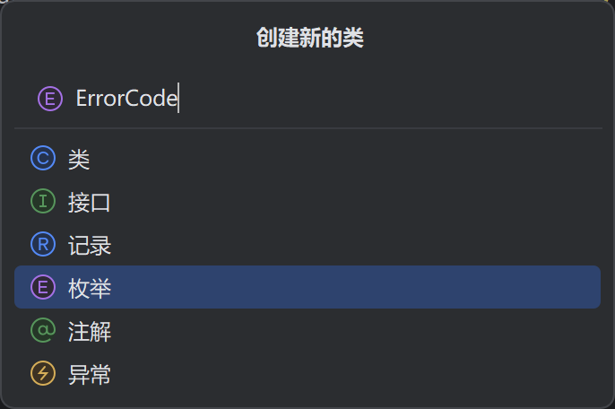

   - 补充代码

   ```java
   package com.msingbai.usercenter.common;
   
   /**
    * 错误码
    */
   public enum ErrorCode {
       SUCCESS(0, "success", ""),
       PARAMS_ERROR(4000, "请求参数错误", ""),
       NULL_ERROR(4001, "请求参数为空", ""),
       NO_LOGIN(40100, "未登录", ""),
       NO_AUTH(40101, "无权限", "");
   
       private final int code;
       /**
        * 状态码信息
        */
       private final String message;
       /**
        * 状态码描述（详情）
        */
       private final String description;
   
       ErrorCode(int code, String message, String description) {
           this.code = code;
           this.message = message;
           this.description = description;
       }
       
   }
   ```

   - 按Alt+Insert选择Getter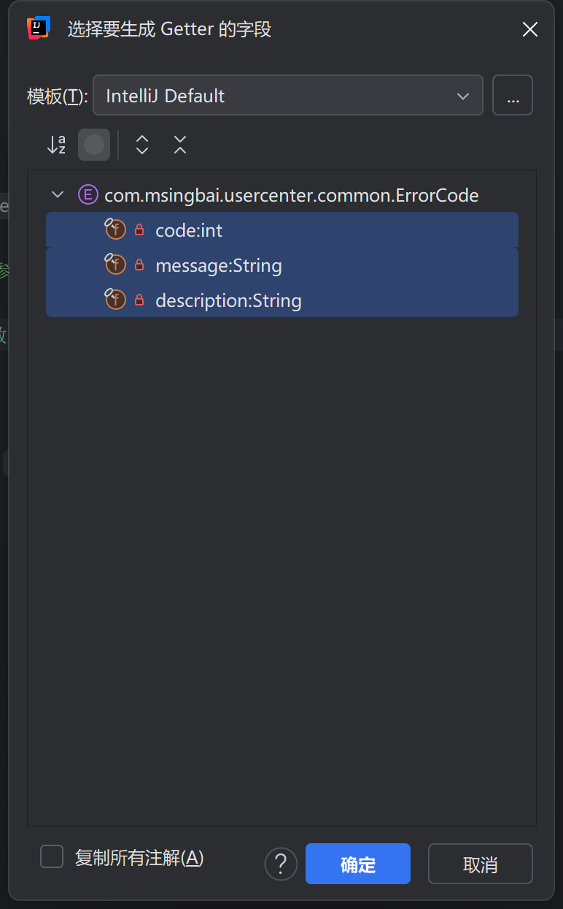

   - 生成了下面的代码

     ```java
         public String getMessage() {
             return message;
         }
     
         public String getDescription() {
             return description;
         }
     
         public int getCode() {
             return code;
         }
     ```

     

2. 修改BaseResponse

   ```java
   package com.msingbai.usercenter.common;
   
   import lombok.Data;
   
   import java.io.Serializable;
   
   @Data
   public class BaseResponse <T> implements Serializable {
   
       private int code;
   
       private T data;
   
       private String message;
   
       private String description;
   
       public BaseResponse(int code, T data, String message, String description) {
           this.code = code;
           this.data = data;
           this.message = message;
           this.description = description;
       }
   
       public BaseResponse(int code, T data, String message) {
           this(code, data, "","");
       }
   
       public BaseResponse(int code, T data) {
           this(code, data, "", "");
       }
   
       public BaseResponse(ErrorCode errorCode) {
           this(errorCode.getCode(),null,errorCode.getMessage(),errorCode.getDescription());
       }
   }
   ```

3. 完善ResultUtils

   ```java
   package com.msingbai.usercenter.common;
   
   /**
    * 返回工具类
    *
    */
   public class ResultUtils {
   
       /**
        * 成功
        *
        * @param data
        * @return
        * @param <T>
        */
       public static <T> BaseResponse<T> success(T data) {
           return new BaseResponse<>(0,data,"success");
       }
   
       /**
        * 失败
        *
        * @param errorCode
        * @return
        * @param <T>
        */
       public static <T> BaseResponse<T> error(ErrorCode errorCode) {
           return new BaseResponse<>(errorCode);
       }
   }
   ```

4. UserController.java

   ```java
      .....
      @PostMapping("/register")
       public BaseResponse<Long> userRegister(@RequestBody UserRegisterRequest userRegisterRequest) {
           if (userRegisterRequest == null) {
               return ResultUtils.error(ErrorCode.PARAMS_ERROR)；
           }
           .....
               @PostMapping("/login")
       public BaseResponse<User> userLogin(@RequestBody UserLoginRequest userLoginRequest,HttpServletRequest request) {
           if (userLoginRequest == null) {
               return ResultUtils.error(ErrorCode.PARAMS_ERROR)；
           }
           String userAccount = userLoginRequest.getUserAccount();
           String userPassword = userLoginRequest.getUserPassword();
           if (StringUtils.isAnyBlank(userAccount, userPassword)) {
               return ResultUtils.error(ErrorCode.PARAMS_ERROR)；
           }
   ```

### 全局异常处理器

1. `com.xxxx.usercenter`新建`exception`包,`exception`包下新建`BusinessException.java`
   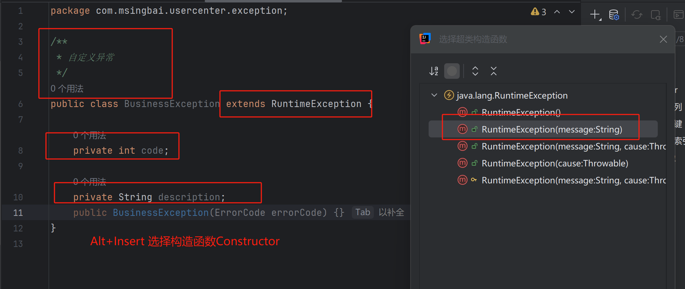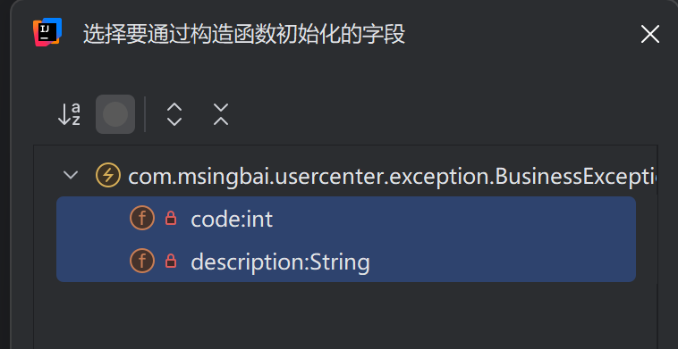

2. 选择code和description

3. 增加下面这段代码，继续生成Getter

   ```java
       public BusinessException(ErrorCode errorCode) {
           super(errorCode.getMessage());
           this.code = errorCode.getCode();
           this.description = errorCode.getDescription();
       }
   
       public BusinessException(ErrorCode errorCode, String description) {
           super(errorCode.getMessage());
           this.code = errorCode.getCode();
           this.description = description;
       }
   ```

4. 增加final字段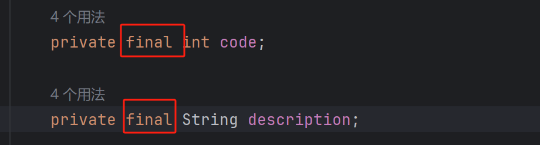

#### 测试

输入一个错误的登录密码 返回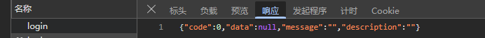

#### 定义全局异常处理器

- `exception`包下新建`GlobalExceptionHandler.java`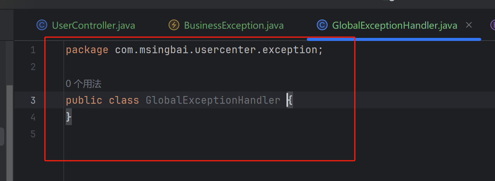

- ErrorCode中新增系统内部异常状态码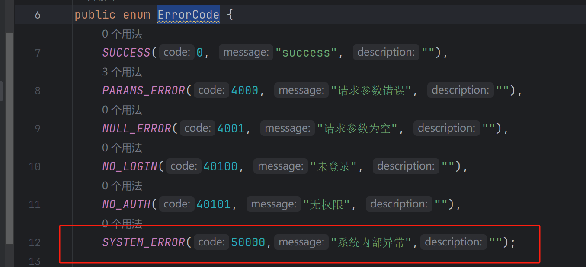

- ResultUtils中新增三个构造函数

  ```java
      /**
       * 失败
       * @param code
       * @param message
       * @param description
       * @return
       */
      public static BaseResponse error(int code, String message, String description) {
          return new BaseResponse(code,null,message,description);
      }
  
      /**
       * 失败
       * @param errorCode
       * @param message
       * @param description
       * @return
       */
      public static BaseResponse error(ErrorCode errorCode, String message, String description) {
          return new BaseResponse(errorCode.getCode(),null,message,description);
      }
  
      /**
       * 失败
       * @param errorCode
       * @param description
       * @return
       */
      public static BaseResponse error(ErrorCode errorCode, String description) {
          return new BaseResponse(errorCode.getCode(),errorCode.getMessage(),description);
      }
  ```

- GlobalExceptionHandler中编写具体的异常处理代码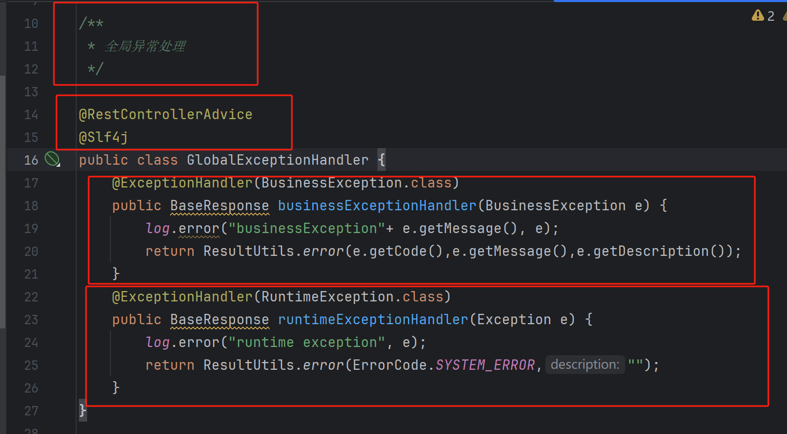

- 修改UserController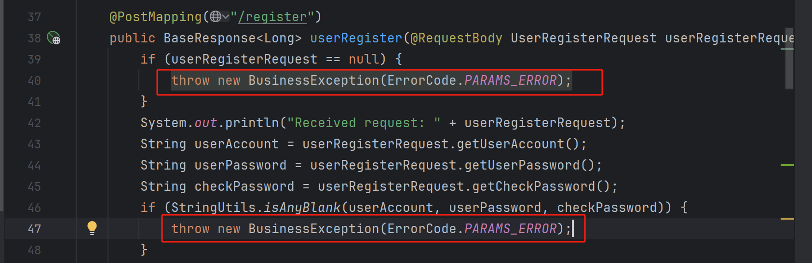**register**

  ------

  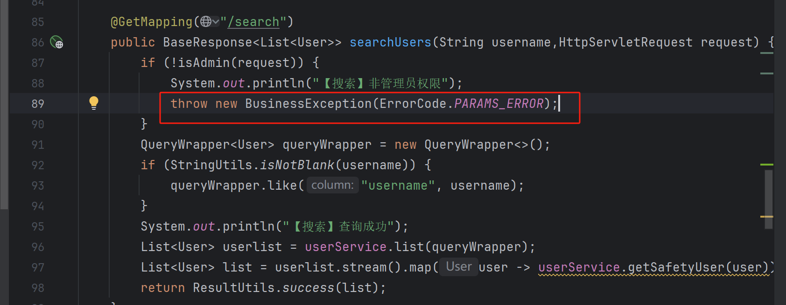**search**

  ------

  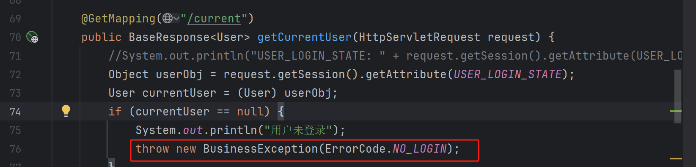**current**

  ------

  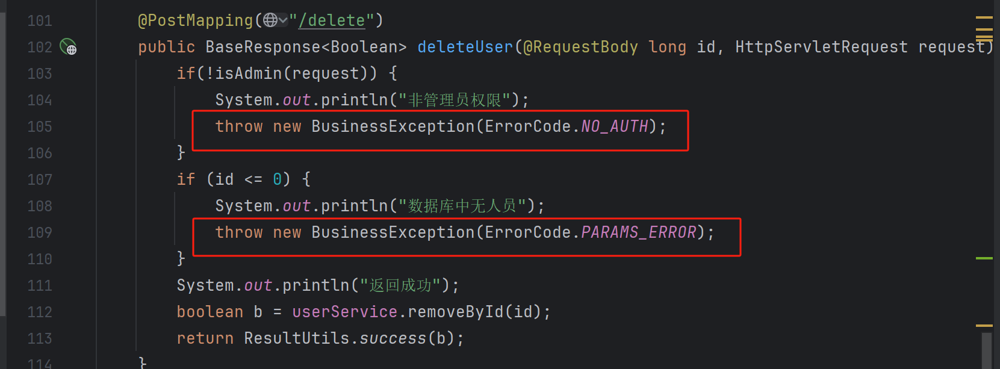**delete**

  ------

  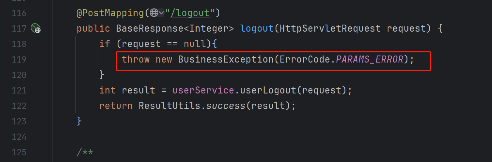**logout**

  ------

  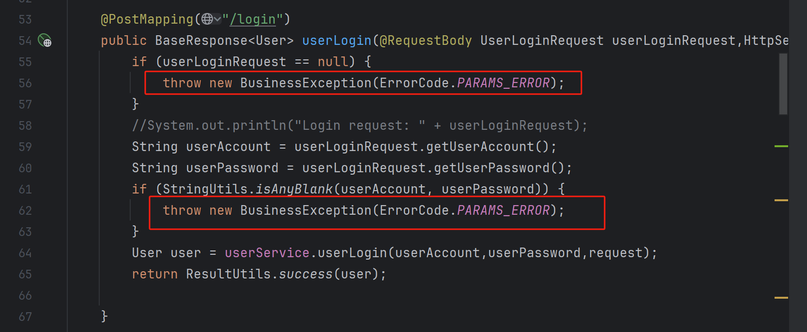**login**

- 修改UserServiceImpl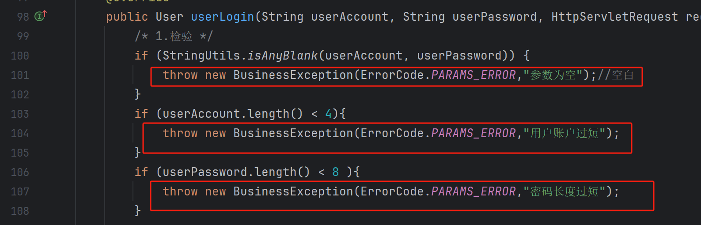

  ------

   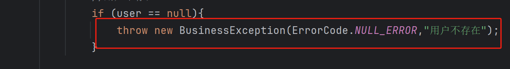

- 测试，登录功能运行异常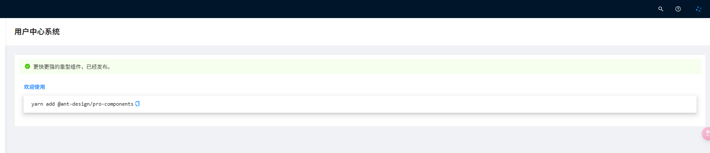

- Debug

  - 这个功能问题很多，技术力不足，不做了
  - 2025/4/22 继续做

在登录时 我输入了错误的密码 返回的错误类型是不存在，不符合预期

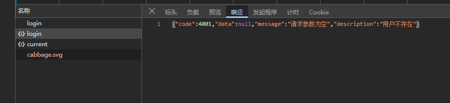

问题在于这段 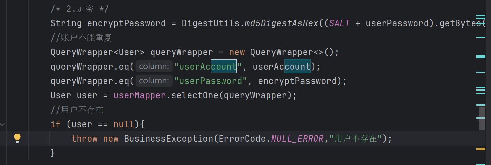

**查询条件不应该同时包含密码**，如果输入错误的密码，也会返回找不到用户的错误，应该只根据账户进行查询，然后再验证密码。

改成如下逻辑

```java
/* 2.加密 */
String encryptPassword = DigestUtils.md5DigestAsHex((SALT + userPassword).getBytes());
//账户不能重复
QueryWrapper<User> queryWrapper = new QueryWrapper<>();
queryWrapper.eq("userAccount", userAccount);
User user = userMapper.selectOne(queryWrapper);
//用户不存在
if (user == null){
    throw new BusinessException(ErrorCode.NULL_ERROR,"用户不存在");
}
// 4. 验证密码
if (!encryptPassword.equals(user.getUserPassword())) {
    throw new BusinessException(ErrorCode.PARAMS_ERROR, "密码错误");
}
```


错误已经正常显示了


## 推送至github


*文字写于：广东*
