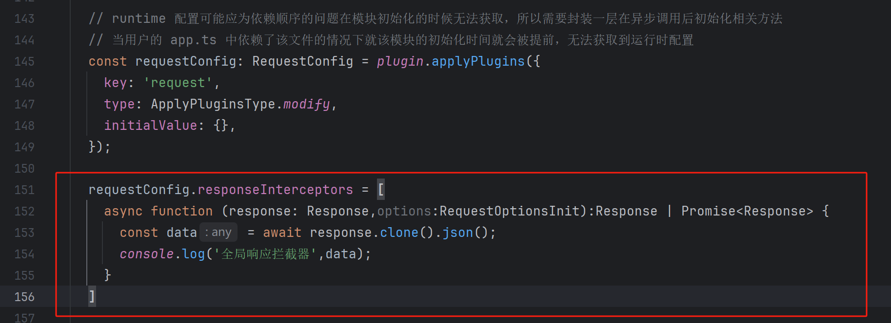
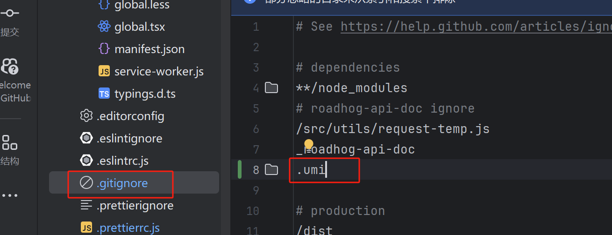
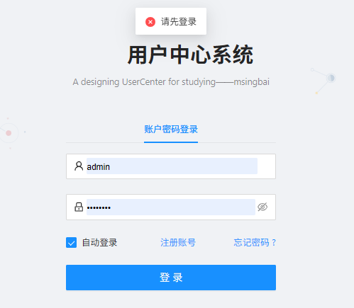
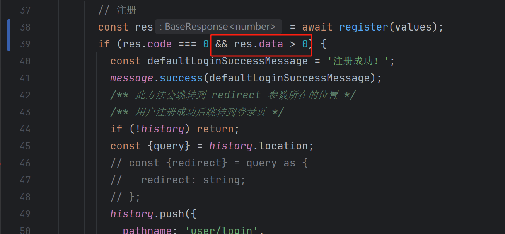

# 13.请求响应处理器（前端）

前端代码优化，**请求响应处理器**封装

<!-- more -->   

## 优化内容

- 对接前端的返回值
- 全局响应处理
  - 应用场景：需要对接口的通用响应进行统一处理，比如从response中取出data；根据code处理错误
  - 参考封装工具的官方文档

## 全局请求响应拦截器封装

1. 定义通用返回对象

   - `UserCenter\myapp\src\typings.d.ts`

   - `src/services/ant-design-pro/api.ts`封装注册的响应类型

   - `src/pages/user/Register/index.tsx`修改注册功能的判断逻辑

     ```tsx
       // 注册
       const res = await register(values);
       if (res.code === 0 && res.data > 0) {
         const defaultLoginSuccessMessage = '注册成功！';
         message.success(defaultLoginSuccessMessage);
         /** 此方法会跳转到 redirect 参数所在的位置 */
         /** 用户注册成功后跳转到登录页 */
         if (!history) return;
         const {query} = history.location;
         // const {redirect} = query as {
         //   redirect: string;
         // };
         history.push({
           pathname: 'user/login',
           query,
         });
         return;
       }else{
         throw new Error(res.description);
       }
     } catch (error: any) {
       const defaultLoginFailureMessage = '注册失败，请重试！';
       message.error(error.message ?? defaultLoginFailureMessage);
     }
     ```

     测试成功

     ------

     

   - 封装其他的API`login``search``notices``current`

2. 前端写一个全局响应拦截器

   - 进入`src/.umi/plugin-request/request.ts`，增加代码

     ```ts
       requestConfig.responseInterceptors = [
         async function (response: Response, options:RequestOptionsInit):Response | Promise<Response> {
           const data = await response.clone().json();
           if (res.code === 0){
             return res.data;
           }
         }
       ]
     ```

     

   - 将所有接口中响应的data取出了。继续编写代码

3. request.ts属于.umi，是框架自动生成的，每次启动会被覆盖掉，在`.gitignore`添加.umi，让编辑器帮我们识别这是项目生成的文件

   这里检查了发现没生效

4. 简单介绍：在Umi中，网络请求由Umi-request完成，它基于 fetch 封装， 兼具 fetch 与 axios 的特点，为开发者提供一个统一的 api 调用方式，简化使用，并提供诸如缓存、 超时、 字符编码处理、 错误处理等常用功能。新建一个请求类，覆盖umi的request方法

   - `src`文件夹下新建`plugins`文件夹，`plugins`文件夹下新建`globalRequests.ts`,补充代码

     ```ts
     /**
      * request 网络请求工具
      * 更详细的 api 文档: https://github.com/umijs/umi-request
      */
     
     
     
     import {extend} from 'umi-request';
     import {history} from 'umi';
     import {stringify} from "querystring";
     import {message} from "antd";
     
     
     /**
      * 配置request请求时的默认参数
      */
     const request = extend({
       credentials: 'include', // 默认请求是否带上cookie
       // requestType: 'form',
     });
     
     /**
      * 所以请求拦截器
      */
     request.interceptors.request.use((url, options): any => {
       console.log(`do requset url = ${url}`);
       return {
         url,
         options: {
           ...options,
           headers: {
           },
         },
       };
     });
     
     /**
      * 所有响应拦截器
      */
     request.interceptors.response.use(async (response, options): Promise<any> => {
       const res = await response.clone().json();
       if (res.code === 0) {
         return res.data;
       }
       if (res.code === 40100) {
         message.error('请先登录');
         history.replace({
           pathname: '/user/login',
           search: stringify({
             redirect: location.pathname,
           }),
         });
       } else {
         message.error(res.description)
       }
       return res.data;
     });
     
     export default request;
     ```

     在api.ts的引入改成自定义的request

5. 测试，未登录时进入管理页，会提示先登录

6. 测试，注册界面正常来说 前端应该只会返回该用户名已被注册 但返回了两条 另一条是 `Cannot read properties of null (reading 'code')`原因在于前端的注册判断逻辑

   `src/pages/user/Register/index.tsx`中

   当 `res.data` 为 `null` 时，`res.data > 0` 将会抛出一个错误。因为无法读取 `null` 的属性，这就是 `"Cannot read properties of null (reading 'code')"` 错误的来源。

   修改逻辑，当code为数字时，会注册成功，否则自动执行

   ```ts
       try {
         // 注册
         const res = await register(values);
   
         // 检查响应是否有效
         if (res && typeof res.code === 'number') {
           if (res.code === 0 && res.data > 0) {
             const defaultLoginSuccessMessage = '注册成功！';
             message.success(defaultLoginSuccessMessage);
   
             // 跳转到登录页
             if (!history) return;
             const { query } = history.location;
             history.push({
               pathname: 'user/login',
               query,
             });
   
           } else {
             throw new Error(res.description || '未知错误');
           }
         }
   
       }
   ```

   这次测试结果符合预期

   但又有了新问题，注册一个新账户后，没有任何提示

   并且抛出了一个空白错误可以发现右边是返回成功的响应，而前端抛出了一个空白错误

   增加一个输出，看看注册成功后返回的是什么

   ```ts
   console.log('注册返回结果：', res);
   ```

   结果返回了data

   

   那就直接修改逻辑

   ```ts
   if (typeof res === 'number' && res > 0) {
   ```

   如果是number，判断注册成功

## 增加用户初始头像

在后端的Impl中增加

```java
/* 3.插入数据 */
User user = new User();
user.setUserAccount(userAccount);
user.setUserPassword(encryptPassword);
String AvatarUrl = ("https://pic.code-nav.cn/user_avatar/1897656130643132418/thumbnail/hKKx7cXTxCQsQm0x.png");
user.setAvatarUrl(AvatarUrl);
```

*文字写于：广东*