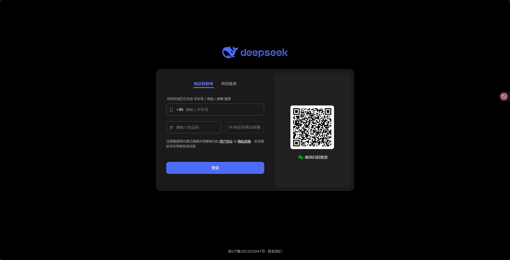
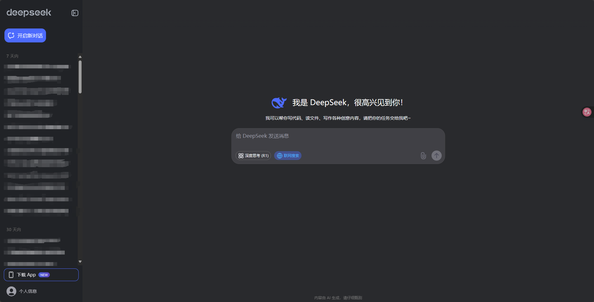

# 01.需求分析

仿主流AI官网的AI聊天网站

项目技术栈: 

前端：**React(Nextjs)** 

后端：**Supabase** **Drizzle ORM** Tanstack Clerk 

大模型支持：**阿里云百炼**

<!-- more -->   

## 需求分析

类deepseek网站的页面开发

1. 登录注册功能

2. 对话功能
   - 左侧需要侧边栏，记录对话记录
   - 右侧主页面，需要**对话框**，**发送按钮**，**模型切换**
   
3. 模型接入，这里采用阿里云百炼[百炼控制台](https://bailian.console.aliyun.com/#/home)

4. 对话历史记录

   采用**Supabase**作为后端数据库[Supabase | The Open Source Firebase Alternative](https://supabase.com/)‌.Supabase‌是一个开源数据处理服务平台，提供了数据库、身份验证、文件存储和自动生成的API等基本要素

## 技术栈

**Nextjs**

next.js是一款轻量级的应用框架，主要用于构建静态网站和后端渲染网站。

它在React的基础上提供了一些增强功能，包括服务器渲染（SSR）、静态生成（SSG）、路由等。Next.js的目标是简化React应用程序的开发流程，并提供更好的性能和开发体验。
官网地址：https://nextjs.org/

**Supabase** 

Supabase 是 Firebase 的开源替代品，是一个后端即服务（BaaS）平台，使用 Postgres 数据库，能够添加用户注册和登录，提供存储服务，不用部署在服务器中，提供了Restful API。

官网地址：https://supabase.com/

**Drizzle **

Drizzle 是一个库提供一系列的 opt-in 工具。能够实现 **[SQL 架构](https://orm.drizzle.team/docs/sql-schema-declaration)**、**[查询](https://orm.drizzle.team/docs/select)**、**[自动迁移](https://orm.drizzle.team/docs/migrations)**，不需要服务器

作为一个基于 node.js 的 ORM 框架，能够让开发者使用面向对象的方式来操作数据库当中的数据，是具有关系型和类 SQL 查询 API 的 ORM。

官网地址：[Drizzle ORM - next gen TypeScript ORM.](https://orm.drizzle.team/)

**TanStack**

**TanStack**是一套为 Web 开发实现**获取、缓存、同步和更新服务器状态**的库集合。提供了无头、类型安全且拥有很多功能的Web应用程序、路由、状态管理、数据可视化、数据网格/表格等工具。

官网地址：[TanStack | High Quality Open-Source Software for Web Developers](https://tanstack.com/)

**Clerk**

Clerk 是一个专门用于处理用户认证和授权的后端服务平台。提供完整的用户注册、登录、身份验证、权限管理等功能，并且支持多种认证方式，如电子邮件、短信验证码、OAuth 等，能够集成在我们的项目中

官网地址：[Clerk | Authentication and User Management](https://clerk.com/)

*文字写于：广东*