# 02.首页&聊天页开发

AI官网页的**首页**和**聊天页**开发

<!-- more -->   

## 初始化next项目

创建next项目，在终端执行

`npm create-next-app@latest`

- 初始化各项配置

像下面的图片即创建完成√


打开测试页面

## 首页

### 导航栏设计

控制首页展示的文件在`src/app/layout.tsx`中

- 设计：左侧为对话相关的内容，作为导航栏。插入导航栏块

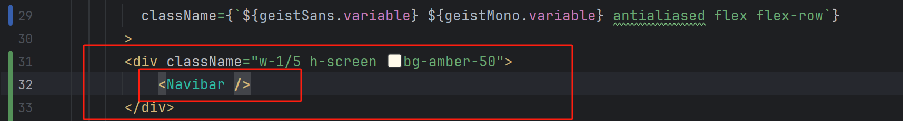

- 新增Navibar组件 `src/components/Navibar.tsx`

  ```tsx
  import React from "react";
  
  type Props = {}
  
  const Navibar = (props:Props) => {
      return (
          <div>Navibar</div>
      )
  }
  
  export default Navibar;
  ```

  创建成功

  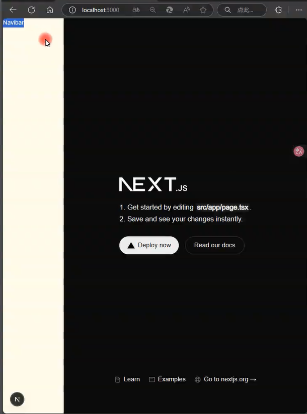

  由于我的系统默认颜色是深色，所以next项目默认也是深色文件了，这里的Navibar看不见，后续步骤进行调整

- `src/app/page.tsx` 打开page文件，删除默认代码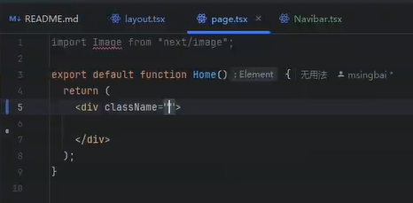

`Home` 能够作为函数组件导出

### 问候语块

- 在首页的中间位置安放问候语块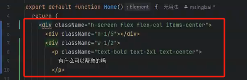

  设置为全屏高（`h-screen`），使用 Flexbox 布局（`flex flex-col items-center`），使其子元素垂直居中    

  页面实况：

  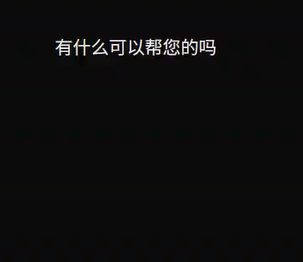

### 输入框模块

输入框模块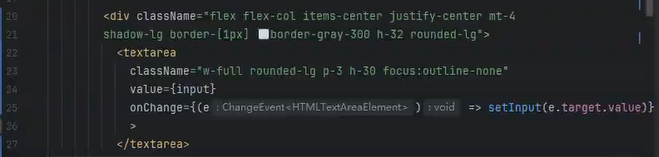

使用 React 的状态管理来处理输入内容的变化。

-  `textarea` 元素，用于多行文本输入。

- `onChange={(e) => setInput(e.target.value)}`：当 `textarea` 的内容发生变化时，更新 `input` 状态变量的值为当前的输入内容。
- `value={input}`：将 `textarea` 的值绑定到 `input` 状态变量上。

这里的 `input`和`setInput`用到了`useState` 钩子，引入生命钩子并定义两个状态变量

```tsx
import {useState} from "react";

.....
export default function Home() {
  const [input, setInput] = useState("");
....
```

页面实况：

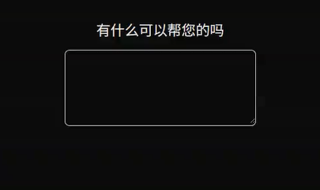

### 模型选择模块

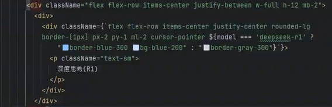

创建一个带有条件样式和交互效果的按钮

页面实况：

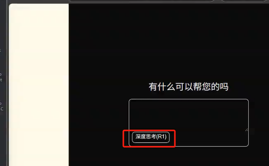

### 右下角提交按钮

右下角通过提交将输入内容提交给AI

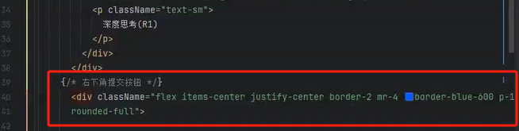

这里我们导入mui库，它可以提供UI组件[Installation - Material UI](https://mui.com/material-ui/getting-started/installation/)

进行安装组件库

```
npm install @mui/icons-material @mui/material @emotion/styled @emotion/react
```

安装好后，在我们的page文件里进行导入，插入到提交按钮中

```ts
import EastIcon from '@mui/icons-material/East'

......
          {/* 右下角提交按钮 */}
            <div className="flex items-center justify-center border-2 mr-4 border-black p-1
            rounded-full">
              <EastIcon></EastIcon>

            </div>
```

页面实况：

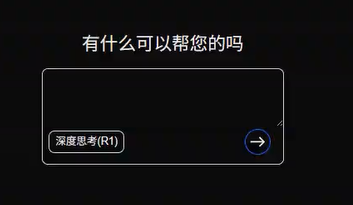

首页完整代码：

```tsx
'use client'

import Image from "next/image";
import {useState} from "react";
import EastIcon from '@mui/icons-material/East'


export default function Home() {

  const [input, setInput] = useState("");
  const [model,setModel] = useState("deepseek-v3");
  const handelChangeModel = () => {
    setModel(model === 'deepseek-v3' ? 'deepseek-r1' : 'deepseek-v3');
  }

  return (
    <div className="h-screen flex flex-col items-center">
      <div className="h-1/5"></div>
      <div className="w-1/2">
        <p className="text-bold text-2xl text-center">
          有什么可以帮您的吗
        </p>

        <div className="flex flex-col items-center justify-center mt-4
        shadow-lg border-[1px] border-gray-300 h-32 rounded-lg">
          <textarea
            className="w-full rounded-lg p-3 h-30 focus:outline-none"
            value={input}
            onChange={(e) => setInput(e.target.value)}
            >
          </textarea>
          <div className="flex flex-row items-center justify-between w-full h-12 mb-2">
            <div>
              {/*左下角深度思考按钮*/}
              <div className={`flex flex-row items-center justify-center rounded-lg 
              border-[1px] px-2 py-1 ml-2 cursor-pointer ${model === 'deepseek-r1' ? 
                  "border-blue-300 bg-blue-200" : "border-gray-300"}`}
                   onClick={handelChangeModel}
              >
                <p className="text-sm">
                  深度思考(R1)
                </p>
              </div>
            </div>
          {/* 右下角提交按钮 */}
            <div className="flex items-center justify-center border-2 mr-4 border-black p-1
            rounded-full">
              <EastIcon></EastIcon>

            </div>
          </div>

        </div>
      </div>
    </div>
  );
}

```

## 聊天页

### 聊天模块

创建聊天页文件`src/app/chat/[chat_id]/page.tsx`

进入nextjs官网文档[Routing: Dynamic Routes | Next.js](https://nextjs.org/docs/app/building-your-application/routing/dynamic-routes)

按照路径格式创建好文件，复制给出的页面例子

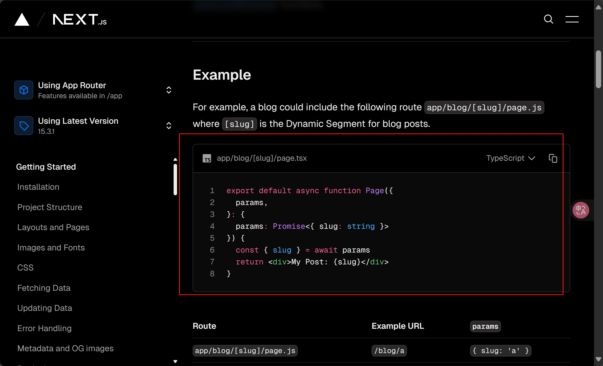

把它复制到我们的聊天页文件中进行修改

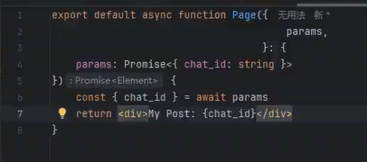

点击Menu，在官方文档里找到chatbot[AI SDK UI: Chatbot](https://sdk.vercel.ai/docs/ai-sdk-ui/chatbot)

将例子中的代码复制下来进行保存。它为我们提供了写好的简单聊天问答

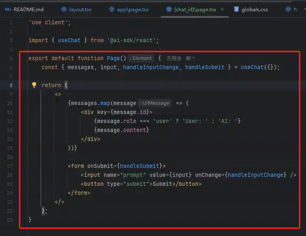

此时切换页面路由进行测试，在本地的：`localhost:3000/chat/1` 

可以看到有一个输入框可以进行聊天了

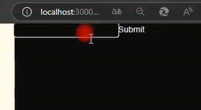

输入文字进行测试

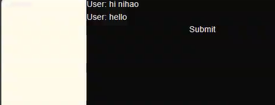

更改布局，使得AI发送的消息在左边，用户发送的消息放在右边,更改气泡框颜色

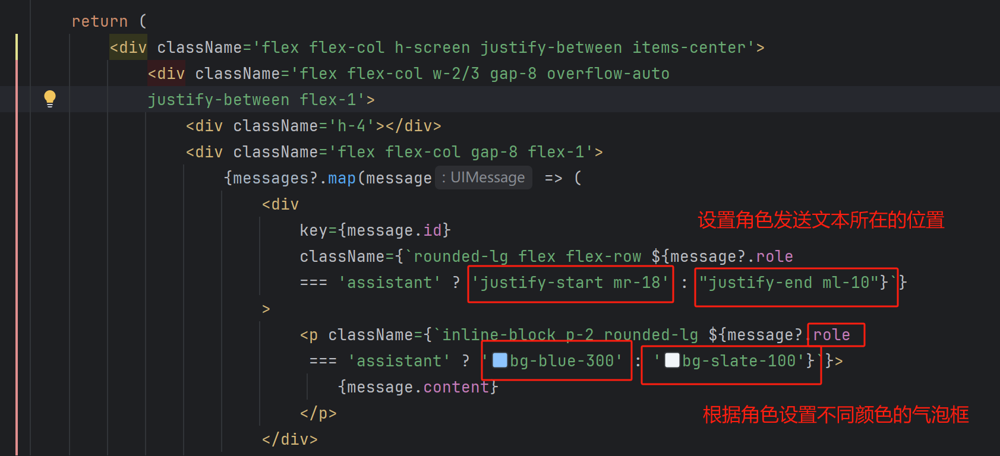

**页面自动下滑功能**

使用`useRef`钩子，它可以用来存储一个可变的值,这个值在组件的整个生命周期内保持不变。使得消息能够保持在页面中

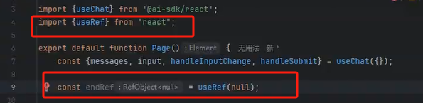

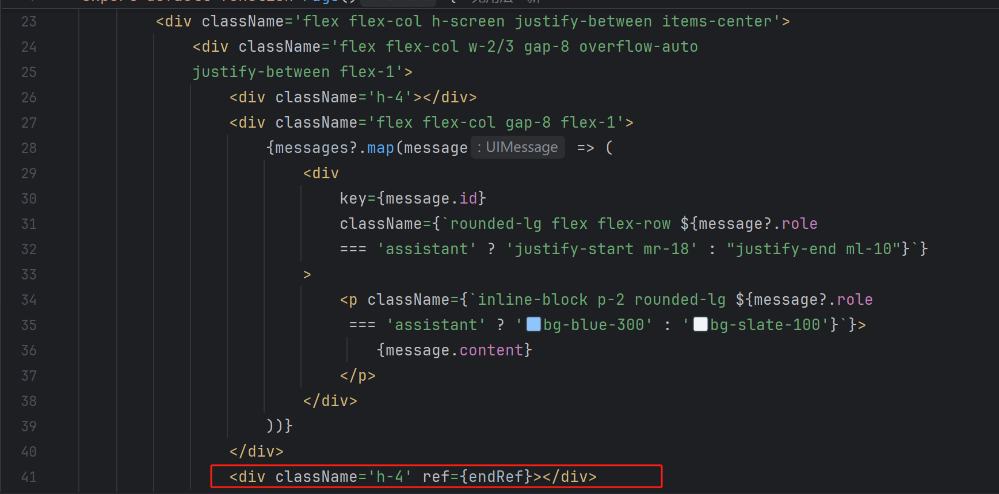

使用`useEffect`钩子,实现自动滚动到页面底部的功能

```tsx
    // 自动下滑
    const endRef = useRef<HTMLDivElement>(null);
    useEffect(() => {
        if (endRef.current){
            endRef?.current?.scrollIntoView({behavior: "smooth"})
        }
    }, [messages])
```

当 `messages` 更新时，`useEffect` 钩子会触发，自动滚动到这个 `div` 的位置，实际上是滚动到消息列表的底部。`{behavior: "smooth"}` 参数确保滚动是平滑的

这样就会使页面自动下滑

**输入框模块**

仿照首页`src/app/page.tsx`的输入框，复制对应代码

```tsx
        <div className="flex flex-col items-center justify-center mt-4
        shadow-lg border-[1px] border-gray-300 h-32 rounded-lg">
          <textarea
            className="w-full rounded-lg p-3 h-30 focus:outline-none"
            value={input}
            onChange={(e) => setInput(e.target.value)}
            >
          </textarea>
          <div className="flex flex-row items-center justify-between w-full h-12 mb-2">
            <div>
              {/*左下角深度思考按钮*/}
              <div className={`flex flex-row items-center justify-center rounded-lg 
              border-[1px] px-2 py-1 ml-2 cursor-pointer ${model === 'deepseek-r1' ? 
                  "border-blue-300 bg-blue-200" : "border-gray-300"}`}
                   onClick={handelChangeModel}
              >
                <p className="text-sm">
                  深度思考(R1)
                </p>
              </div>
            </div>
          {/* 右下角提交按钮 */}
            <div className="flex items-center justify-center border-2 mr-4 border-black p-1
            rounded-full">
              <EastIcon></EastIcon>

            </div>
          </div>

        </div>
      </div>
```

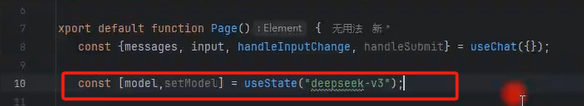

定义一个切换模型的方法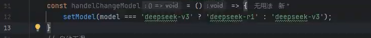

增加点击功能，同时在首页也补充此功能

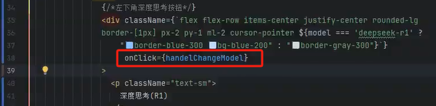

这样就开发完成了


聊天页完整代码

```tsx
'use client';

import {useChat} from '@ai-sdk/react';
import {useEffect, useRef, useState} from "react";
import EastIcon from "@mui/icons-material/East";

export default function Page() {
    const {messages, input, handleInputChange, handleSubmit} = useChat({});

    const [model,setModel] = useState("deepseek-v3");
    const handelChangeModel = () => {
        setModel(model === 'deepseek-v3' ? 'deepseek-r1' : 'deepseek-v3');
    }
    // 自动下滑
    const endRef = useRef<HTMLDivElement>(null);
    useEffect(() => {
        if (endRef.current){
            endRef?.current?.scrollIntoView({behavior: "smooth"})
        }
    }, [messages])

    return (
        <div className='flex flex-col h-screen justify-between items-center'>
            <div className='flex flex-col w-2/3 gap-8 overflow-auto
            justify-between flex-1'>
                <div className='h-4'></div>
                <div className='flex flex-col gap-8 flex-1'>
                    {messages?.map(message => (
                        <div
                            key={message.id}
                            className={`rounded-lg flex flex-row ${message?.role
                            === 'assistant' ? 'justify-start mr-18' : "justify-end ml-10"}`}
                        >
                            <p className={`inline-block p-2 rounded-lg ${message?.role
                             === 'assistant' ? 'bg-blue-300' : 'bg-slate-100'}`}>
                                {message.content}
                            </p>
                        </div>
                    ))}
                </div>
                <div className='h-4' ref={endRef}></div>
            </div>

        {/*  输入框  */}
            <div className="flex flex-col items-center justify-center mt-4
        shadow-lg border-[1px] border-gray-300 h-32 rounded-lg w-2/3">
          <textarea
              className="w-full rounded-lg p-3 h-30 focus:outline-none"
              value={input}
              onChange={handleInputChange}
          >
          </textarea>
                <div className="flex flex-row items-center justify-between w-full h-12 mb-2">
                    <div>
                        {/*左下角深度思考按钮*/}
                        <div className={`flex flex-row items-center justify-center rounded-lg 
              border-[1px] px-2 py-1 ml-2 cursor-pointer ${model === 'deepseek-r1' ?
                            "border-blue-300 bg-blue-200" : "border-gray-300"}`}
                        onClick={handelChangeModel}
                        >
                            <p className="text-sm">
                                深度思考(R1)
                            </p>
                        </div>
                    </div>
                    {/* 右下角提交按钮 */}
                    <div className="flex items-center justify-center border-2 mr-4 border-black p-1
            rounded-full"
                    onClick={handleSubmit}>
                        <EastIcon></EastIcon>
                    </div>
                </div>
            </div>

        </div>
    );
}
```


## 深浅色模式切换

根据这篇文章

[🌈 为你的网站增加点灵性：随系统变色网站切换主题色已经是非常常见的功能了，提供浅色和暗色两种色调可以满足用户的使用习惯 - 掘金](https://juejin.cn/post/7368413086955225124)

在`src\app\globals.css`中更改应用程序的主题颜色，从深色改为浅色

```css
/*@media (prefers-color-scheme: dark) {*/
/*  :root {*/
/*    --background: #0a0a0a;*/
/*    --foreground: #ededed;*/
/*  }*/
/*}*/
/* 注释掉原来的深色模式 */

@media (prefers-color-scheme: light) {
    :root {
      --background: #f2f2f2;
    }
}
```

## Google字体问题

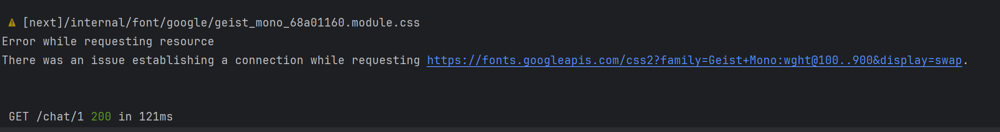

中国大陆用户在访问 Google Fonts 时，浏览器请求可能被网络屏障拦截，或需要通过复杂的迂回路径和多个中间节点才能完成。

在`src/app/globals.css`中，有未定义的错误

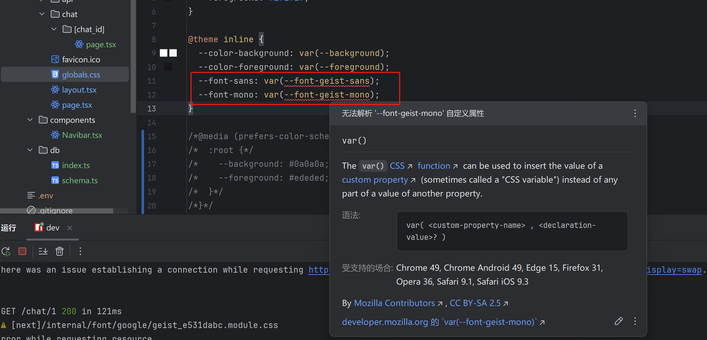

在root中补充以下代码

```ts
:root {
  --background: #ffffff;
  --foreground: #171717;
  //下面两行是补充的代码
  --font-geist-sans: Arial, Helvetica, sans-serif;
  --font-geist-mono: "Courier New", Courier, monospace;
}
```

暂时不影响使用

*文字写于：广东*