# 03.接入deepseek

通过**阿里云百炼**，接入我们需要的ai大模型

<!-- more -->   

## 模型接入

[阿里云百炼](https://bailian.aliyun.com/)

进行注册登录

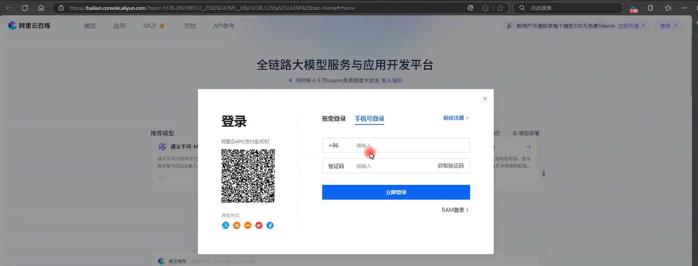阿里云百炼为注册用户提供了免费的额度

来到API参考，点开创建我的API key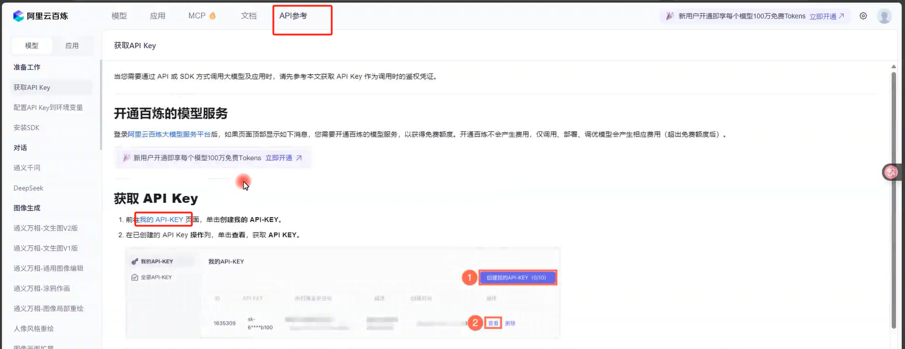

确认开通

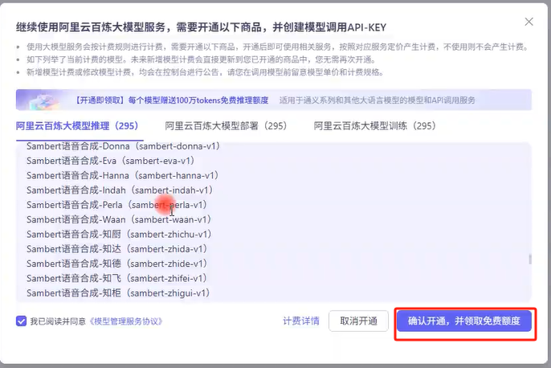选择更多模型，选择Deepseek V3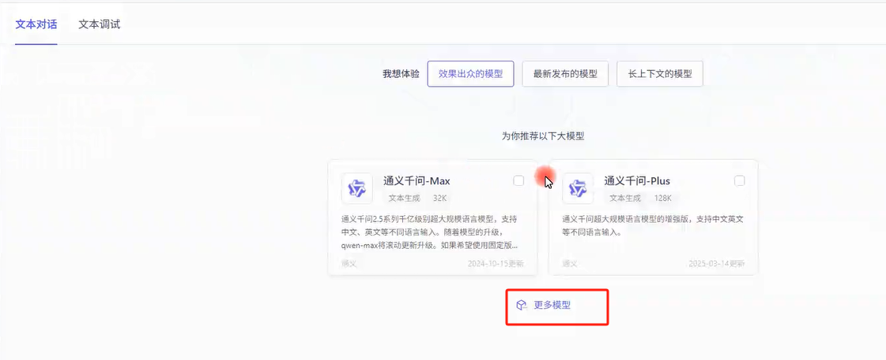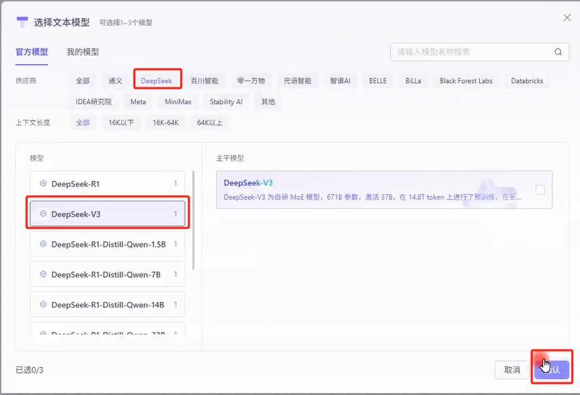

输入API-KEY的名称

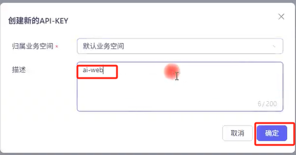

创建成功后复制对应的API-KEY，记录下来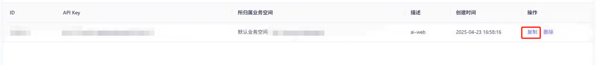

回到控制台，记录下baseurl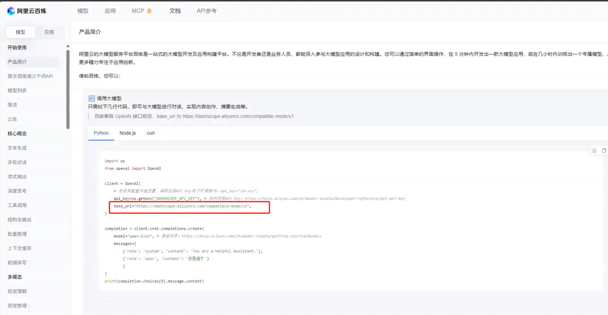

回到项目中，在根目录创建`.env`文件，将刚才复制的API-KEY和BASE_URL填写在`.env`中

```env
DEEPSEEK_API_KEY="刚才复制的API-KEY"
BASE_URL="https://dashscope.aliyuncs.com/compatible-mode/v1"
```

## route路由-后端API处理

在 Next.js 中，使用`app` 目录中的路由处理程序 (Route Handlers) 来处理 API 请求。

创建`app/api/chat/route.ts`文件

在本项目中`route.ts` 是为 `/api/chat` 这个路径提供路由处理程序的文件。

在[AI SDK UI: Chatbot](https://sdk.vercel.ai/docs/ai-sdk-ui/chatbot) 官网文档中复制`app/api/chat/route.ts`的代码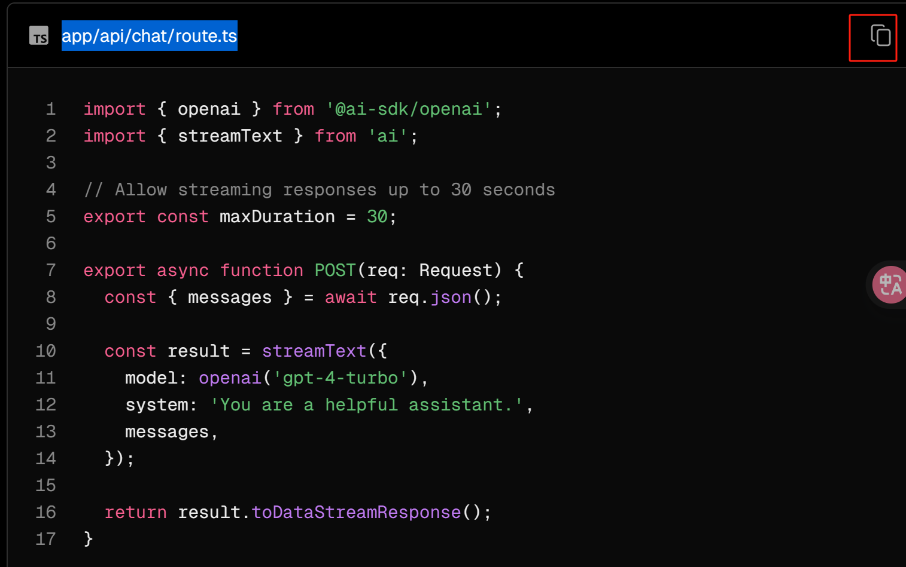

官方文档的例子是用的openai，我们改成deepseek

```ts
import {createDeepSeek} from "@ai-sdk/deepseek";
```

增加调用deepseek的路径

```ts
const deepseek = createDeepSeek({
    apiKey: process.env.DEEPSEEK_API_KEY,
    baseURL: process.env.BASE_URL
})
```

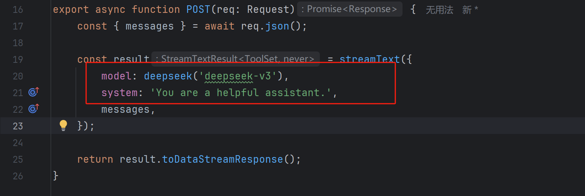

完整代码：

```ts
// 后端API
/**
 * 将消息传给deepseek，得到result进行流式输出到message
 */
import { streamText } from 'ai';
import {createDeepSeek} from "@ai-sdk/deepseek";

// Allow streaming responses up to 30 seconds
export const maxDuration = 30;

const deepseek = createDeepSeek({
    apiKey: process.env.DEEPSEEK_API_KEY,
    baseURL: process.env.BASE_URL
})

export async function POST(req: Request) {
    const { messages } = await req.json();

    const result = streamText({
        model: deepseek('deepseek-v3'),
        system: 'You are a helpful assistant.',
        messages,
    });

    return result.toDataStreamResponse();
}
```

回到页面进行测试

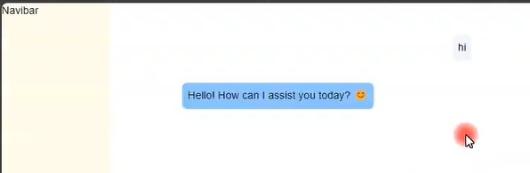

这样就接入成功了

*文字写于：广东*