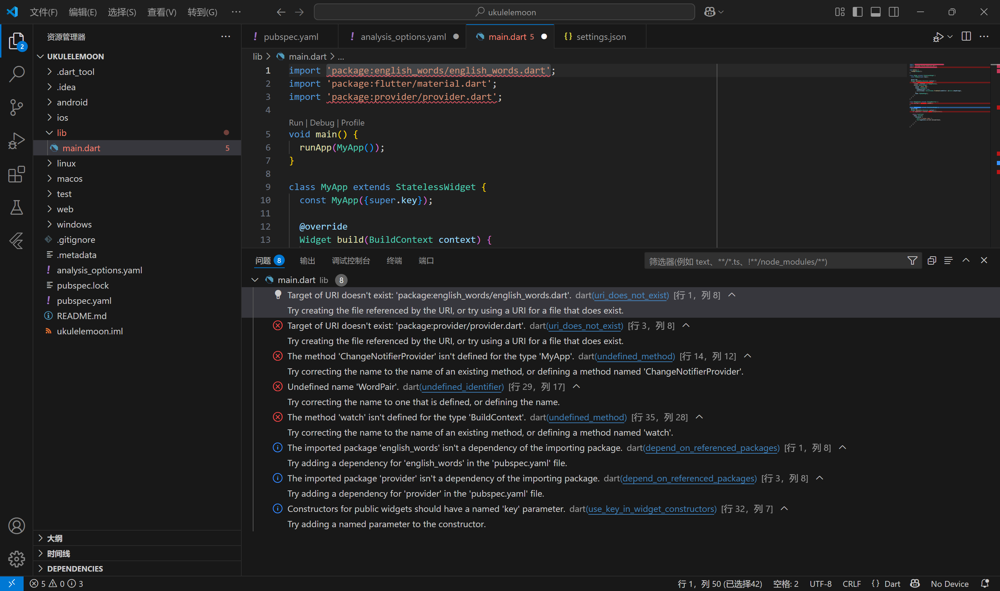
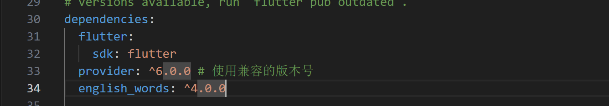

最近在练琴 owo

Flutter项目初尝试，后续待续
<!-- more -->

# 01.尤克里里音月

​	今天练琴时刚好把调音器打开了，发现调音器波动了一下，联想到了全民K歌里的音准识别，如果弹琴时也有这样一个功能，记录音准，那么就能实现自动记录，而且比视频记录的方式好太多了
​	那可以自己开发一款这样的app呀，很兴奋，说干就干。查了一下资料，安卓和ios都可以用的话，先学flutter开始[Flutter中文网 官网](https://flutter.p2hp.com/)

## 环境配置

​	我用的是IDEA 下载好插件，再下载Flutter的SDK**（Software Development Kit）**

想在安卓上测试软件，还要下载一个android-studio[下载 Android Studio 和应用工具 - Android 开发者  | Android Developers](https://developer.android.google.cn/studio?hl=zh-cn)

Android studio是基于IDEA二次开发的，汉化包可以通用

> 这是汉化教程 [Android studio 2024.3.1 版本汉化-CSDN博客](https://blog.csdn.net/Spark217/article/details/146391672?spm=1001.2014.3001.5502)

[制作 Android 应用 |扑动](https://docs.flutter.dev/get-started/install/windows/mobile#install-the-flutter-sdk)

调好google的usb devices调试，方便在手机上调试

> [!] Network resources                   
>     X A network error occurred while checking "https://maven.google.com/": 信号灯超时时间已到
>
> maven解决办法[flutter安装过程中遇到的问题_flutter_IT阿剂-华为开发者空间](https://huaweicloud.csdn.net/6510fe5487b26b6585a227c8.html)

## VSCode

[构建您的第一个 Flutter 应用](https://codelabs.developers.google.cn/codelabs/flutter-codelab-first?hl=zh-cn#2)

按照官方的代码，导入依赖报了红

导入这两个依赖

在pubspec.yaml文件里

## 踩坑

换了一个安卓sdk后好多报错

解决办法：

- 运行 flutter clean 命令清理项目。
- 然后运行 flutter run 重建项目。

*文字写于：广东*