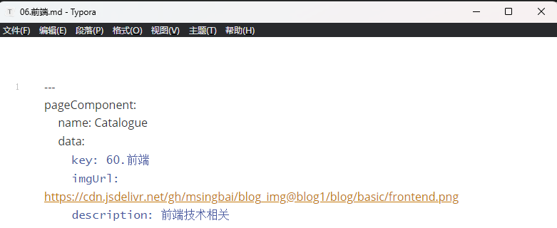
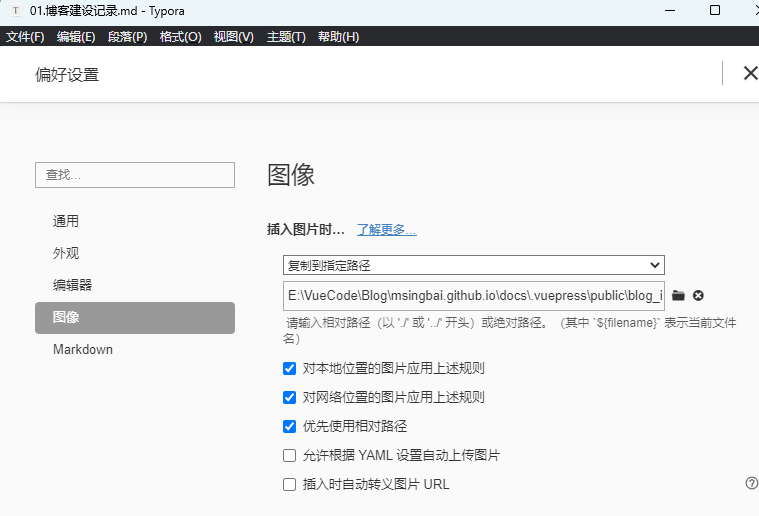
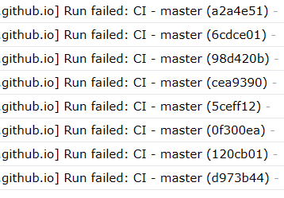
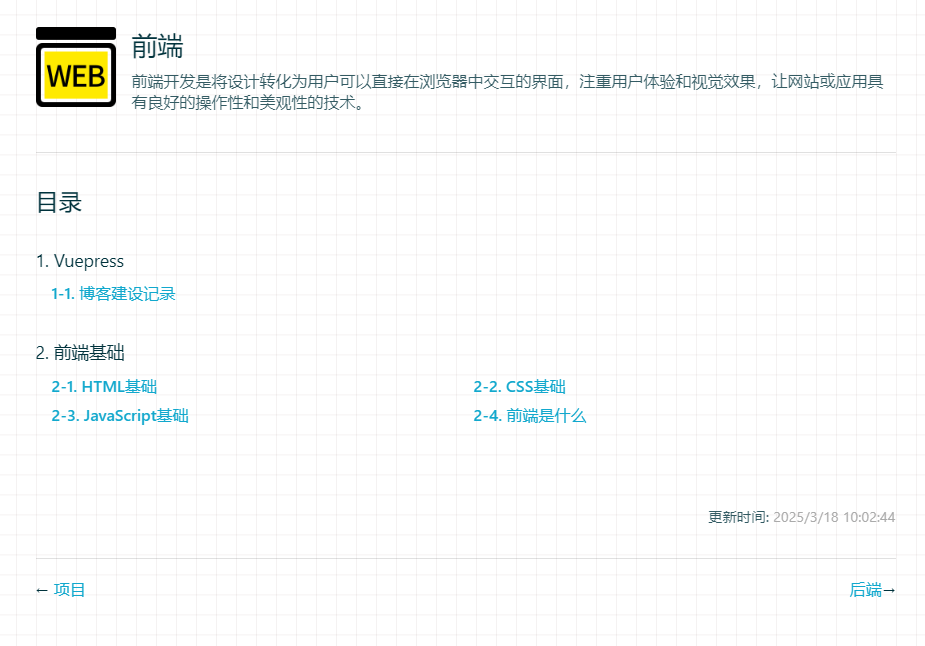

# 博客建设记录

## 01.加入了gitalk

创建一个 OAuth Apps
在 Github 设置中找到Settings / Developer settings / OAuth Apps / new OAuth Apps, 创建一个应用
创建成功有 Client ID 和 Client Secret ，保存下来。

在plugin.js里修改Client ID和Client Secret

## 02.将源代码推送到了master分支

pages分支是默认分支，创建master时会自动克隆pages的源码，需要我们先清空再推送

> //推送shell
>
> cd E:/VueCode/Blog/仓库名.github.io   //仓库名
> git init
> git remote add origin https://github.com/仓库名/仓库名.github.io.git
> git checkout master
> git add .
> git commit -m "Initial commit with new content"
> git push -u origin master --force

## 03.出现了YAML格式解析错误

原因是添加导航栏的前端.md文件时，出现了两个---

>  msingbai.github.io@0.0.1 dev > vuepress dev docs wait Extracting site metadata... YAMLException: end of the stream or a document separator is expected at line 3, column 14:    pageComponent:
>
> ......

- 错误提示指出问题出现在 `pageComponent` 的定义处，可能是因为 YAML 文件的格式不正确。YAML 文件对缩进和语法非常敏感，常见的问题包括：

  - 缩进不一致（YAML 使用空格缩进，不能使用 Tab）。

  - 错误的引号或符号（如多余的逗号、冒号等）。

  - 缺少必要的分隔符（如 `---`）。

    排查多个md文件后发现问题，删除多余的分隔符，成功
    
    

## 04.如何在Vuepress中插入图片

Typora提供了一种方法，可以将复制的图片保存到指定文件夹

VuePress 默认会将 `public` 文件夹中的内容直接映射到站点的根路径。

因此，可以将图片放在 `public` 文件夹中，然后通过相对路径引用。

例如：

- 将图片放在 `public/images/` 文件夹中。
- 在 Markdown 中引用：

markdown复制

```markdown

```



这样在站点中可以引用上传好的图片了

## 05.推送ci工作流的报错

2025/3/18



给仓库新加了一条master主分支，原来的page的分支优先级改为副分支，之后每次push master邮箱就会收到新邮件

打开之后，发现github会根据workflow/ci 文件执行命令，报错包括node的版本，以及找不到deploy.sh文件，这是因为我为了方便把deploy改了名字，复制一个文件，把它改回原来的名字可以解决

> 目前已注释掉ci文件
>
> 这个文件是执行推送到linux上的
>
> E:\VueCode\Blog\msingbai.github.io\node_modules\i\.github\workflows

## 06.webp图像格式无法在博客中渲染

Typora能够显示

## 07.Vuepress插入Latex公式

用到的是markdown-it-mathjax3插件

修改总配置文件和插件的配置文件

1.config.js

```js
module.exports = {
extendsMarkdown: md => {
    md.use(require('markdown-it-mathjax3'))
    md.linkify.set({ fuzzyEmail: false }) // 可选，用于禁用模糊电子邮件链接
},
    markdown: {
    lineNumbers: true, // 显示代码块的行号
    extractHeaders: ["h2", "h3", "h4"], // 支持 h2、h3、h4 标题
    plugins:['markdown-it-mathjax3'],
    externalLinks: { target: '_blank', rel: 'nofollow noopener noreferrer' }
  }，
}
```
2.plugin.js

```javascript
// 插件配置
module.exports = [
  // 自定义插件，即本地插件
  [
    {
      name: "custom-plugins",
      globalUIComponents: ["BlockToggle", "GlobalTip", "Aplayer"], // 2.x 版本 globalUIComponents 改名为 clientAppRootComponentFiles
    },
  ],
  [
    // 配置 Markdown 插件
    [
  "markdown-it-mathjax3", // 添加 markdown-it-mathjax3 插件
  {
    markdown: {
      lineNumbers: true,
      extractHeaders: ["h2", "h3", "h4"],
      externalLinks: { target: '_blank', rel: 'nofollow noopener noreferrer' }
    }
  }
]
  ],]
```

## 08.增加了百度统计

## 增加了社交图标[知乎]

## 增加了文章摘要

参考：

[vuepress+百度统计 API 调用+源码_vuepress记录浏览量-CSDN博客](https://blog.csdn.net/weixin_40532650/article/details/116064497)

[vuepress+百度统计显示博客浏览量_vuepress 百度统计-CSDN博客](https://blog.csdn.net/weixin_45732455/article/details/129975128)

[vue 项目引入iconfront-CSDN博客](https://blog.csdn.net/yhr19910929/article/details/106091859)

[Hexo写作：Markdown、Mathjax和HTML语法 - 知乎](https://zhuanlan.zhihu.com/p/599068136/)

> 导言区之后到`<!--more-->`之前的部分是摘要。

# 待解决

01.目录页更新时间问题



右下角的更新时间是以导航页的md文件,以这个页面为例子，也就是前端.md的更新时间为准的，并不以目录的文件更新时间为准，待解决

*文字写于：广东*

