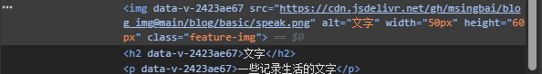

1.首页大图取消早中晚变化，大小调整 100vh->60vh

2.首页三个feature图标调整

<!-- more -->   

# 03.首页优化

feature图标调整

在阅读官方文档时发现了很多功能

找到了vdoing主题的文件夹

> node_modules\vuepress-theme-vdoing
>
> "node_modules\vuepress-theme-vdoing\components\Home.vue"

 右键检查元素可以在开发者控制台看html代码

直接设置了`img`标签的属性 结果是没达到效果



可能是div的优先级比较高，要更改这个div 的style

最终解决方案：

在`node_modules\vuepress-theme-vdoing\components\Home.vue`中找到控制features块的代码

```vue
                  
```

插入

```vue
  :style="feature.imgStyle"
```

同时在index.md文件中加入

```markdown
  - title: 阅读
    details: 一些阅读轨迹
    link: /read/
    imgUrl: example.png
    imgStyle: "width: 10% ;height: 10%"
```

**效果图**


*文字写于：广东*