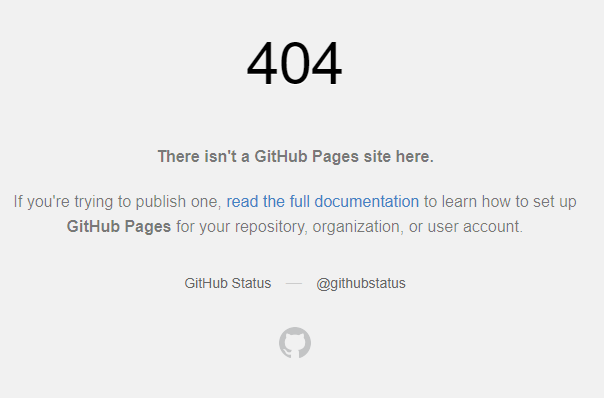
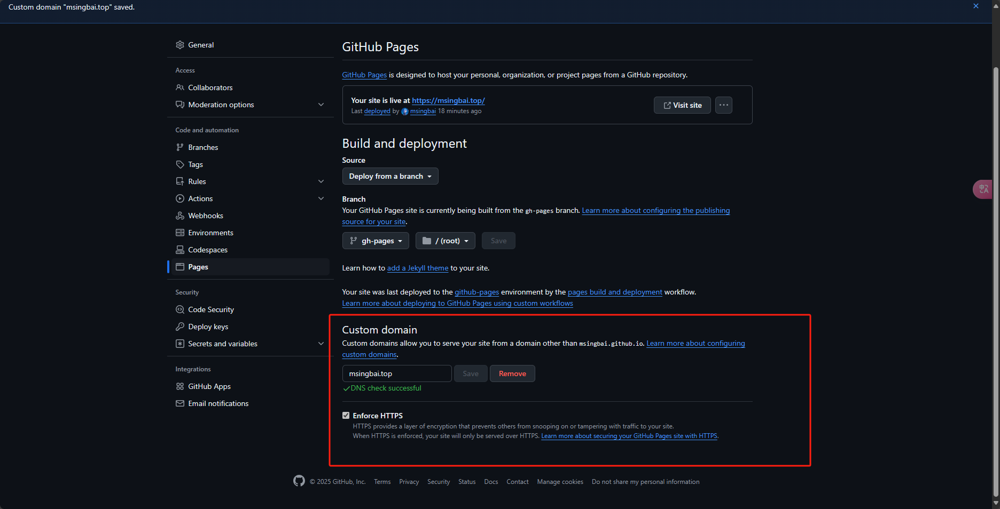
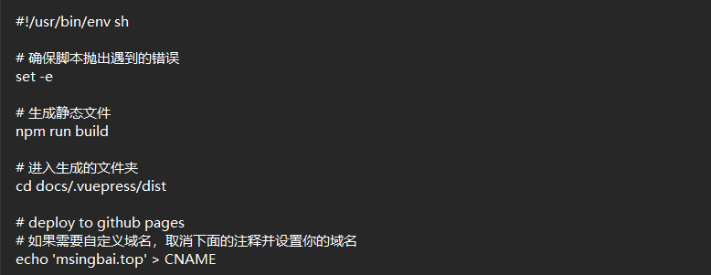
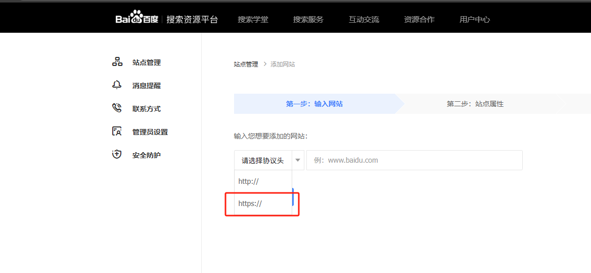
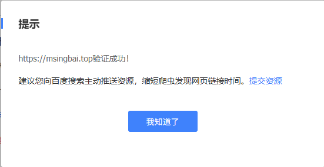
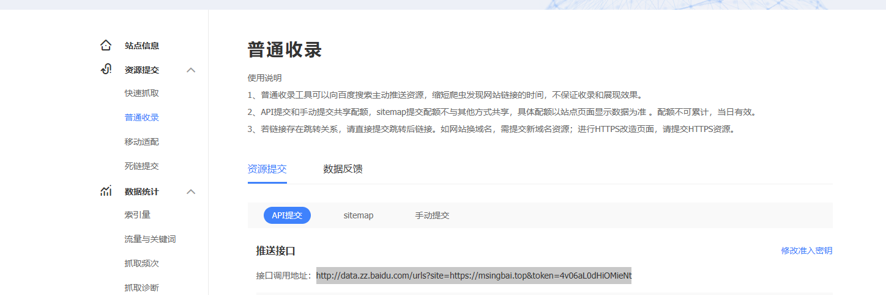
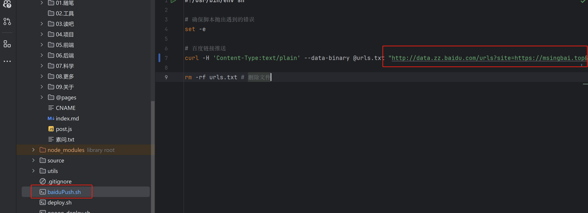

# 04.购买了域名

给网站一个**自定义域名**吧🎈

<!-- more -->   

在namesilo上购买了top域名

进行DNS解析[博客配置域名_博客域名-CSDN博客](https://blog.csdn.net/Ih_sabtreriver/article/details/145183419)

进入top域名，发现遇到了404错误

一般是在这里没有设置好

每推送一次master，这里不改变，但是每在本地deploy一次，就需要重新设置

在deploy里添加

添加百度站长工具

https://ziyuan.baidu.com/site

如果遇到了301错误[百度站长HTML添加301错误,搜索资源平台(百度站长)添加网站 使用文件验证 验证失败，原因：未知原因：301的解决办法...-CSDN博客](https://blog.csdn.net/weixin_39794734/article/details/118218361)

一般是http和https的分别，在选择的时候，选择自己网站使用的协议

选择html标签验证，验证自己是网站的拥有者

在`\docs\.vuepress\config.js`中添加html标签

验证成功

进行baiduPush的文件修改 

修改成自己的

*文字写于：广东*
