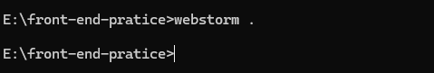
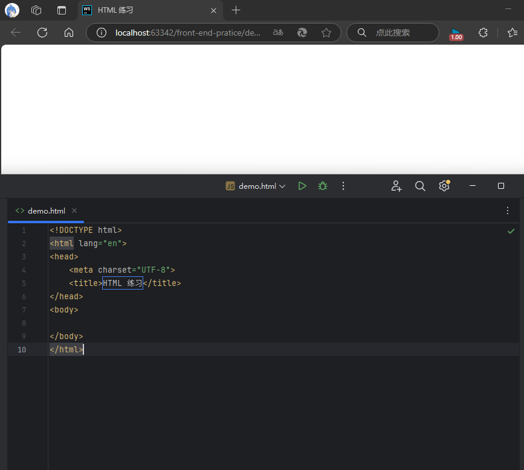

前端三件套之HTML

<!-- more -->

# 01.HTML基础

## HTML标签

**HTML的全称是 Hypertext Markup Language(超文本标记语言)**

通过HTML标签（也叫元素）来定义文本、图像、链接等待。是由尖括号包围的关键字

通常标签都是成对出现，包括开始标签和结束标签，内容位于标签内

```html
<p>这是一个段落。</p>
<h1>这是一个一级标题。</h1>
<ahref="#">这是一个超链接。</a>
```

单标签

```html
<input type="text">
<br> ​<!--换行 -->​
<hr> ​<!--分割线 -->​
<!--这是一个注释标签 -->​
```

单标签用于没有内容的元素，双标签用于有内容的元素

## HTML文件结构

```html
<! --这里放置文档的元信息-->
<!DOCTYPE html>
<html>
	<head>
		<!--这里放置文档的元信息--->
		<title>文档标题</title>
		<meta charset="UTF-8">
		<!--连接外部样式表或脚本文件等-->
		<link rel="stylesheet" type="text/css" href="styles.css">
		<script src="script.js"></script>
	</head>
	<body>
		<!--这里放置页面内容-->
		<h1>这是一个标题</h1>
		<p>这是一个段落。</p>
		<a href="https://www.example.com">这是一个链接</a>
		<!-- 其他内容 -->
	</body>
</html>
```

## HTML练习

创建一个文件夹，打开cmd

如果用vscode就用code . 我用了webstorm



title名字是标签页的名字



**常见文本标签练习**

<iframe src="/blog_file/HTML基础/demo.html" width="100%" height="500px"></iframe>

## HTML标签属性

接上一次练习中，我们使用了table的border属性 给表格添加上了一个宽度为22的边框

```html
<table border="22">
```

**属性在HTML中起到重要的作用，它们用于定义元素的行为和外观，以及与其他元素的关系。**

**基本语法：**
**<开始标签属性名="属性值">**

- 每个HTML元素可以具有不同的属性

  ```html
  <p id="describe" class="section">这是一个段落标签</p>
  <a href="https://www.baidu.com">这是一个超链接</a>
  ```

- 属性名称不区分大小写，属性值对大小写敏感

  ```html
  
  
  
  <！--前两者相同，第三个与前两个不一样-->
  ```

  **适用于大多数HTML元素的属性**

  | 属性  | 描述                                               |
  | ----- | -------------------------------------------------- |
  | class | 为HTML元素定义一个或多个类名（类名从样式文件引入） |
  | id    | 定义元素唯一的 id                                  |
  | style | 规定元素的行内样式                                 |

**HTML标签属性练习**

<iframe src="/blog_file/HTML基础/HTML属性.html" width="100%" height="500px"></iframe>

## 块元素与行内元素

### 块元素(block)

**块级元素通常用于组织和布局页面的主要结构和内容，例如段落、标题、列表、表格等。它们用于创建页面的主要部分，将内容分隔成逻辑块。**

- 块级元素通常会从新行开始，并占据整行的宽度，因此它们会在页面上呈现为一块独立的内容块。

- 可以包含其他块级元素和行内元素。

- 常见的块级元素包括

  ```php+HTML
  <div>,<p>,<h1>到<h6>,<ul>,<ol>,<li>,<table>,<form>等。
  ```

  

### 行内元素(inline)

**行内元素通常用于添加文本样式或为文本中的一部分应用样式。它们可以在文本中插入小的元素，例如超链接、强调文本等。**

- 行内元素通常在同一行内呈现，不会独占一行。

- 它们只占据其内容所需的宽度，而不是整行的宽度。

- 行内元素不能包含块级元素，但可以包含其他行内元素。

- 常见的行内元素包括

  ```html
  <span>,<a>,<strong>,<em>,,<br>,<input>等。
  ```

  #### div标签

```html
 <div>
```

标签 无特殊意义表示一个块标签，便于组织页面的结构和布局

```html
  <div class="nav"> navigation，导航
      可以用div.xxx 创建出class属性
      <div class="xxx">
      div#xxx 创建出id属性
      <div id="xxx"></div>
```

#### span标签

```html
 <span>
```

把一小部分文本包装起来，以便于使用css、js行为

<iframe src="/blog_file/HTML基础/HTML区块.html" width="100%" height="500px"></iframe>

## HTML表单

**HTML表单（Form）**是一种用于收集用户输入的网页元素集合。

它允许用户通过输入框、选择框、按钮等控件输入数据，并将这些数据发送到服务器进行处理。表单是网页交互的核心功能之一，广泛用于登录、注册、搜索、评论、在线调查等场景。

w3cschool可以查到教程

[HTML 表单_w3cschool](https://www.w3cschool.cn/html/html-form.html)

### **表单的基本结构**

HTML表单由`<form>`标签定义，其中可以包含多种表单控件（如输入框、按钮、选择框等）。

```html
<input>
```

input标签中 有单独的属性

- **password** :能够隐藏输入内容

- **radio**:单选

- **checkbox**:多选

  

```html
<form action=""></form>
```

一半用于填写后端的API，表示向后端发送数据

**HTML表单练习**

<iframe src="/blog_file/HTML基础/HTML表单.html" width="100%" height="500px"></iframe>

## 踩坑

markdown文件中我使用了

```html
<iframe src="../../.vuepress/public/blog_file/HTML基础/HTML表单.html" width="100%" height="500px"></iframe>
```

iframe标签，便于插入作为练习的html页面，并且把html文件放在了public文件夹里，这在typora里是显示正常的，但在vuepress渲染的博客中显示的是404

如果把链接改为某个页面的链接，在vuepress上能够正常显示

推断vuepress不支持直接的html文件

### **解决方案：**

百度找不到我们想要的答案，用了ai帮忙

#### ai给出的问题原因和解决思路

> 从你提供的路径来看，你可能对 VuePress 的文件结构和静态资源的处理方式有一些误解。VuePress 的默认行为和文件结构是针对 Markdown 文件和 VuePress 的特定目录结构设计的。如果你直接将 HTML 文件放在 `.vuepress/public` 或其他目录下，访问路径可能会出现问题。
>
> ### VuePress 的文件结构和静态资源处理
>
> 1. **`docs` 文件夹**：这是 VuePress 的主要内容目录，通常用于存放 Markdown 文件。VuePress 会自动解析这些文件并生成对应的页面。
> 2. **`.vuepress/public` 文件夹**：这个目录是用于存放静态资源的，比如图片、CSS、JS 文件等。VuePress 会将这些文件原样复制到最终的输出目录中。
>
> 如果你将 HTML 文件放在 `.vuepress/public` 文件夹下，VuePress 会将其作为静态资源处理，但访问路径会有所不同。
>
> ### 如何正确访问 HTML 文件
>
> 假设你将一个名为 `demo.html` 的文件放在 `.vuepress/public/blog_file/HTML基础/` 文件夹下，访问路径应该是：
>
> ```
> http://localhost:8080/blog_file/HTML基础/demo.html
> ```

实际上，vuepress在docs/public存放的是静态资源

若将文件放入public文件夹，则直接省去public

### 最终方案：

> ```
> <iframe src="/blog_file/HTML基础/HTML表单.html" width="100%" height="500px"></iframe>
> ```

发现html能以子页面的形式出现了

*文字写于：广东*