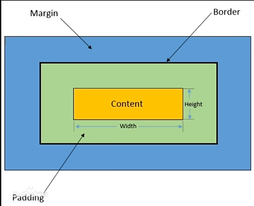

# CSS基础

## 什么是 CSS？

- *CSS* 指的是**层叠样式表*** (*C*ascading *S*tyle *S*heets)
- HTML负责定义页面的结构和内容，CSS负责控制页面的外观和样式
- 通过CSS，你可以指定页面中各个元素的颜色、字体、大小、间距、边框、背景等样式，从而实现更精确的页面设计。

## CSS语法

通常由选择器、属性和属性值组成，多个规则可以组合在一起，以便同时应用多个样式

```css
选择器｛
属性1：属性值1;
属性2：属性值2;
}
```

例子

```css
/*这是一个p标签选择器*/
p{
	color: blue;
	font-size: 16px;
}
```

## CSS的三种导入方式

1. 内联样式  
2. 内部样式表 <style标签>
3. 外部样式表


三种导入方式的优先级：内联样式 > 内部样式表 > 外部样式表

### CSS导入方式练习

<iframe src="/blog_file/CSS基础/CSS导入练习.html" width="100%" height="500px"></iframe>

## CSS选择器

- 元素选择器
- 类选择器
- ID 选择器
- 通用选择器
- 子元素选择器
- 后代选择器（包含选择器）
- 并集选择器（兄弟选择器）
- 伪类选择器

### 后代选择器和子代选择器

子代选择器是直接的第一代选择器

使用方式是

```css
  /*  子元素选择器 */
    .father > .son {
      color: yellowgreen;
    }
```

例如

```html
 <ul>
    <li>包子</li>
    <li>豆浆</li>
    <li>油条</li>
    <div>
      <li>食物</li>
    </div>
   </ul>  
```

包子、豆浆、油条属于**子代**，食物和前三者属于***后代***

### 相邻元素选择器

选择一个元素紧跟其后的一个标签

```html
  /*  相邻元素选择器*/
    h3 + p{
      background-color: red;
    }
```

### 伪类选择器

当鼠标悬停(hover)时的状态可以用伪类实现

```html
/*  伪类选择器*/
#element:hover{
  background-color: blueviolet;
}
```

### CSS选择器练习

<iframe src="/blog_file/CSS基础/CSS选择器.html" width="100%" height="500px"></iframe>

## CSS常用属性

CSS有上百个属性，这里学习常用的部分

CSS常用属性主要包括以下几类：

1. **布局属性**：如`display`定义元素的显示类型（块、行内、弹性等），`position`控制元素的定位方式（静态、相对、绝对、固定等），`float`实现元素的浮动布局，`flex`和`grid`用于现代弹性盒模型和网格布局。
2. **尺寸属性**：`width`和`height`设置元素的宽高，`margin`和`padding`控制元素的外边距和内边距，`box-sizing`定义元素的盒模型计算方式。
3. **文本样式**：`font-size`设置字体大小，`font-weight`定义字体粗细，`color`设置文字颜色，`text-align`控制文本对齐方式，`line-height`设置行高。
4. **背景与边框**：`background-color`设置背景颜色，`background-image`添加背景图片，`border`定义边框样式（宽度、颜色、样式）。
5. **视觉效果**：`opacity`设置元素透明度，`transform`实现元素的变形（旋转、缩放、移动等），`transition`和`animation`用于添加过渡和动画效果。

这些属性通过组合使用，可以实现丰富的页面样式和交互效果。

**在HTML基础中，我们知道块元素和行内元素，这里多提一个行内块元素，其实HTML基础中做过了练习，就是常用的<img标签>**

### 块元素(block):<div标签>

- 块级元素通常会从新行开始，并占据整行的宽度。
- 可以包含其他块级元素和行内元素。

### 行内元素(inline):<span标签>

- 行内元素通常在同一行内呈现，不会独占一行。
- 它们只占据其内容所需的宽度，而不是整行的宽度。
- 行内元素不能包含块级元素，但可以包含其他行内元素。

### 行内块元素(Inline-block):<img标签>

- 水平方向上排列，但可以设置宽度、高度、内外边距等块级元素的属性。
- 行内块元素可以包含其他行内元素或块级元素。

### CSS常用属性练习

<iframe src="/blog_file/CSS基础/CSS常用属性.html" width="100%" height="500px"></iframe>

## CSS盒子模型

CSS 盒子模型是网页布局的基础，它将页面元素视为一个个矩形盒子，每个盒子由以下四部分组成：

1. **内容区（Content）**：盒子的核心部分，用于容纳文本、图片等实际内容。
2. **内边距（Padding）**：内容区与边框之间的空间，用于扩展内容区的范围，不包含滚动条。
3. **边框（Border）**：围绕内边距的线条，用于装饰或分隔元素。
4. **外边距（Margin）**：盒子与其他元素之间的空间，用于控制元素之间的距离。



**CSS盒子模型练习**

<iframe src="/blog_file/CSS基础/CSS盒子模型.html" width="100%" height="500px"></iframe>

## 浮动

- 网页布局方式有以下五种：
- 标准流（普通流、文档流）：网页按照元素的书写顺序依次排列
- 浮动
- 定位
- Flexbox和Grid(自适应布局)

标准流是由块级元素和行内元素按照默认规定的方式来排列，块级就是占一行，行内元素一行放好多个元素。

**浮动**属性用于创建浮动框，将其移动到一边，直到左边缘或右边缘触及包含块或另一个浮动框的边缘，这样即
可使得元素进行浮动。
语法：

```html
选择器｛
float: left/right/none;
}
```

注意：浮动是相对于父元素浮动，只会在父元素的内部移动

### 浮动的三大特性

- 脱标：脱离标准流
- 一行显示，顶部对齐
- 具备行内块元素特性

**CSS浮动练习**

<iframe src="/blog_file/CSS基础/CSS浮动.html" width="100%" height="500px"></iframe>

## CSS定位

定位方式:

- 相对定位`：相对于元素在文档流中的正常位置进行定位。
- 绝对定位：相对于其最近的已定位祖先元素进行定位，不占据文档流。
- 固定定位：相对于浏览器窗口进行定位。不占据文档流，固定在屏幕上的位置，不随滚动而移动。**（常用侧边栏）**

**CSS定位练习**

<iframe src="/blog_file/CSS基础/CSS定位.html" width="100%" height="500px"></iframe>

*文字写于：广东*

