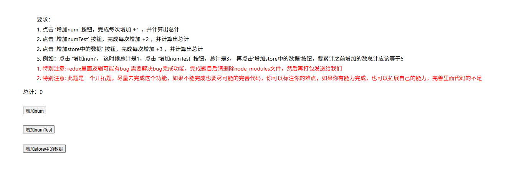

# 06.前端基础题练习-1

📖一次**题目练习**，前端的基础题

<!-- more -->

## 📖一、前端基础题

1. **Flexbox**：如何使用Flexbox实现一个三栏布局，左右固定宽度100px，中间自适应？

   Flexible Box是“有弹性的盒子”，CSS布局工具有floats和positioning，后来出现了flex，任何一个容器都可以指定为Flex布局

   当为容器设置`display:flex`，便创建了flex容器，容器内的直系子元素，将变成`flex元素。`

   ```css
   .box{
     display: flex;
   }
   ```

   行内元素也可以使用 Flex 布局。

   ```css
   .box{
     display: inline-flex;
   }
   ```

   设置为Flex 布局以后，子元素的`float`、`clear`和`vertical-align`属性将失效

    回顾一下html的基础结构

   ```html
   <!DOCTYPE html>
    
   <html lang="zh-CN">
    
   <head>
    
       <meta charset="utf-8">
    
       <title>三栏布局with Flexbox</title>
       <style>
           body{
               margin: 0; /* 外边距为0 */
           }
           .container {
               display:flex;/* 设定容器为flexbox */
           }
           .left-column{
               width:100px;/* 左宽度 */
               background-color: #f0f0f0;/* 增加颜色提高视觉效果 */
           }
           .right-column{
               width:100px;/* 右宽度 */
               background-color: #f0f0f0;
           }
           .center-column{
               flex-grow: 1; /* 自动填满，自适应 */
               background-color: #e0e0e0;
           }
       </style>
   </head>
   <body>
       <h1>示例文档</h1>
       <div class="container">
           <div class="left-column">Left Column</div>
           <div class="center-column">Center Column</div>
           <div class="right-column">Right Column</div>
       </div>
   </body>
   </html>
   ```

   <iframe src="/blog_file/前端基础题/Flexbox-partice.html" width="100%" height="500px"></iframe>

2. **防抖和节流**：请解释防抖和节流的区别，并用JavaScript实现一个防抖函数。

   防抖是指在事件被触发后，等待一段时间，如果这段时间里没有再次触发此事件，则执行一次该事件处理，若有再次触发的情况，则按最后一次的触发时间开始计时

   节流是让函数按照固定的时间间隔执行函数，不论事件触发频率如何，都不影响函数的按时执行。

   节流和防抖的区别在于，防抖是在最后一次触发事件后等待一段时间执行函数，节流是在一定时间内只执行一次

   ```javascript
   function debounce(func, wait) {
     let timeout;
     
     return function() {
       clearTimeout(timeout);//清除之前的定时器
       timeout = setTimeout(() =>{
         func.apply(this, arguments);//在延迟后执行目标函数
       },wait);
     };
   }
   ```

3. **数组遍历**：给定一个字符串数组，如何找出出现频率最高的单词？

   ```javascript
   const findMostWord = sentence => {
       if(!sentence) return; //若为空 返回
       const article = sentence.trim().toLowerCase(); //去掉空格+转化为小写
       const list = article.match(/[a-zA-Z]+/g);
       const map = {};
       const result = { maxCount: 0,words: []};//初始化记录结果
       list.forEach(word => {
           let count = 1;
           if(Object.hasOwn(map,word)){
               count += map[word];
           }
           map[word] = count;
           if(count > result.maxCount){
               result.maxCount = count;
               result.words = [word];
           } else if (count === result.maxCount) {
               result.words.push(word);;
           }
       });
       return result;
   };
   ```

   .match 找到所有字符 forEach 列出数组的每个元素

   <iframe src="/blog_file/前端基础题/findMostWord.html" width="100%" height="500px"></iframe>

4. **防抖和节流**：请解释防抖和节流的区别，并用JavaScript实现一个防抖函数。

## 📀二、React 框架应用

### 一、什么是Hooks?

`Hook`翻译过来是**钩子**的意思，其本质上是一组可复用的函数。

简单理解：能够在不同的组件中，实现相同的代码逻辑，以达到代码复用、提高维护性的效果。

### 二、使用场景

逻辑复用：当多个组件需要共享相同的逻辑时，可以将这些逻辑封装成一个Hook，然后在需要的组件中导入并使用。可以避免代码重复，提高代码的复用性。

逻辑拆分：对于复杂的组件，可以使用Hooks将组件的逻辑拆分成多个独立的函数，每个函数负责处理一部分逻辑。可以使组件的代码更加清晰、易于维护。

副作用管理：Hooks中的函数可以访问组件的响应式数据，并且可以在组件的生命周期中执行副作用操作（如定时器、事件监听等）。通过使用Hooks，可以更好地管理这些副作用操作，确保它们在组件卸载时得到正确的清理。

### 三、前端生命周期概述

前端生命周期可以分为以下几个主要阶段：

加载（Loading）：浏览器加载 HTML、CSS 和 JavaScript 文件。

解析（Parsing）：浏览器解析 HTML 和 CSS，构建 DOM 和 CSSOM。

渲染（Rendering）：浏览器将 DOM 和 CSSOM 结合，生成渲染树并绘制页面。

交互（Interactivity）：用户与页面交互，JavaScript 执行。

销毁（Unloading）：页面被卸载或销毁。


react中的class组件是拥有生命周期的。
生命周期分为：mounting，updating，unmounting三个阶段。

1. **useEffect/**生命周期：useEffect的作用是什么？如何模拟生命周期？

   useEffect是React中用于处理副作用的钩子(hock)。并且充当生命周期函数。副作用函数是在执行时会改变外部状态或者依赖外部可变状态的函数。react中的class组件的生命周期分为：mounting，updating，unmounting三个阶段。

   虽然useEffect不能完全替代所有生命周期方法，但它可以实现大部分常见的生命周期功能。

   **使用useEffect模拟componentDidMount、componentDidUpdate、componentWillUnmount**

   ```javascript
    useEffect(() => {
      // 这里的代码会在组件挂载后执行，类似于 componentDidMount
      console.log('Component mounted or updated, count:', count);
    }, []); // 空数组作为依赖项，确保只在组件挂载时执行
   
   useEffect(() => {
     // componentDidUpdate 逻辑
   }, [variable1, variable2]);
   
   useEffect(() => {
     // componentDidMount 逻辑
   
     return () => {
       // componentWillUnmount 逻辑
     };
   }, []);
   ```

2. **组件状态/****属性**：请解释 state 和 props 的区别，并举例说明它们的用途。

   state是React组件内部的数据存储，由组件本身管理，通常用于保存组建的可变数据，当state改变时，React会自动触发重新渲染。

   props是由父组件传递给子组件的数据，props是只读的，子组件不能修改他们。

   区别在于：state可变，由组件自身管理，组件内部代码可以自由修改state，并根据state变化来更新渲染，state是可变的。props是由父组件传递给子组件，子组件无法修改props，它只能接收并使用父组件传递的数据，props是只读的。

   State用于保存组件内部的动态数据，通常用于用户交互，例如创建一个计数器组件，用户点击按钮增加计数，就可以用state用于保存计数值，每次用户点击state就会更新，使得组件重新渲染

   Props用于展示数据或调用方法，假设有一个User组件，父组件通过props向子组件传递用户数据，例如用户名等等，子组件只负责接收并展示这些数据

## 🥧三、React 应用实践

### 典型项目结构

```tex
my-react-app/
|-- public/
|   |-- index.html            # 公共HTML文件
|   |-- favicon.ico           # 网站图标
|-- src/
|   |-- index.js              # 入口文件
|   |-- App.js                # 主组件
|   |-- App.css               # 主组件的样式
|   |-- index.css             # 全局样式
|   |-- components/           # 存放所有组件
|   |   |-- Button/
|   |   |   |-- Button.js
|   |   |   |-- Button.css
|   |   |-- Header/
|   |   |   |-- Header.js
|   |   |   |-- Header.css
|   |-- containers/           # 存放容器组件（通常与Redux或其他状态管理库结合使用）
|   |-- actions/              # 存放action创建函数（与Redux结合使用）
|   |-- reducers/             # 存放reducer函数（与Redux结合使用）
|   |-- store/                # 存放store配置（与Redux结合使用）
|   |-- styles/               # 存放全局样式或可复用的样式组件
|   |-- utils/                # 存放工具函数或帮助函数
|   |-- api/                  # 存放API调用相关的函数
|-- .gitignore              # Git忽略文件配置
|-- package.json            # 项目配置文件
|-- README.md               # 项目说明文件
```

#### 实战一

1. **应用实践：**请使用素材中 react-timer-app 项目，实现一个计时器，具备以下功能和要求：

**功能**：

\1. 开始计时：点击按钮后，计时器开始运行。

\2. 停止计时：点击按钮后，计时器停止运行。

\3. 实时更新：计时器每隔 1 秒更新一次显示的时间。

**要求：**

\1. 功能逻辑完整，确保开始、停止和更新时间的功能正常运行。

\2. 完成开发后，**录制一段计时器运行的演示视频**，要求运行效果清晰。

JavaScript setTimeout() 用法

setTimeout() 是属于 window 的方法，该方法用于在指定的毫秒数后调用函数或计算表达式。

语法格式可以是以下两种：

> setTimeout(要执行的代码, 等待的毫秒数)
> setTimeout(JavaScript 函数, 等待的毫秒数)

示例一

```javascript
setTimeout("alert('对不起, 要你久候')", 3000 )
```

示例二

```html
<p id="content"> 请等三秒钟!</p>  
<script>  
setTimeout("changeState()",3000 );  
function changeState(){  
    let content=document.getElementById('content');  
    content.innerHTML="<div style='color:red'>我是三秒后显示的内容！</div>";  
}  
</script>
```

<iframe src="/blog_file/前端基础题/settimeout.html" width="100%" height="500px"></iframe>

```javascript
// 开始计时
const startTimer = () => {
    setIsActive(true);
};
```

`const App = () => {}`：这是一个箭头函数（arrow function）定义。

setInterval() 方法可按照指定的周期（以毫秒计）来调用函数或计算表达式

在 React 的 `useState` 中，更新状态时可以传入一个函数，而不是直接传入一个值。这种方式称为 **函数式更新**。

- **函数式更新的语法：**

  JavaScript

  复制

  ```javascript
  setState((prevState) => newState);
  ```

  

  - `setState` 是由 `useState` 返回的更新函数。
  - `prevState` 是当前状态的值。
  - `newState` 是基于 `prevState` 计算出的新状态值。

```jsx
import React, { useState , useEffect } from "react";
import "./index.css";

function App() {
    const [time, setTime] = useState(0); // 初始化值为0
    const [isActive, setIsActive] = useState(false); // 控制计时器是否在运行

    // 开始计时
    const startTimer = () => {
        setIsActive(true);
    };

    // 停止计时
    const stopTimer = () => {
        setIsActive(false);
    };

    // 重置计时器
    const resetTimer = () => {
        setIsActive(false);
        setTime(0);
    };

    // 使用 useEffect 来处理计时逻辑
    useEffect(() => {
        let interval = null;

        if (isActive) {
            interval = setInterval(() => {
                setTime((prevTime) => prevTime + 1); //传入一个方法 每秒增加1秒
            }, 1000);
        } else if (!isActive && time !== 0) {
            clearInterval(interval); // 停止计时时，清除定时器
        }

        // 清理函数，清楚定时器和时间
        return () => clearInterval(interval);
    }, [isActive, time]);

    return (
        <div className="App">
            <h3>实现一个计时器，具备以下功能和要求：</h3>
            <h4>功能：</h4>
            <p>1. 开始计时：点击按钮后，计时器开始运行。</p>
            <p>2. 停止计时：点击按钮后，计时器停止运行。</p>
            <p>3. 实时更新：计时器每隔 1 秒更新一次显示的时间。</p>

            <h4>要求：</h4>
            <p>1. 功能逻辑完整，确保开始、停止和更新时间的功能正常运行。</p>
            <p>
                2.
                完成开发后，录制一段计时器运行的演示视频，要求清晰展示计时器的运行效果。
            </p>

            <h4>实现：</h4>
            <div className="timer">
                <button onClick={startTimer}>开始计时</button>
                <button onClick={stopTimer}>结束计时</button>
            </div>
            <div>
                计时：<span className="primary">{time}</span> 秒
            </div>
        </div>
    );
}


export default App;

```

#### 实战二




**Redux**最早运用于**React**框架中，是一个全局状态管理器，使用叫做“action”的事件来管理和更新应用状态的模式和工具库。它以集中式Store（centralized store）的方式对整个应用中使用的状态进行集中管理，其规则确保状态只能以可预测的方式更新。

为什么要用 Redux？

**Redux 提供的模式和工具使您更容易理解应用程序中的状态何时、何地、为什么以及如何更新，以及当这些更改发生时您的应用程序逻辑将如何表现**. Redux 指导您编写可预测和可测试的代码，这有助于让您确信您的应用程序将按预期工作。

Redux 在以下情况下更有用：

- 在应用的**大量地方**，都存在**大量的状态**
- 应用状态会随着时间的推移而**频繁更新**
- 更新该状态的**逻辑可能很复杂**
- 中型和大型代码量的应用，**很多人协同开发**

## Redux 术语

### Action (动作)

**action**是一个具有 **type** 字段的普通 JavaScript 对象。**你可以将 action 视为描述应用程序中发生了什么的事件**.

一个典型的 action 对象可能如下所示：

```js
const addTodoAction = {
  type: 'todos/todoAdded',
  payload: 'Buy milk'
}
```

### Reducer (缩减器)

**reducer** 是一个函数，接收当前的 **state** 和一个 **action** 对象，必要时决定如何更新状态，并返回新状态。函数签名是：(state, action) => newState。你可以将 reducer 视为一个事件监听器，它根据接收到的 action（事件）类型处理事件。

### Store (仓库)

当前 Redux 应用的状态存在于一个名为 **store** 的对象中。

store 是通过传入一个 reducer 来创建的，并且有一个名为 **getState** 的方法，它返回当前状态值：


*文字写于：广东*