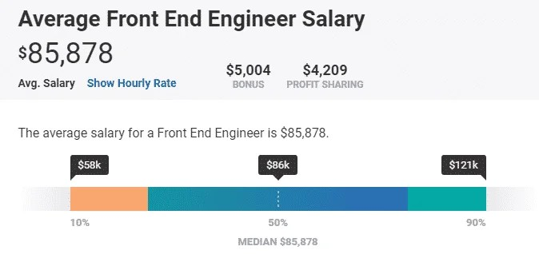
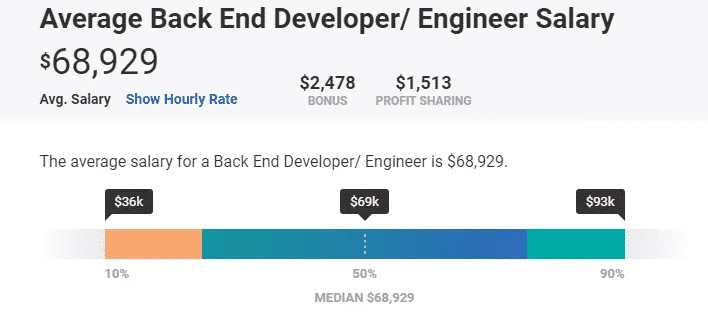
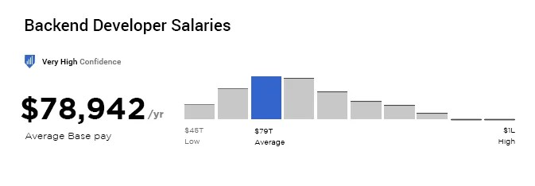

# 01.后端基础

> 本文引用:
>
> 1.自[前端后端的区别（超详细版）_如何区分前端和后端问题-CSDN博客](https://blog.csdn.net/low5252/article/details/97007172)
>
> 作者：[水无垠ZZU](https://debuger.blog.csdn.net/)
>
> 2.[Backend vs Frontend Development: What’s The Difference?](https://www.excellentwebworld.com/backend-vs-frontend/)
>
> Author:Paresh Sagar

## 后端是什么	

​	后端是应用程序的后台开发，也称为“服务器端开发”，也就是在系统“后面”所发生的事情。在后端服务器和浏览器或应用程序之间存储网站、应用数据和中间媒介的服务器都属于后端。简单来说，在应用程序或网站的屏幕上看不到的所有东西都是前端的后端。

### 网站和移动应用后端

​	网站的后端需要设置服务器，存储和检索数据，以及将这些服务器与前端进行连接的接口。如果说前端开发人员梗关注网站的外观，后端开发人员则更更关注网站的速度、性能和响应能力，后端通过编码、云 API 和数据库进行集成。

​	就像前端一样，移动应用的后端开发在各个方面都与网站后端相同。此外，你为移动应用设置后端服务器的选项包括：云计算（AWS，Firebase）定制服务器或 MBaaS（移动后端即服务）。

Ruby，Apache，Nginx，PHP，MySQL，MongoDB 等用于后端开发的工具和技术很少。我们将在文中进一步讨论这些技术栈。

## 前端和后端的区别

| 前端         | 后端                                                         |                                                              |
| ------------ | ------------------------------------------------------------ | ------------------------------------------------------------ |
| 专业知识     | 前端 Web 开发人员需要精通 HTML，CSS 和 JavaScript。          | 后端开发人员应该拥有数据库，服务器，API 等技能               |
| 职位描述     | 前端开发人员团队设计网站的外观，并通过测试不断修改。         | 后端开发人员团队开发软件，并构建支持前端的数据库架构。       |
| 独立开发服务 | 除非网站是一个简单工作的静态网站，否则不能单独提供前端服务。 | 后端服务可以作为 BaaS（后端即服务）独立提供。                |
| 项目目标     | 前端开发人员的目标是确保所有用户都可以访问该网站或应用，并在所有视图中做出响应 —— 移动和桌面。 | 后端开发人员的目标是围绕前端构建程序，并提供所需的所有支持，并确保站点或应用始终正常运行。 |

## 前端与后端技术栈

|          | 前端                                                         | 后端                                                         |
| -------- | ------------------------------------------------------------ | ------------------------------------------------------------ |
| 编程语言 | HTML，CSS，JavaScript                                        | PHP，Python，SQL，Java，Ruby，.NET，Perl                     |
| 框架     | Angular.JS，React.JS，Backbone.JS，Vue.JS，Sass，Ember.JS，NPM | Laravel，CakePHP，Express，CodeIgniter，Ruby on Rails，Pylon，[ASP.NET](http://asp.net/) |
| 数据库   | Local Storage, Core Data, SQLite, Cookies, Sessions          | MySQL，Casandra，Postgre SQL，MongoDB，Oracle，Sybase，SQL Server |
| 服务器   | -                                                            | Ubuntu，Apache，Nginx，Linux，Windows                        |
| 其他     | AJAX，AMP，Atom，Babel，BEM，Blaze，Bourbon，Broccoli，Dojo，Flux，GraphQL，Gulp，Polymer，[Socket.IO](http://socket.io/)，Sublime Text | -                                                            |

## 前端 Vs 后端：谁是最好的？

**除了所涉及的技术之外，你对前端与后端开发人员的选择取决于开发人员最重要的因素。**

如果对美学和产品的感觉对你来说至关重要，那么你会倾向于将前端技术作为职业和专业。另一方面，如果你关注提高网站、应用程序或软件的效率和响应能力，那么你的方向就应该是后端开发。

前端设计师所做的很大一部分工作就是让用户在移动设备或 PC 屏幕上看到的东西看起来都很棒而且易于使用。相反，后端开发人员唯一关注的美学是编写干净的代码。

如果你开始认为在前端 Vs 后端 中，两者中任何一个基于我们上面谈到的内容都优于另一个，那么这是一个错误的假设。这两个学科非常独特，对于构建网站或应用程序同样重要。

**只是有些人对视觉方面有天赋，而有些人则对逻辑和技术问题解决的很好。由于史蒂夫·乔布斯（前端幻想家）以及史蒂夫·沃兹尼亚克（后端天才），苹果成为了它的样子。**

**前端职称：**

- 前端开发人员
- 前端 Web 设计师
- Android 开发人员
- iOS 开发人员
- 前端开发运营
- 前端 JavaScript 应用程序开发人员

- 前端用户界面 （UI） 开发人员
- 前端用户界面 （UI） 开发人员
- HTML/CSS 开发人员
- 前端测试/QA
- 前端 SEO 专家

**后端职称：**

- 后端开发人员
- 初级后端工程师
- Web 开发人员
- 开发运营
- 软件工程师
- WordPress 开发人员

- 云开发人员
- REST API 专家
- 服务器/系统管理员
- 数据库设计师 /Architecturer
- Java 开发人员
- Python 开发人员
- PHP 开发人员

### 前端与后端开发人员：所需技能

所需的高级技能会根据经验和职称而变化，但成为前端或后端开发人员绝对需要一些技能。

| 前端开发人员所需的技能                         | 后端开发人员所需的技能                     |
| ---------------------------------------------- | ------------------------------------------ |
| 对美学、艺术和设计有很好的理解                 | 对第三方附加组件的透彻理解                 |
| 了解各种 CMS，如 WordPress、Joomla 或 Drupal   | 对如何调试代码的批判性理解                 |
| 直观满足用户需求                               | 将客户的业务需求转化为功能代码             |
| 了解 PHP 和 OOPs（面向对象编程）               | 了解 Web 服务器配置                        |
| 质量保证专业知识                               | 与外部系统（支付处理器、社交媒体网站）兼容 |
| 懂得使用 PhotoShop、Sketch 或 Figma 等设计工具 | 批判性思维能力                             |
| 虚拟主机的基础知识                             | 设计用户交互系统                           |

#### 前端与后端开发人员：角色与职责

前端和后端开发人员的角色和职责是什么？在申请工作或雇用您的前端或后端开发人员之前，请务必仔细阅读这些内容。

| 前端开发人员的角色和职责                           | 后端开发人员的角色和职责                                   |
| -------------------------------------------------- | ---------------------------------------------------------- |
| 确保网站的可见性在各种浏览器中保持不变。           | 了解客户对网站或应用程序的目标，并提供有效的开发解决方案。 |
| 构建具有视觉吸引力并吸引用户互动的网站或应用程序。 | 安全地存储数据，并确保在请求时向该用户显示数据。           |
| 了解跨浏览器测试。                                 | 开发支付处理系统、安全地存储支付信息并收取支付费用。       |
| 熟练使用 Flash 和 Dreamweaver 等工具。             | 管理和构建（如有必要）跨设备工作的 API 资源。              |
| 对 SEO 有基本的了解。                              | 构建系统架构和数据科学分析。                               |
| 设计易于使用。                                     | 组织跨多个设备高效运行的系统逻辑。                         |
| 擅长与客户互动并实施他们的反馈。                   | 解决系统相关问题和实施算法的技能。                         |

### 前端与后端开发人员：薪资比较

#### 前端开发人员薪水

**根据** ***\*[PayScale](https://www.payscale.com/research/US/Job=Front_End_Engineer/Salary)：\****

**根据** **[Glassdoor](https://www.glassdoor.co.in/Salaries/us-front-end-developer-salary-SRCH_IL.0,2_IN1_KO3,22.htm) 的说法：**

#### 后端开发人员薪水

**根据** ***\*[PayScale](https://www.payscale.com/research/US/Job=Back_End_Developer%2F_Engineer/Salary)：\****

**根据** **[Glassdoor](https://www.glassdoor.co.in/Salaries/us-backend-developer-salary-SRCH_IL.0,2_IN1_KO3,20.htm) ：**

## 什么是全栈开发？

有些人可以同时掌握前端和后端开发技能。这样的开发被称为全栈开发人员。

学习或雇用全栈开发者有其自身的优点和缺点。可以吧开发人员数量减少到一半，但专业水平也随之降低了。专门从事前端或后端开发的开发人员一般比了解两者的人对于单一学科更加专业。

还有各种类似于全栈的技术栈，如 MEAN 技术栈，LAMP 技术栈，.NET 技术栈，Python-Django 技术栈，ROR 技术栈开发人员可以成为任何这些技术堆栈的专家。

*文字写于：广东*