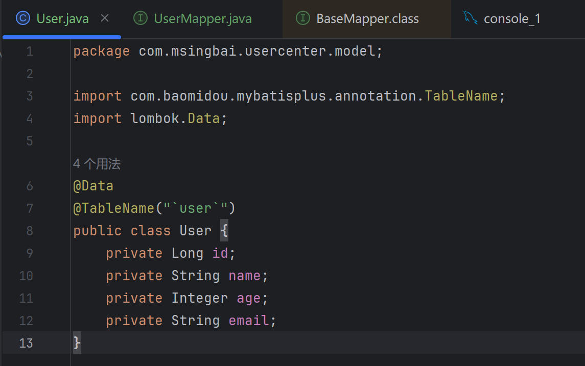

SpringBoot早有耳闻，甚至在不知道他们的时候就已经用过，他们都是啥？🤔

<!-- more -->

# 03.Spring Boot和Spring、MyBatis

## 什么是MyBatis的Mapper层？

​	在后端开发中，我们需要将数据库中的数据映射到Java对象上，对数据进行增删查改等操作。MyBatis是一个Java持久层框架，它支持SQL映射，允许开发者编写SQL语句并与Java对象进行交互。

在MyBatis中，Mapper层通常由两个部分组成：

> 1. **Mapper接口**：定义与数据库交互的方法。
> 2. **Mapper XML文件**：包含SQL语句的映射，定义具体的SQL操作。

我们创建了一个实体类User，用于表示数据库中的用户信息。



**`UserMapper`接口**

Mapper定义与数据库操作相关的方法。每个方法对应一个SQL查询或更新操作。

## 什么是Spring Boot和Spring？

**Spring Boot** 是基于Spring框架的扩展工具

###  **Spring vs Spring Boot 对比**

| 特性         | Spring                               | Spring Boot                     |
| :----------- | :----------------------------------- | :------------------------------ |
| **定位**     | 基础框架，提供核心功能（IoC、AOP等） | 基于Spring的快速开发框架        |
| **配置**     | 需要手动配置很多（XML/注解）         | **自动配置**，大部分默认搞定    |
| **服务器**   | 需要额外部署（如Tomcat）             | **内嵌服务器**，直接运行        |
| **依赖管理** | 需要自己管理依赖                     | 提供**starter**，一键引入相关库 |
| **适用场景** | 需要高度定制化的复杂系统             | 快速开发、微服务、REST API      |

### **举个例子 🌰**

#### 目标

创建一个简单的HTTP接口，访问 `http://localhost:8080/hello` 时返回 `"Hello, Spring Boot!"`。

#### **①.用 Spring 写一个Web接口**

相比于Spring Boot的“一键式”开发，**原生Spring需要手动配置很多步骤**，比如：

- 手动配置Tomcat服务器
- 手动编写XML定义Bean
- 手动初始化Spring容器

##### **创建Maven项目**

###### **（1）新建项目**

1. 在IDE中选择 **Maven项目**（不是Spring Boot！）。
2. 填写 `GroupId`（如 `com.example`）和 `ArtifactId`（如 `spring-demo`）。

###### **（2）添加依赖**

在 `pom.xml` 中加入Spring和Servlet依赖：

```xml
<dependencies>
    <!-- Spring Core + MVC -->
    <dependency>
        <groupId>org.springframework</groupId>
        <artifactId>spring-webmvc</artifactId>
        <version>5.3.30</version>  <!-- 选一个稳定版本 -->
    </dependency>

    <!-- Servlet API（Tomcat需要） -->
    <dependency>
        <groupId>javax.servlet</groupId>
        <artifactId>javax.servlet-api</artifactId>
        <version>4.0.1</version>
        <scope>provided</scope>  <!-- 编译时需要，运行时由Tomcat提供 -->
    </dependency>
</dependencies>
```

##### **初始化Spring**

###### **（1）创建Spring配置文件**

在 `src/main/resources` 下新建 `spring-config.xml`：

```xml
<?xml version="1.0" encoding="UTF-8"?>
<beans xmlns="http://www.springframework.org/schema/beans"
       xmlns:xsi="http://www.w3.org/2001/XMLSchema-instance"
       xmlns:context="http://www.springframework.org/schema/context"
       xmlns:mvc="http://www.springframework.org/schema/mvc"
       xsi:schemaLocation="
           http://www.springframework.org/schema/beans
           http://www.springframework.org/schema/beans/spring-beans.xsd
           http://www.springframework.org/schema/context
           http://www.springframework.org/schema/context/spring-context.xsd
           http://www.springframework.org/schema/mvc
           http://www.springframework.org/schema/mvc/spring-mvc.xsd">

    <!-- 启用注解扫描（@Controller等） -->
    <context:component-scan base-package="com.example"/>

    <!-- 启用Spring MVC注解（@GetMapping等） -->
    <mvc:annotation-driven/>

    <!-- 配置视图解析器（虽然我们只返回字符串，但Spring MVC要求配这个） -->
    <bean class="org.springframework.web.servlet.view.InternalResourceViewResolver">
        <property name="prefix" value="/WEB-INF/views/"/>  <!-- 可忽略，因为我们不返回JSP -->
        <property name="suffix" value=".jsp"/>
    </bean>
</beans>
```

运行 HTML

------

###### **（2）配置Web应用**

在 `src/main/webapp/WEB-INF` 下新建 `web.xml`：

```xml
<!DOCTYPE web-app PUBLIC
        "-//Sun Microsystems, Inc.//DTD Web Application 2.3//EN"
        "http://java.sun.com/dtd/web-app_2_3.dtd">
<web-app>
    <!-- 配置Spring的DispatcherServlet（前端控制器） -->
    <servlet>
        <servlet-name>dispatcher</servlet-name>
        <servlet-class>org.springframework.web.servlet.DispatcherServlet</servlet-class>
        <init-param>
            <param-name>contextConfigLocation</param-name>
            <param-value>classpath:spring-config.xml</param-value>  <!-- 指定Spring配置文件 -->
        </init-param>
        <load-on-startup>1</load-on-startup>  <!-- 容器启动时加载 -->
    </servlet>

    <!-- 映射所有HTTP请求到DispatcherServlet -->
    <servlet-mapping>
        <servlet-name>dispatcher</servlet-name>
        <url-pattern>/</url-pattern>
    </servlet-mapping>
</web-app>
```

需额外安装Tomcat并部署war包

##### **部署到Tomcat**

###### **（1）配置Tomcat**

1. 下载Tomcat（如Tomcat 9）并解压。
2. 在IDE中配置Tomcat服务器：
   - 在IntelliJ IDEA中：`Run → Edit Configurations → 添加Tomcat Server`。
   - 指定Tomcat安装目录。

###### **（2）构建并运行**

1. 用Maven打包项目：

   ```bash
   mvn clean package
   ```

   这会生成 `target/spring-demo.war` 文件。

2. 将 `war` 文件复制到Tomcat的 `webapps/` 目录下。

3. 启动Tomcat：

   ```bash
   cd tomcat/bin
   ./startup.sh  # Linux/Mac
   startup.bat    # Windows
   ```

##### **测试接口**

访问：

```
http://localhost:8080/spring-demo/hello
```

（`spring-demo`是你的war包名，如果没改就是项目名）

你应该看到：

```
Hello, Spring!
```


#### **②.用 Spring Boot 写同样的接口**

##### **步骤 1：创建Spring Boot项目**

###### **方法1：用官方工具（推荐）**

1. 打开浏览器，访问 [start.spring.io](https://start.spring.io/)（Spring官方项目生成器）。
2. 按以下配置选择：
   - **Project**：Maven（默认）
   - **Language**：Java
   - **Spring Boot**：选最新稳定版（如3.2.x）
   - **Group**：`com.example`（你的包名）
   - **Artifact**：`demo`（项目名）
   - **Dependencies**：添加 `Spring Web`（这是写Web接口必需的）
3. 点击 **Generate** 下载一个压缩包，解压后用IDE（如IntelliJ IDEA或VS Code）打开。

###### **方法2：用IDE直接创建**

- 在IntelliJ IDEA中：
  1. 新建项目 → 选择 **Spring Initializr**。
  2. 后续步骤和方法1一致，勾选 `Spring Web` 依赖。

------

##### **步骤 2：项目结构说明**

解压或创建后的项目目录长这样：

```lua
demo
├── src
│   ├── main
│   │   ├── java
│   │   │   └── com
│   │   │       └── example
│   │   │           └── demo
│   │   │               └── DemoApplication.java  # 启动类
│   │   └── resources
│   │       ├── application.properties  # 配置文件（可选）
│   │       └── static/  # 静态资源（如HTML）
├── pom.xml  # Maven依赖管理文件
```

关键文件：

- `DemoApplication.java`：Spring Boot的启动入口。
- `pom.xml`：管理项目依赖（比如你选的`Spring Web`就在这里）。

------

##### **步骤 3：编写代码**

1. 在 `src/main/java/com/example/demo` 下新建一个类 `HelloController.java`：

   ```java
   package com.example.demo;
   
   import org.springframework.web.bind.annotation.GetMapping;
   import org.springframework.web.bind.annotation.RestController;
   
   @RestController  // 告诉Spring这是一个HTTP接口的控制器
   public class HelloController {
   
       @GetMapping("/hello")  // 定义HTTP GET请求的路径
       public String sayHello() {
           return "Hello, Spring Boot!";
       }
   }
   ```

   - `@RestController`：表示这个类是用来处理HTTP请求的。
   - `@GetMapping("/hello")`：当用户访问 `/hello` 时，调用这个方法。

2. 确保启动类 `DemoApplication.java` 是这样的（一般自动生成，不用改）：

   ```java
   package com.example.demo;
   
   import org.springframework.boot.SpringApplication;
   import org.springframework.boot.autoconfigure.SpringBootApplication;
   
   @SpringBootApplication  // 标记这是Spring Boot应用
   public class DemoApplication {
       public static void main(String[] args) {
           SpringApplication.run(DemoApplication.class, args);  // 启动应用
       }
   }
   ```

------

##### **步骤 4：运行项目**

1. 在IDE中：

   - 找到 `DemoApplication.java`，右键点击 `Run`。

   - 或直接运行命令：

     ```bash
     ./mvnw spring-boot:run  # 如果你是Maven项目
     ```

2. 你会看到控制台输出类似：

   ```bash
   Tomcat started on port 8080  # 内嵌Tomcat服务器启动了！
   ```

------

##### **步骤 5：测试接口**

1. 打开浏览器，访问：

   ```
   http://localhost:8080/hello
   ```

2. 你会看到页面显示：

   ```
   Hello, Spring Boot!
   ```

------

#### **关键点解释**

1. **为什么不用配置Tomcat？**
   Spring Boot内嵌了Tomcat服务器，直接运行即可，无需额外安装。

2. **为什么不用写XML？**
   Spring Boot默认使用**约定优于配置**，比如：

   - 所有HTTP接口默认在 `8080` 端口。
   - `@RestController` 自动处理HTTP响应。

3. **如何改端口？**
   在 `src/main/resources/application.properties` 里加一行：

   ```
   server.port=9090  # 改成9090端口
   ```

*文字写于：广东*