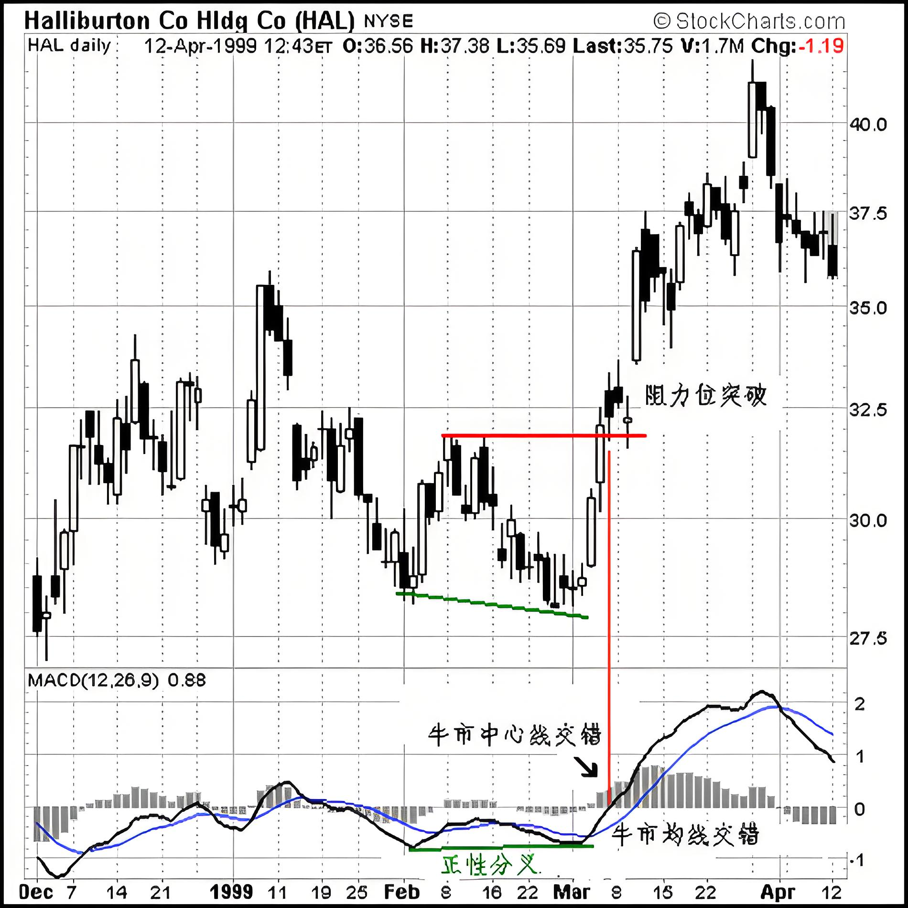
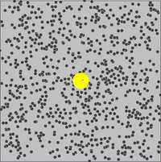
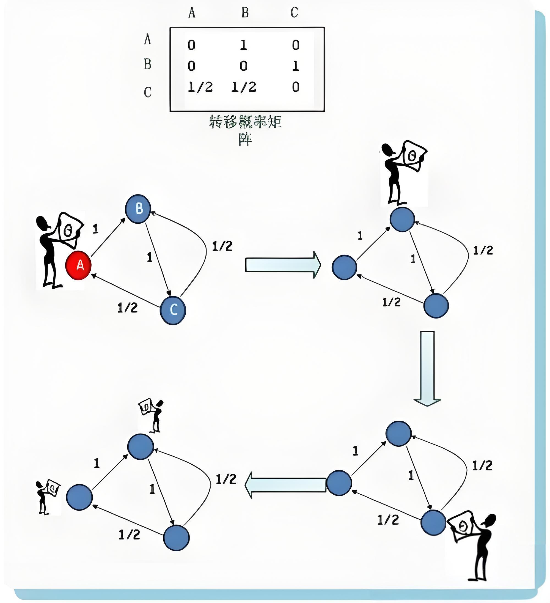
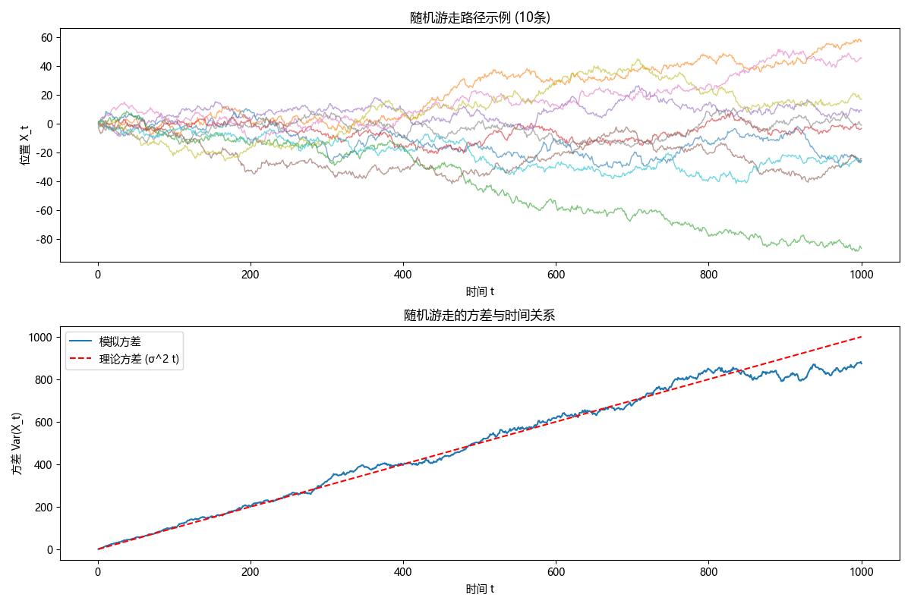

新建了科学目录，收录论文的阅读和科学写作，今天要写的是**随机游走**

<!-- more -->

# 01.随机游走

### 定义

​	随机游走（Random Walk）是一种数学统计模型。它描述了一个在某种空间（如一维直线、二维平面或更高维空间）中随机移动的过程。在每次移动中，移动的方向和距离都是随机决定的。例如，在一维随机游走中，一个粒子在数轴上每次可以向左或向右移动一个单位，向左或向右的概率通常是相等的（假设为1/2）。

### 性质

- **无记忆性**：随机游走的下一步移动只依赖于当前位置，而与之前走过的路径无关。这体现了马尔可夫性质，即未来的状态仅与当前状态有关，而与过去状态无关。
- **扩散性**：随着时间的推移，随机游走的粒子会扩散到更广阔的空间区域。在一维随机游走中，粒子的平均位移的平方与时间成正比，即

$$
x^2∝t
$$

其中*x*是粒子的位移，*t*是时间。

- **遍历性**：在无限的时间内，随机游走的粒子会以概率1遍历空间中的每一个点（对于一些简单规则的格点空间）。不过，这并不意味着粒子会均匀地访问每个点，有些点可能被频繁访问，而有些点可能很少被访问。

### 应用领域

- **金融领域**：股票价格的变化可以看作是一种随机游走。虽然股票价格受到众多因素（如公司业绩、宏观经济环境等）的影响，但从短期来看，其价格波动在一定程度上具有随机性。有效市场假说认为，在理想情况下，股票价格的变动是随机游走的，因为所有可用信息都已经反映在当前价格中，新的价格变动只能由新的随机信息引起。

  <div style="text-align: center">
    
  </div>

- **物理学领域**：布朗运动是随机游走的一个经典物理模型。微观粒子（如悬浮在液体中的花粉颗粒）在液体分子的碰撞下，会进行无规则的运动。这种运动可以用随机游走来描述，帮助人们理解物质的扩散、热传导等物理现象。

<div style="text-align: center">
  
</div>


- **计算机科学领域**：在网页排序算法（如Google的PageRank算法）中，随机游走的思想被用来模拟网页之间的链接关系。一个“随机游走者”在网页之间随机点击链接，网页被点击的频率越高，其重要性就越高。此外，在网络爬虫中，也可以利用随机游走策略来探索网络中的网页。

> 假设互联网由A、B、C三个节点组成，其互相链接的关系由图中的有向边表示。节点A只有一个出链指向B，B只有一个指向到C，而C有两个指向，到A和到B，转向任意一个节点的概率都为1/2
>
> 假设在时刻1，用户浏览页面A，之后经由链接进入页面B，然后进入页面C，此时面临两种可能选择，跳转进入页面A 或者页面B 皆可，两者概率相同，都为1/2。

<div style="text-align: center">
  
</div>


### 项目背景

这个项目旨在通过计算机模拟一维随机游走过程，帮助理解随机游走的基本特性和规律。在一维随机游走中，粒子在数轴上移动，每次随机选择向左或向右移动一个单位。

### 实现步骤

1. **初始化参数**
   - 设定初始位置为*x*=0。
   - 设定步数*N*，例如100步。
   - 设定向左或向右移动的概率，这里假设都是*p*=0.5。
2. **模拟过程**
   - 使用随机数生成器来决定每次移动的方向。例如，在Python中可以使用`random.choice([-1, 1])`来随机选择-1（向下）或1（向上）。
   - 对于每一步，将当前的位置与随机选择的移动方向相加，得到新的位置。
   - 记录每一步的位置。
3. **结果分析**
   - 绘制粒子位置随步数变化的图像。可以看到粒子位置在数轴上随机波动。
   - 计算粒子在不同步数下的平均位置和方差。理论上，平均位置应该接近0（因为向左和向右的概率相等），而方差会随着步数的增加而增大，符合 $x^2∝t$ 的规律。

### 代码示例（Python）

```python
import numpy as np
import matplotlib.pyplot as plt
import matplotlib.font_manager as fm

# 设置字体（解决中文和数学符号问题）
plt.rcParams['font.sans-serif'] = ['Microsoft YaHei']  # 使用支持数学符号的字体
plt.rcParams['axes.unicode_minus'] = False

# 参数设置
n_steps = 1000
n_paths = 100
step_var = 1

# 生成随机游走路径
steps = np.random.normal(0, np.sqrt(step_var), (n_paths, n_steps))
paths = np.cumsum(steps, axis=1)

# 计算方差
time = np.arange(1, n_steps + 1)
variance = np.var(paths, axis=0)

# 绘图
plt.figure(figsize=(12, 8))

# 子图1：路径示例
plt.subplot(2, 1, 1)
for i in range(min(10, n_paths)):
    plt.plot(time, paths[i], lw=1, alpha=0.6)
plt.title('随机游走路径示例 (10条)')
plt.xlabel('时间 t')
plt.ylabel('位置 X_t')

# 子图2：方差与时间关系（用σ^2代替σ²）
plt.subplot(2, 1, 2)
plt.plot(time, variance, label='模拟方差')
plt.plot(time, time * step_var, 'r--', label='理论方差 (σ^2 t)')  # 修改这里
plt.title('随机游走的方差与时间关系')
plt.xlabel('时间 t')
plt.ylabel('方差 Var(X_t)')
plt.legend()

plt.tight_layout()
plt.show()
```



可以直观地观察到一维随机游走的轨迹。从图像中可以看到粒子位置的随机波动，同时通过对多次模拟结果的统计分析，可以验证随机游走的数学性质，如平均位置和方差的变化规律。

随机游走的平均位置是0，并不意味着粒子在每一步都必须回到0位置。粒子的位置会随机波动，但随着时间的推移，这些波动的平均值会趋近于0。这种波动的幅度可以用方差来描述，方差随时间增加而增大，具体来说，方差与时间成正比

这种模拟方法也可以扩展到更高维度的随机游走研究，为理解复杂随机过程提供基础。

*文字写于：广东*

