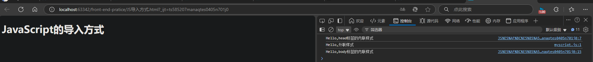
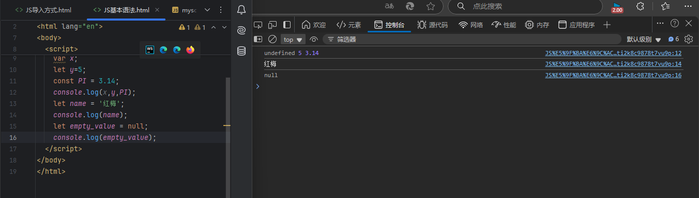

# 03.JavaScript基础

**JavaScript和Java没有任何关系，类似于张学友和张学。JavaScript简称JS**

JavaScript是一种轻量级、解释型、面向对象的脚本语言。它主要被设计用于在网页上实现动态效果，增加用户与网页的交互性。

作为一种客户端脚本语言，JavaScript可以直接嵌入HTML，并在浏览器中执行。

与HTML和CSS不同，JavaScript使得网页不再是静态的，而是可以根据用户的操作动态变化的。

**在前端开发中**

- 客户端脚本：用于在用户浏览器中执行，实现动态效果和用户交互。
- 网页开发：与HTML和CSS协同工作，使得网页具有更强的交互性和动态性。
- 后端开发：使用Node.js，JavaScript也可以在服务器端运行，实现服务器端应用的开发。

## JS导入方式

内联式

外部引入

**JS导入方式练习**

在开发者工具的控制台中可以看到



## JS基本语法

var：变量的意思，variable

let、const

三个方式都可以定义一个变量，区别在于

### 1.var的作用域是整个函数，let、const是一个块例如在一个函数中

```javascript
函数{
	if{
	let X=0;
	}
}
```

用了const和let，X只会在if中起作用，而var会在整个函数中起作用

### 2.变量提升

var：变量提升

let 和 const：无提升（暂时性死区）

```javascript
console.log(a); // 输出 undefined，因为 var 声明被提升，但赋值未提升
var a = 5;

console.log(b); // 报错：ReferenceError，因为 let 声明前不可用
let b = 10;

console.log(c); // 报错：ReferenceError，因为 const 声明前不可用
const c = 20;
```

### 3.可变性

var 和 let：可以重新赋值

const：不能重新赋值

```javascript
var num1 = 1;
num1 = 2; // 可以重新赋值
console.log(num1); // 输出 2

let num2 = 3;
num2 = 4; // 可以重新赋值
console.log(num2); // 输出 4

const num3 = 5;
num3 = 6; // 报错：TypeError，const 声明的变量不能重新赋值
```

优先使用 let 和 const，避免使用 var，这样可以减少意外错误，提升代码的可读性和安全性。



*文字写于：广东*